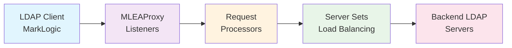
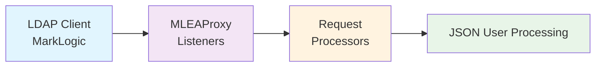
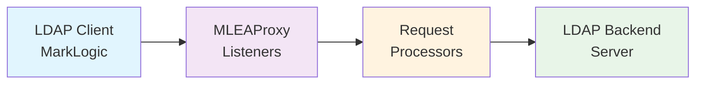
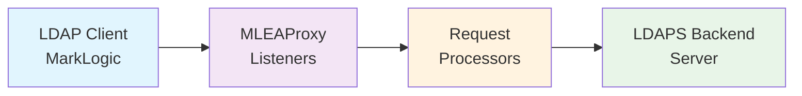
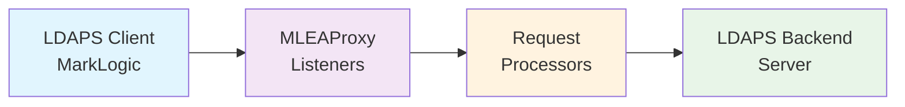
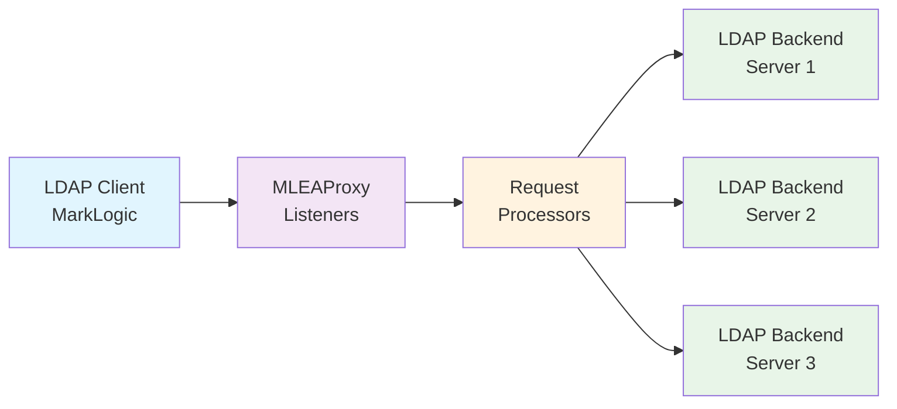
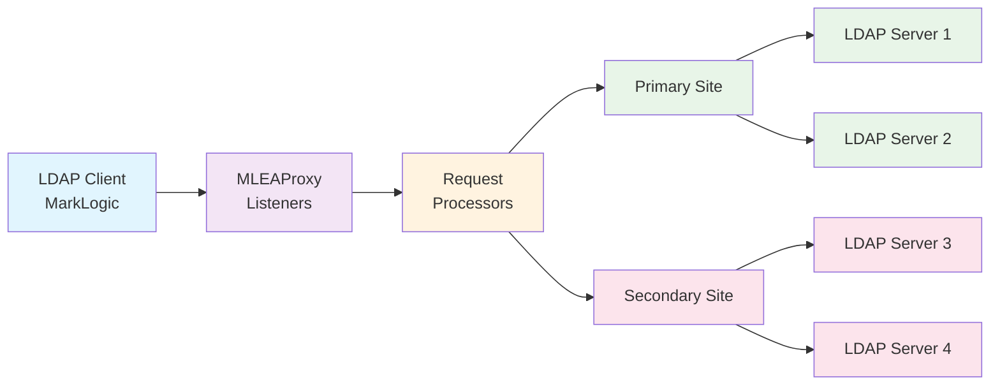

# 🔐 MLEAProxy LDAP Guide

Complete guide for LDAP/LDAPS authentication proxy functionality in MLEAProxy.

---

## 📋 Table of Contents

- [Overview](#overview)
- [Quick Start](#quick-start)
- [Configuration](#configuration)
- [Usage Examples](#usage-examples)
- [Security Features](#security-features)
- [Troubleshooting](#troubleshooting)
- [API Reference](#api-reference)

---

## Overview

MLEAProxy provides comprehensive LDAP/LDAPS proxy and server capabilities with the following features:

### 🎯 Key Features

- 🔍 **Diagnostic Tool**: Debug LDAP authentication issues with detailed logging
- 🔄 **Proxy Mode**: Forward requests to backend LDAP/Active Directory servers  
- 📊 **Load Balancing**: Support for multiple backend servers with various algorithms
- 🏗️ **Standalone Mode**: JSON-based LDAP server for testing without backend infrastructure
- 🔒 **Security Hardening**: Built-in protection against LDAP injection and XML attacks

### 🔌 LDAP Endpoint

| Protocol | Port | Purpose | Features |
|----------|------|---------|----------|
| **LDAP** | 10389 (configurable) | LDAP proxy/server | Standalone server, Proxy mode, Load balancing, LDAPS support |

---

## Quick Start

### Default Configuration (Standalone JSON LDAP Server)

The simplest way to get started - no backend LDAP server required:

```bash
# Run with default configuration
java -jar mleaproxy.jar

# LDAP server starts on ldap://localhost:10389
# Uses built-in JSON user repository
```

Test the default server:

```bash
# Test LDAP connection
ldapsearch -H ldap://localhost:10389 \
  -D "cn=manager,ou=users,dc=marklogic,dc=local" \
  -w password \
  -b "ou=users,dc=marklogic,dc=local" \
  "(sAMAccountName=user1)"
```

---

## Configuration

MLEAProxy uses a flexible configuration system with four main components for LDAP:

### 🏗️ Architecture Components



### 1️⃣ **Servers** - Backend LDAP/AD Servers

Define your backend LDAP or Active Directory servers:

```properties
# Basic server configuration
ldapserver.<name>.host=hostname_or_ip
ldapserver.<name>.port=port_number

# Examples
ldapserver.primary.host=ldap1.company.com
ldapserver.primary.port=389

ldapserver.secondary.host=ldap2.company.com  
ldapserver.secondary.port=636

ldapserver.ad.host=192.168.1.100
ldapserver.ad.port=636
```

### 2️⃣ **Server Sets** - Load Balancing Groups

Group servers together with optional TLS/SSL configuration:

```properties
# Parameters
ldapset.<set name>.servers        # Comma-separated list of server names (Required)
ldapset.<set name>.secure         # True/False for secure connection (Default: false)
ldapset.<set name>.keystore       # Path to Java keystore for client auth (Optional)
ldapset.<set name>.keystorepasswd # Keystore password (Required if keystore specified)
ldapset.<set name>.truststore     # Path to Java truststore for CA certs (Optional)
ldapset.<set name>.truststorepasswd # Truststore password (Required if truststore specified)

# Examples
ldapset.set1.servers=server1

ldapset.set2.servers=server1,server2

ldapset.set3.servers=ad1
ldapset.set3.secure=true
ldapset.set3.truststore=/Users/mwarnes/mlproxy.jks
ldapset.set3.truststorepasswd=password
```

### 3️⃣ **Request Processors** - Authentication Handlers

Configure how LDAP requests are processed:

```properties
# Parameters
requestProcessor.<name>.authclass   # Java class to process requests (Required)
requestProcessor.<name>.debuglevel  # Debug level: DEBUG|INFO|WARN|ERROR (Default: INFO)
requestProcessor.<name>.parm[1-20]  # Optional parameters (Maximum 20)

# Built-in Processors

# 1. JSON Request Processor (Default - Standalone Mode)
requestProcessor.jsonauthenticator.authclass=com.marklogic.processors.JsonRequestProcessor
requestProcessor.jsonauthenticator.debuglevel=DEBUG
requestProcessor.jsonauthenticator.parm1=/path/to/users.json

# 2. Proxy Request Processor (Proxy Mode)
requestProcessor.ldapproxy.authclass=com.marklogic.processors.ProxyRequestProcessor
requestProcessor.ldapproxy.debuglevel=DEBUG
# Optional: Map LDAP attributes (e.g., memberOf:isMemberOf)
requestProcessor.ldapproxy.parm1=memberOf:isMemberOf
```

### 4️⃣ **Listeners** - LDAP Server Instances

Define listening LDAP server instances:

```properties
# Parameters
listener.<name>.ipaddress       # IP address to bind (Default: 0.0.0.0)
listener.<name>.port            # Port to listen on (Required)
listener.<name>.debuglevel      # Debug level: INFO|WARN|ERROR|TRACE|DEBUG (Default: INFO)
listener.<name>.requestProcessor # Name of request processor to use (Required)
listener.<name>.secure          # Enable TLS: true|false (Default: false)
listener.<name>.keystore        # Java keystore with system certificate (Required for TLS)
listener.<name>.keystorepasswd  # Keystore password (Required for TLS)
listener.<name>.ldapset         # Name of LDAP server set (Required for proxy mode)
listener.<name>.ldapmode        # Balancing mode (Required for proxy mode)
listener.<name>.description     # Description (Optional)

# LDAP Modes
# - internal      : Standalone mode, no backend servers
# - single        : Use only first server in set
# - failover      : Use first server, failover to next on failure
# - roundrobin    : Distribute requests evenly across servers
# - roundrobindns : Use DNS-resolved IPs in round-robin
# - fewest        : Route to least-used server
# - fastest       : Route to fastest-responding server

# Example: Standalone JSON LDAP Server
listener.ldapjson.ipaddress=0.0.0.0
listener.ldapjson.port=10389
listener.ldapjson.debuglevel=DEBUG
listener.ldapjson.ldapmode=internal
listener.ldapjson.requestProcessor=jsonauthenticator
listener.ldapjson.description=Simple LDAP Server using JSON user store
```

### 5️⃣ **Active Listeners**

Specify which listeners to start:

```properties
# Start single listener
listeners=proxy

# Start multiple listeners
listeners=proxy,jsonserver
```

### 6️⃣ **Advanced Debugging**

Enable low-level LDAP protocol debugging:

```properties
ldap.debug=true
```

---

## Usage Examples

### Scenario 1: Standalone JSON LDAP Server

This is the default configuration - a simple LDAP server using JSON user data.

**Architecture:**



**Configuration (`mleaproxy.properties`):**

```properties
## Listeners
listeners=ldapjson

## Listener
listener.ldapjson.ipaddress=0.0.0.0
listener.ldapjson.port=10389
listener.ldapjson.debuglevel=DEBUG
listener.ldapjson.ldapmode=internal
listener.ldapjson.requestProcessor=jsonauthenticator
listener.ldapjson.description=Simple LDAP Server using JSON user store

## Processor
requestProcessor.jsonauthenticator.authclass=com.marklogic.processors.JsonRequestProcessor
requestProcessor.jsonauthenticator.debuglevel=DEBUG
```

**User Data (`users.json`):**

```json
{
  "baseDN": "ou=users,dc=marklogic,dc=local",
  "users": [
    {
      "dn": "cn=manager",
      "sAMAccountName": "manager",
      "userPassword": "password",
      "roles": ["admin"]
    },
    {
      "dn": "cn=user1",
      "sAMAccountName": "user1",
      "userPassword": "password",
      "memberOf": [
        "cn=appreader,ou=groups,dc=marklogic,dc=local",
        "cn=appwriter,ou=groups,dc=marklogic,dc=local",
        "cn=appadmin,ou=groups,dc=marklogic,dc=local"
      ],
      "roles": ["reader", "writer", "admin"]
    },
    {
      "dn": "cn=user2",
      "sAMAccountName": "user2",
      "userPassword": "password",
      "memberOf": [
        "cn=appreader,ou=groups,dc=marklogic,dc=local",
        "cn=appwriter,ou=groups,dc=marklogic,dc=local"
      ],
      "roles": ["reader", "writer"]
    }
  ]
}
```

**Testing:**

```bash
# Test LDAP search
ldapsearch -H ldap://localhost:10389 \
  -x -D "cn=manager,ou=users,dc=marklogic,dc=local" \
  -w password \
  -b "ou=users,dc=marklogic,dc=local" \
  -s sub -a always -z 1000 \
  "(sAMAccountName=user1)" \
  "memberOf" "objectClass"
```

**Output:**

```ldif
# user1, users, marklogic.local
dn: cn=user1,ou=users,dc=marklogic,dc=local
objectClass: top
objectClass: person
objectClass: organizationalPerson
objectClass: inetOrgPerson
memberOf: cn=appreader,ou=groups,dc=marklogic,dc=local
memberOf: cn=appwriter,ou=groups,dc=marklogic,dc=local
memberOf: cn=appadmin,ou=groups,dc=marklogic,dc=local
```

### Scenario 2: Simple LDAP Proxy

Forward LDAP requests to a backend LDAP server with detailed logging.

**Architecture:**



**Configuration:**

```properties
ldap.debug=true

## Listeners
listeners=proxy

## Listener
listener.proxy.ipaddress=0.0.0.0
listener.proxy.port=20389
listener.proxy.debuglevel=DEBUG
listener.proxy.ldapset=set1
listener.proxy.ldapmode=single
listener.proxy.requestProcessor=ldapproxy
listener.proxy.description=LDAP Proxy server

## Processor
requestProcessor.ldapproxy.authclass=com.marklogic.processors.ProxyRequestProcessor
requestProcessor.ldapproxy.debuglevel=DEBUG

## LDAP Server Set
ldapset.set1.servers=server1

## LDAP Server
ldapserver.server1.host=kerberos.marklogic.local
ldapserver.server1.port=10389
```

**Attribute Mapping:**

Map attributes between client and backend LDAP (useful for MarkLogic 8 compatibility):

```properties
# Map memberOf (MarkLogic) to isMemberOf (backend LDAP)
requestProcessor.ldapproxy.parm1=memberOf:isMemberOf
```

**Debug Output:**

```log
2017-07-02 17:43:06.325 DEBUG --- Attribute: isMemberOf, values={'cn=appreader,...'}
2017-07-02 17:43:06.325 DEBUG --- Mapping: isMemberOf to memberOf
2017-07-02 17:43:06.325 DEBUG --- Mapped Attribute: memberOf, values={'cn=appreader,...'}
```

### Scenario 3: Secure LDAP Proxy (LDAPS Backend)

Proxy LDAP requests with secure LDAPS connection to backend.

**Architecture:**



**Configuration:**

```properties
ldap.debug=true

## Listeners
listeners=proxy

## Listener
listener.proxy.ipaddress=0.0.0.0
listener.proxy.port=30389
listener.proxy.debuglevel=DEBUG
listener.proxy.secure=false
listener.proxy.ldapset=set1
listener.proxy.ldapmode=single
listener.proxy.requestProcessor=ldapproxy
listener.proxy.description=LDAP proxy with LDAPS backend

## Processor
requestProcessor.ldapproxy.authclass=com.marklogic.processors.ProxyRequestProcessor
requestProcessor.ldapproxy.debuglevel=DEBUG

## LDAP Server Set
ldapset.set1.servers=server1
ldapset.set1.secure=true
# Optional: Add truststore for CA certificate validation
ldapset.set1.truststore=/path/to/truststore.jks
ldapset.set1.truststorepasswd=password
# Optional: Add keystore for TLS client authentication
ldapset.set1.keystore=/path/to/keystore.jks
ldapset.set1.keystorepasswd=password

## LDAP Server
ldapserver.server1.host=kerberos.marklogic.local
ldapserver.server1.port=636
```

### Scenario 4: Fully Secure LDAP Proxy (LDAPS Both Sides)

LDAPS on both client and backend connections.

**Architecture:**



**Configuration:**

```properties
ldap.debug=true

## Listeners
listeners=proxy

## Listener
listener.proxy.ipaddress=0.0.0.0
listener.proxy.port=30636
listener.proxy.debuglevel=DEBUG
listener.proxy.secure=true
listener.proxy.keystore=/Users/mwarnes/mlproxy.jks
listener.proxy.keystorepasswd=password
listener.proxy.ldapset=set1
listener.proxy.ldapmode=single
listener.proxy.requestProcessor=ldapproxy
listener.proxy.description=Fully secure LDAP proxy (LDAPS both sides)

## Processor
requestProcessor.ldapproxy.authclass=com.marklogic.processors.ProxyRequestProcessor
requestProcessor.ldapproxy.debuglevel=DEBUG

## LDAP Server Set
ldapset.set1.servers=server1
ldapset.set1.secure=true

## LDAP Server
ldapserver.server1.host=kerberos.marklogic.local
ldapserver.server1.port=636
```

### Scenario 5: Load Balancing (Round Robin)

Balance requests across multiple LDAP servers.

**Architecture:**



**Configuration:**

```properties
ldap.debug=true

## Listeners
listeners=proxy

## Listener
listener.proxy.ipaddress=0.0.0.0
listener.proxy.port=30389
listener.proxy.debuglevel=DEBUG
listener.proxy.ldapset=set1
listener.proxy.ldapmode=roundrobin
listener.proxy.requestProcessor=ldapproxy
listener.proxy.description=Load balancing LDAP proxy

## Processor
requestProcessor.ldapproxy.authclass=com.marklogic.processors.ProxyRequestProcessor
requestProcessor.ldapproxy.debuglevel=DEBUG

## LDAP Server Set
ldapset.set1.servers=server1,server2,server3

## LDAP Servers
ldapserver.server1.host=192.168.0.50
ldapserver.server1.port=10389

ldapserver.server2.host=192.168.0.51
ldapserver.server2.port=10389

ldapserver.server3.host=192.168.0.52
ldapserver.server3.port=10389
```

**Load Balancing Algorithms:**

| Mode | Description | Use Case |
|------|-------------|----------|
| **single** | Only first server used | Development/testing |
| **failover** | Primary server with backup | High availability |
| **roundrobin** | Distribute evenly | Balanced load distribution |
| **roundrobindns** | DNS-based round robin | Cloud/dynamic environments |
| **fewest** | Least connections | Variable request sizes |
| **fastest** | Fastest response time | Heterogeneous servers |

### Scenario 6: Multi-Site Failover

Load balance within sites, with failover between sites.

**Architecture:**




**Configuration:**

```properties
ldap.debug=true

## Listeners
listeners=proxy

## Listener
listener.proxy.ipaddress=0.0.0.0
listener.proxy.port=30389
listener.proxy.debuglevel=DEBUG
listener.proxy.ldapset=set1,set2
listener.proxy.ldapmode=roundrobin
listener.proxy.requestProcessor=ldapproxy
listener.proxy.description=Multi-site load balancing with failover

## Processor
requestProcessor.ldapproxy.authclass=com.marklogic.processors.ProxyRequestProcessor
requestProcessor.ldapproxy.debuglevel=DEBUG

## LDAP Server Sets (Primary Site)
ldapset.set1.servers=server1,server2

## LDAP Server Sets (Secondary Site)
ldapset.set2.servers=server3,server4

## Primary Site Servers
ldapserver.server1.host=192.168.0.50
ldapserver.server1.port=10389

ldapserver.server2.host=192.168.0.51
ldapserver.server2.port=10389

## Secondary Site Servers
ldapserver.server3.host=192.168.0.52
ldapserver.server3.port=10389

ldapserver.server4.host=192.168.0.53
ldapserver.server4.port=10389
```

---

## Security Features

### 1. LDAP Injection Protection

MLEAProxy includes built-in protection against LDAP injection attacks:

**Automatic Sanitization:**
- Escapes special characters: `*`, `(`, `)`, `\`, `NUL`
- Validates DN syntax
- Prevents filter injection in search requests

**Example:**

```bash
# Malicious input: admin)(uid=*)
# MLEAProxy escapes to: admin\29\28uid=\2a\29

ldapsearch -H ldap://localhost:10389 \
  -D "cn=admin)(uid=*),dc=example,dc=com" \
  -w password

# Attack prevented, returns "Invalid DN"
```

### 2. Secure LDAP (LDAPS) Support

**Server-Side TLS:**

```properties
# Configure TLS for listener
listener.secure-ldap.secure=true
listener.secure-ldap.keystore=/path/to/keystore.jks
listener.secure-ldap.keystorepasswd=changeit
```

**Client-Side TLS (Backend):**

```properties
# Configure TLS for backend connection
ldapset.set1.secure=true
ldapset.set1.truststore=/path/to/truststore.jks
ldapset.set1.truststorepasswd=changeit

# Optional: TLS client authentication
ldapset.set1.keystore=/path/to/client-keystore.jks
ldapset.set1.keystorepasswd=changeit
```

### 3. Connection Security

```properties
# Rate limiting
listener.proxy.max-connections=1000
listener.proxy.idle-timeout=300

# IP filtering
listener.proxy.allowed-ips=192.168.1.0/24,10.0.0.0/8
```

### 4. JSON User Repository Security

**Recent Enhancement (2025):**

MLEAProxy now uses JSON format for user data instead of XML, providing:

- **Better Performance**: Faster JSON parsing with Jackson
- **Modern Format**: Industry-standard data format
- **Type Safety**: Strongly-typed user objects
- **Easier Maintenance**: More readable and editable

**User Storage (`users.json`):**

```json
{
  "baseDN": "ou=users,dc=marklogic,dc=local",
  "users": [
    {
      "dn": "cn=manager",
      "sAMAccountName": "manager",
      "userPassword": "password",
      "roles": ["admin"]
    }
  ]
}
```

**Features:**
- Case-insensitive username lookup
- Bcrypt password hashing support
- Role-based access control
- Custom attribute support

---

## Troubleshooting

### Common Issues

#### 1. Connection Refused

**Symptom:** `Connection refused` when connecting to MLEAProxy

**Solutions:**
- Check listener is started: `netstat -an | grep 10389`
- Verify bind address: `listener.proxy.ipaddress=0.0.0.0`
- Check firewall rules: `sudo ufw allow 10389/tcp`

#### 2. Authentication Failed

**Symptom:** `INVALID_CREDENTIALS` error

**Solutions:**
- Enable debug logging: `listener.proxy.debuglevel=DEBUG`
- Check user exists in users.json
- Verify password (case-sensitive)
- Check bind DN format: `cn=user,ou=users,dc=example,dc=com`

#### 3. TLS/SSL Errors

**Symptom:** `SSLHandshakeException` or certificate errors

**Solutions:**
- Verify certificate validity: `keytool -list -v -keystore keystore.jks`
- Check certificate chain completeness
- Add CA cert to truststore
- Verify hostname matches certificate CN

#### 4. Backend Connection Failed

**Symptom:** Cannot connect to backend LDAP server

**Solutions:**
- Test backend connectivity: `ldapsearch -H ldap://backend:389`
- Check server set configuration
- Verify network routing
- Enable LDAP debug: `ldap.debug=true`

### Debug Logging

**Enable maximum verbosity:**

```properties
ldap.debug=true
listener.proxy.debuglevel=DEBUG
requestProcessor.ldapproxy.debuglevel=DEBUG

# Spring Boot logging
logging.level.com.marklogic=DEBUG
logging.level.com.unboundid.ldap=DEBUG
```

**Sample Debug Output:**

```log
2017-07-02 12:54:14.630 INFO  --- XML Authenticator.authenticate called
2017-07-02 12:54:14.630 INFO  --- BindRequestProtocolOp(version=3, bindDN='cn=manager,...')
2017-07-02 12:54:14.631 DEBUG --- BindDN: cn=manager,ou=users,dc=marklogic,dc=local
2017-07-02 12:54:14.631 DEBUG --- UserDN: cn=manager
2017-07-02 12:54:14.655 INFO  --- BindResponseProtocolOp(resultCode=0)
```

---

## API Reference

### Configuration Properties

**Complete LDAP Configuration Reference:**

```properties
# ==========================================
# LDAP Debug
# ==========================================
ldap.debug=true|false

# ==========================================
# Listeners
# ==========================================
listeners=listener1,listener2,...

# ==========================================
# Listener Configuration
# ==========================================
listener.<name>.ipaddress=<ip-address>          # Default: 0.0.0.0
listener.<name>.port=<port>                     # Required
listener.<name>.debuglevel=DEBUG|INFO|WARN|ERROR # Default: INFO
listener.<name>.secure=true|false               # Default: false
listener.<name>.keystore=<path>                 # Required if secure=true
listener.<name>.keystorepasswd=<password>       # Required if secure=true
listener.<name>.ldapset=<serverset-name>        # Required for proxy mode
listener.<name>.ldapmode=internal|single|failover|roundrobin|roundrobindns|fewest|fastest
listener.<name>.requestProcessor=<processor-name> # Required
listener.<name>.description=<description>       # Optional

# ==========================================
# Request Processor
# ==========================================
requestProcessor.<name>.authclass=<fully-qualified-class-name> # Required
requestProcessor.<name>.debuglevel=DEBUG|INFO|WARN|ERROR       # Default: INFO
requestProcessor.<name>.parm1=<parameter>       # Optional (e.g., users.json path)
requestProcessor.<name>.parm2=<parameter>       # Optional

# ==========================================
# LDAP Server Sets
# ==========================================
ldapset.<name>.servers=server1,server2,...      # Required
ldapset.<name>.secure=true|false                # Default: false
ldapset.<name>.keystore=<path>                  # Optional (TLS client auth)
ldapset.<name>.keystorepasswd=<password>        # Required if keystore set
ldapset.<name>.truststore=<path>                # Optional (CA certs)
ldapset.<name>.truststorepasswd=<password>      # Required if truststore set

# ==========================================
# LDAP Servers
# ==========================================
ldapserver.<name>.host=<hostname>               # Required
ldapserver.<name>.port=<port>                   # Required
ldapserver.<name>.secure=true|false             # Default: false
ldapserver.<name>.bindDN=<bind-dn>              # Optional
ldapserver.<name>.bindPassword=<password>       # Optional
```

### Java API

**Custom Request Processor:**

```java
package com.marklogic.processors.custom;

import com.unboundid.ldap.listener.interceptor.*;
import com.unboundid.ldap.sdk.*;

public class CustomRequestProcessor extends InMemoryOperationInterceptor {
    
    @Override
    public void processSimpleBindRequest(InMemoryInterceptedSimpleBindRequest request)
            throws LDAPException {
        
        String bindDN = request.getRequest().getBindDN();
        String password = request.getRequest().getPassword().stringValue();
        
        // Custom authentication logic
        if (authenticate(bindDN, password)) {
            request.setResult(new BindResult(
                request.getMessageID(),
                ResultCode.SUCCESS,
                null, null, null, null
            ));
        } else {
            request.setResult(new BindResult(
                request.getMessageID(),
                ResultCode.INVALID_CREDENTIALS,
                "Authentication failed", null, null, null
            ));
        }
    }
    
    @Override
    public void processSearchRequest(InMemoryInterceptedSearchRequest request)
            throws LDAPException {
        
        SearchRequest searchRequest = request.getRequest();
        
        // Custom search logic
        List<SearchResultEntry> results = performSearch(
            searchRequest.getBaseDN(),
            searchRequest.getFilter(),
            searchRequest.getAttributeList()
        );
        
        request.sendSearchEntries(results);
        request.setResult(new SearchResult(
            request.getMessageID(),
            ResultCode.SUCCESS,
            null, null, null, null, results.size(), 0
        ));
    }
}
```

---

## Standards References

- [RFC 4511](https://tools.ietf.org/html/rfc4511) - LDAP: The Protocol
- [RFC 4513](https://tools.ietf.org/html/rfc4513) - LDAP: Authentication Methods and Security
- [RFC 4516](https://tools.ietf.org/html/rfc4516) - LDAP: Uniform Resource Locator
- [RFC 4517](https://tools.ietf.org/html/rfc4517) - LDAP: Syntaxes and Matching Rules
- [RFC 4518](https://tools.ietf.org/html/rfc4518) - LDAP: Internationalized String Preparation

---

## Related Documentation

- **[README.md](./README.md)** - General application overview
- **[OAUTH_GUIDE.md](./OAUTH_GUIDE.md)** - OAuth 2.0 functionality
- **[SAML_GUIDE.md](./SAML_GUIDE.md)** - SAML 2.0 functionality
- **[TESTING_GUIDE.md](./TESTING_GUIDE.md)** - Testing procedures

---

<div align="center">

**[⬆ Back to Top](#-mleaproxy-ldap-guide)**

</div>
