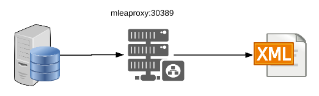
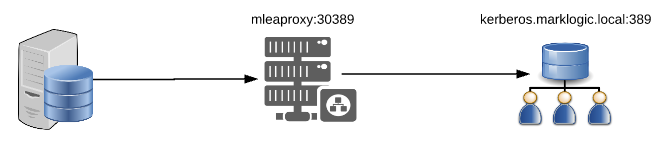
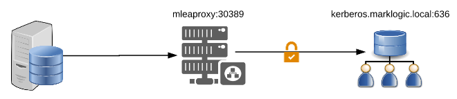
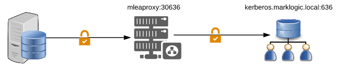
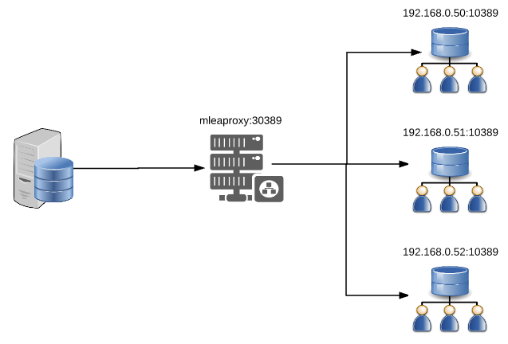
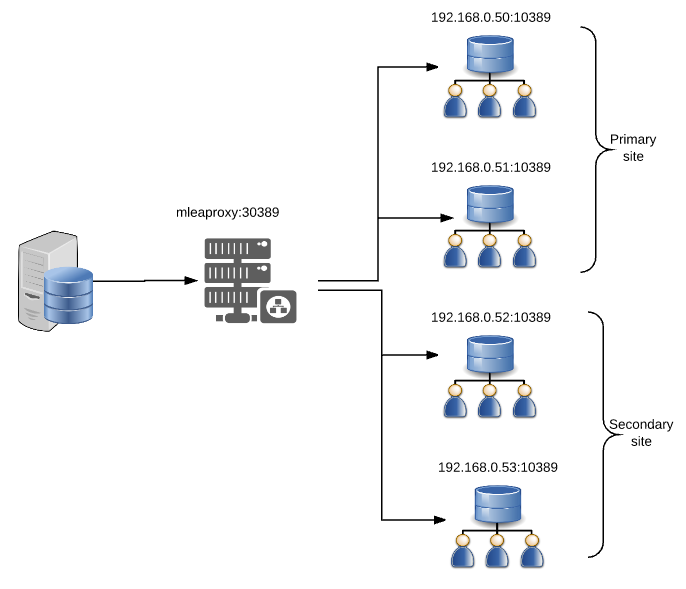

# MLEAProxy
## An External LDAP Authentication Proxy server for MarkLogic Server
### Introduction
MLEAProxy was primarily written as a support tool to aid in diagnosing issues when authorizing MarkLogic Users against an external LDAP or Active Directory server. However there is no reason it could not be used for other uses but in being designed as a diagnostic tool it has not undergone any significant testing to ensure it is production ready, therefore use at your own discretion.
<P>As well a being a proxy LDAP server MLEAProxy can run a simple LDAP server using an XML file containing a pseudo LDAP configuration. This is useful for users wanting to configure and evaluate MarkLogic External Security without the need to access a full LDAP or Active Directory server. This is the default configuration mode if no properties file is available.
<P>MLEXProxy can also be extended using custom written Java code to intercept LDAP requests and take any actions or make modifications before returning the response to the LDAP client.

### Installation

 [](./mleaproxy.jar) or clone the repository and build your own version.
 
 <p>To run simply execute the the runnable Jar file
 
```` 
java -jar mleaproxy.jar 
````

MLEAProxy will search in the following order of preference for a mleaproxy.properties file in the current directory, the users home directory, /etc/ directory on Unix and finally will use the default in-built properties configuration if no other is found.

````
./mleaproxy.properties
${HOME}/mleaproxy.properties
/etc/mleaproxy.properties
Application defaults
````

In addition, the path of the properties file can be passed using the System property "mleaproxy.properties", if this method is used it takes precedence over the method listed above.
````
java -Dmleaproxy.properties=/Users/mwarnes/my.props -jar mleaproxy.jar 
````

### Configuration

The configuration is made up of 4 areas, Servers, Server Sets, Listeners, and Processors.

Servers define the back-end LDAP or Active Directory server that MLEAProxy will connect to.

````
Parameters
==========
ldapserver.<name>.host : IP Address or Hostname of back-end LDAP server <Required>.
ldapserver.<name>.port : Back-end LDAP Server listening port <Required>.
 
Examples
======== 
ldapserver.server1.host=dirsrv1.marklogic.com
ldapserver.server1.port=389

ldapserver.server2.host=dirsrv2.marklogic.com
ldapserver.server2.port=389
 
ldapserver.ad1.host=192.168.0.60
ldapserver.ad1.port=636
````

Server Sets define the back-end LDAP servers to use; As well as a single back-end server, MLEAProxy supports load balancing to one or more back-end LDAP servers.

````
Parameters
==========
ldapset.<set name>.servers        : The names of one or more ldapserver configurations <Required>.
ldapset.<set name>.secure         : True/False if Secure connection is required (Default:false) <Optional>.
ldapset.<set name>.keystore       : Path to Java keystore containing user certificate if remote server requires
                                    TLS Client Autnentication <Optional>.
ldapset.<set name>.keystorepasswd : Keystore password <Required only if keystore specified>.
ldapset.<set name>.truststore     : Path to Java Truststore containing CA certificates, if not specified and a secure
                                    session is opened a TrustAll policy will be used.
ldapset.<set name>.truststorepasswd : Truststore password <Required only if Truststorestore specified>.
 
Examples
========  
ldapset.set1.servers=server1
 
ldapset.set2.servers=server1,server2
 
ldapset.set3.servers=ad1
ldapset.set3.secure=true
ldapset.set3.truststore=/Users/mwarnes/mlproxy.jks
ldapset.set3.truststorepasswd=password
````

Request Processors are used to identify the Processor class, debug level and parameters that will be used to handle the request.

````
Parameters
==========
requestProcessor.xmlauthenticator.authclass   : Java class to process the request <Required>.
requestProcessor.xmlauthenticator.debuglevel  : Debug level <Default INFO>
requestProcessor.xmlauthenticator.parm[1-20]  : Optional list of parameters (Maximum 20 pararmeters).
 
Examples
======== 
requestProcessor.xmlauthenticator.authclass=com.marklogic.processors.XMLRequestProcessor
requestProcessor.xmlauthenticator.debuglevel=DEBUG
requestProcessor.xmlauthenticator.parm1=/path/to/users.xml 
````

A Listener defines the individual MLEAProxy listening instance and defines such properties as listening port, bind address, whether TLS is required, the LDAP server set to use and the type of load balancing if required.
````
Parameters
==========
listener.<name>.ipaddress       : IP address to bind to (Default 0.0.0.0). 
listener.<name>.port            : port to listenon <Required>.
listener.<name>.debuglevel      : Level to use INFO|WARN|ERROR|TRACE|DEBUG  (Default INFO)
listener.<name>.requestProcessor: Name of Process clas to handle the request.                              
listener.<name>.secure          : True/False whether to enable TLS (Default false).
listener.<name>.keystore        : Java Keystore containing system certificate.
listener.<name>.keystorepasswd  : Keystore password
listener.<name>.ldapset         : Name of LDAP Server set to use.
listener.<name>.ldapmode        : LDAP balancing mode (internal|single|failover|roundrobin|roundrobindns|fewest|fastest) (Default single).
listener.<name>.description     : Description of listener (Optional).
 
Examples
======== 
listener.proxy.ipaddress=0.0.0.0
listener.proxy.port=20389
listener.proxy.debuglevel=DEBUG
listener.proxy.ldapset=set1
listener.proxy.ldapmode=single
listener.proxy.requestProcessor=ldapproxy
listener.proxy.description=LDAP Proxy server
````

MLEAProxy is able to run multiple, Listeners configure which listener instances will be started

````
Parameters
==========
listeners   : Name of listeners to start
 
Examples
======== 
listeners=proxy
 
listeners=proxy,xmlcustom
````

Lower level LDAP debugging in addition to the listener debug level can be enabled using the following parameter in the mleaproxy.properties file.
````
ldap.debug=true
````

### Sample Configurations
#### XML LDAP Server

This is the default configuration if no other configuration or properties file and will start a simple LDAP server that uses a XML file which contains a pseudo LDAP server layout with a number of user entries containing a example attributes needed to support external security on a MarkLogic server.

As all LDAP Requests are processed internal "listener.ldapxml.ldapmode=internal" no Servers are Server Sets are required



````
## Listeners
listeners=ldapxml

## Listener
listener.ldapxml.ipaddress=0.0.0.0
listener.ldapxml.port=30389
listener.ldapxml.debuglevel=DEBUG
listener.ldapxml.ldapmode=internal
listener.ldapxml.requestProcessor=xmlauthenticator
listener.ldapxml.description=Simple LDAP Server using a read-only XML User store
## processor
requestProcessor.xmlauthenticator.authclass=com.marklogic.processors.XMLRequestProcessor
requestProcessor.xmlauthenticator.debuglevel=DEBUG
````

To use a different XML LDAP users files a path can be specified using parm1 as below.

````
requestProcessor.xmlauthenticator.parm1=/Users/mwarnes/users.xml
````

If no XML LDAP users file is provided the default internal layout will be used:

````xml
<?xml version="1.0"?>
<ldap>
    <users basedn="ou=users,dc=marklogic,dc=local">
        <user dn="cn=manager">
            <sAMAccountName>manager</sAMAccountName>
            <userPassword>password</userPassword>
        </user>
        <user dn="cn=user1">
            <sAMAccountName>user1</sAMAccountName>
            <memberOf>cn=appreader,ou=groups,dc=marklogic,dc=local</memberOf>
            <memberOf>cn=appwriter,ou=groups,dc=marklogic,dc=local</memberOf>
            <memberOf>cn=appadmin,ou=groups,dc=marklogic,dc=local</memberOf>
            <userPassword>password</userPassword>
        </user>
        <user dn="cn=user2">
            <sAMAccountName>user2</sAMAccountName>
            <memberOf>cn=appreader,ou=groups,dc=marklogic,dc=local</memberOf>
            <memberOf>cn=appwriter,ou=groups,dc=marklogic,dc=local</memberOf>
            <userPassword>password</userPassword>
        </user>
        <user dn="cn=user3">
            <sAMAccountName>user3</sAMAccountName>
            <memberOf>cn=appreader,ou=groups,dc=marklogic,dc=local</memberOf>
            <userPassword>password</userPassword>
        </user>
        <user dn="cn=user4">
            <sAMAccountName>user4</sAMAccountName>
            <userPassword>password</userPassword>
        </user>
    </users>
</ldap>
````

Sample ldapsearch and log output.

````bash
ldapsearch -H ldap://localhost:30389 -x -D "cn=manager,ou=users,dc=marklogic,dc=local" -W -b "ou=users,dc=marklogic,dc=local" -s sub -a always -z 1000 "(sAMAccountName=user1)" "memberOf" "objectClass"
Enter LDAP Password: 
# extended LDIF
#
# LDAPv3
# base <ou=users,dc=marklogic,dc=local> with scope subtree
# filter: (sAMAccountName=user1)
# requesting: memberOf objectClass 
#

# user1, users, marklogic.local
dn: cn=user1,ou=users,dc=marklogic,dc=local
objectClass: top
objectClass: person
objectClass: organizationalPerson
objectClass: inetOrgPerson
memberOf: cn=appreader,ou=groups,dc=marklogic,dc=local
memberOf: cn=appwriter,ou=groups,dc=marklogic,dc=local
memberOf: cn=appadmin,ou=groups,dc=marklogic,dc=local

# search result
search: 2
result: 0 Success

# numResponses: 2
# numEntries: 1
````

````
2017-07-02 12:54:04.130  INFO 91756 --- [           main] com.marklogic.MLEAProxy                  : Starting MLEAProxy on MacPro-4505.local with PID 91756 (/Users/mwarnes/IdeaProjects/MLEAProxy/target/classes started by mwarnes in /Users/mwarnes/IdeaProjects/MLEAProxy)
2017-07-02 12:54:04.132  INFO 91756 --- [           main] com.marklogic.MLEAProxy                  : No active profile set, falling back to default profiles: default
2017-07-02 12:54:04.165  INFO 91756 --- [           main] s.c.a.AnnotationConfigApplicationContext : Refreshing org.springframework.context.annotation.AnnotationConfigApplicationContext@42607a4f: startup date [Sun Jul 02 12:54:04 BST 2017]; root of context hierarchy
2017-07-02 12:54:04.879  INFO 91756 --- [           main] o.s.j.e.a.AnnotationMBeanExporter        : Registering beans for JMX exposure on startup
2017-07-02 12:54:04.909 DEBUG 91756 --- [           main] com.marklogic.handlers.LDAPlistener      : IP Address: 0.0.0.0
2017-07-02 12:54:04.909 DEBUG 91756 --- [           main] com.marklogic.handlers.LDAPlistener      : Port: 30389
2017-07-02 12:54:04.909 DEBUG 91756 --- [           main] com.marklogic.handlers.LDAPlistener      : Request handler: com.marklogic.handlers.LDAPRequestHandler
2017-07-02 12:54:04.910 DEBUG 91756 --- [           main] com.marklogic.handlers.LDAPlistener      : Building server sets
2017-07-02 12:54:04.910 DEBUG 91756 --- [           main] com.marklogic.handlers.LDAPlistener      : ServerSet: null
2017-07-02 12:54:04.913 DEBUG 91756 --- [           main] com.marklogic.handlers.LDAPlistener      : ServerSet(className=com.marklogic.handlers.NullServerSet)
2017-07-02 12:54:04.920  INFO 91756 --- [           main] com.marklogic.handlers.LDAPlistener      : Listening on: 0.0.0.0:30389 ( Simple LDAP Server using a read-only XML User store )
2017-07-02 12:54:04.921  INFO 91756 --- [           main] com.marklogic.MLEAProxy                  : Started MLEAProxy in 1.135 seconds (JVM running for 1.403)
2017-07-02 12:54:14.597 DEBUG 91756 --- [0:0:0:0:1:30389] c.m.processors.XMLRequestProcessor       : XML file path: /Users/mwarnes/IdeaProjects/MLEAProxy/src/main/resources/users.xml
2017-07-02 12:54:14.612  INFO 91756 --- [0:0:0:0:1:30389] c.m.processors.XMLRequestProcessor       : Using custom LDAP configuration from: /Users/mwarnes/IdeaProjects/MLEAProxy/src/main/resources/users.xml
2017-07-02 12:54:14.630  INFO 91756 --- [0:0:0:0:1:30389] c.m.processors.XMLRequestProcessor       : XML Authenticator.authenticate called.
2017-07-02 12:54:14.630  INFO 91756 --- [0:0:0:0:1:30389] c.m.processors.XMLRequestProcessor       : BindRequestProtocolOp(version=3, bindDN='cn=manager,ou=users,dc=marklogic,dc=local', type=simple)
2017-07-02 12:54:14.631 DEBUG 91756 --- [0:0:0:0:1:30389] c.m.processors.XMLRequestProcessor       : BindDN cn=manager,ou=users,dc=marklogic,dc=local
2017-07-02 12:54:14.631 DEBUG 91756 --- [0:0:0:0:1:30389] c.m.processors.XMLRequestProcessor       : UserDN cn=manager
2017-07-02 12:54:14.631 DEBUG 91756 --- [0:0:0:0:1:30389] c.m.processors.XMLRequestProcessor       : Passwd password
2017-07-02 12:54:14.631 DEBUG 91756 --- [0:0:0:0:1:30389] c.m.processors.XMLRequestProcessor       : BaseDN ou=users,dc=marklogic,dc=local
2017-07-02 12:54:14.631 DEBUG 91756 --- [0:0:0:0:1:30389] c.m.processors.XMLRequestProcessor       : xpath query /ldap/users[@basedn="ou=users,dc=marklogic,dc=local"]/user[@dn="cn=manager"]/userPassword
2017-07-02 12:54:14.645 DEBUG 91756 --- [0:0:0:0:1:30389] c.m.processors.XMLRequestProcessor       : LDAP userPassword password
2017-07-02 12:54:14.655  INFO 91756 --- [0:0:0:0:1:30389] c.m.processors.XMLRequestProcessor       : BindResponseProtocolOp(resultCode=0)
2017-07-02 12:54:14.660 DEBUG 91756 --- [0:0:0:0:1:30389] c.m.processors.XMLRequestProcessor       : XML file path: /Users/mwarnes/IdeaProjects/MLEAProxy/src/main/resources/users.xml
2017-07-02 12:54:14.661  INFO 91756 --- [0:0:0:0:1:30389] c.m.processors.XMLRequestProcessor       : Using custom LDAP configuration from: /Users/mwarnes/IdeaProjects/MLEAProxy/src/main/resources/users.xml
2017-07-02 12:54:14.663  INFO 91756 --- [0:0:0:0:1:30389] c.m.processors.XMLRequestProcessor       : XML Authenticator.search called.
2017-07-02 12:54:14.663  INFO 91756 --- [0:0:0:0:1:30389] c.m.processors.XMLRequestProcessor       : SearchRequestProtocolOp(baseDN='ou=users,dc=marklogic,dc=local', scope='SUB', derefPolicy='ALWAYS', sizeLimit=1000, timeLimit=0, typesOnly=false, filter='(sAMAccountName=user1)', attributes={memberOf,objectClass})
2017-07-02 12:54:14.663 DEBUG 91756 --- [0:0:0:0:1:30389] c.m.processors.XMLRequestProcessor       : BaseDN: ou=users,dc=marklogic,dc=local
2017-07-02 12:54:14.663 DEBUG 91756 --- [0:0:0:0:1:30389] c.m.processors.XMLRequestProcessor       : Filter: (sAMAccountName=user1)
2017-07-02 12:54:14.665 DEBUG 91756 --- [0:0:0:0:1:30389] c.m.processors.XMLRequestProcessor       : Attributes: [memberOf, objectClass]
2017-07-02 12:54:14.665 DEBUG 91756 --- [0:0:0:0:1:30389] c.m.processors.XMLRequestProcessor       : /ldap/users[@basedn="ou=users,dc=marklogic,dc=local"]/user[sAMAccountName="user1"]/@dn
2017-07-02 12:54:14.666 DEBUG 91756 --- [0:0:0:0:1:30389] c.m.processors.XMLRequestProcessor       : UserDN cn=user1,ou=users,dc=marklogic,dc=local
2017-07-02 12:54:14.669 DEBUG 91756 --- [0:0:0:0:1:30389] c.m.processors.XMLRequestProcessor       : memberOf : cn=appreader,ou=groups,dc=marklogic,dc=local
2017-07-02 12:54:14.669 DEBUG 91756 --- [0:0:0:0:1:30389] c.m.processors.XMLRequestProcessor       : memberOf : cn=appwriter,ou=groups,dc=marklogic,dc=local
2017-07-02 12:54:14.669 DEBUG 91756 --- [0:0:0:0:1:30389] c.m.processors.XMLRequestProcessor       : memberOf : cn=appadmin,ou=groups,dc=marklogic,dc=local
2017-07-02 12:54:14.710 DEBUG 91756 --- [0:0:0:0:1:30389] c.m.processors.XMLRequestProcessor       : Response Attribute  [SearchResultEntry(dn='cn=user1,ou=users,dc=marklogic,dc=local', messageID=2, attributes={Attribute(name=objectClass, values={'top', 'person', 'organizationalPerson', 'inetOrgPerson'}), Attribute(name=memberOf, values={'cn=appreader,ou=groups,dc=marklogic,dc=local', 'cn=appwriter,ou=groups,dc=marklogic,dc=local', 'cn=appadmin,ou=groups,dc=marklogic,dc=local'})}, controls={})]
2017-07-02 12:54:14.711  INFO 91756 --- [0:0:0:0:1:30389] c.m.processors.XMLRequestProcessor       : SearchResultEntryProtocolOp(dn='cn=user1,ou=users,dc=marklogic,dc=local', attrs={Attribute(name=objectClass, values={'top', 'person', 'organizationalPerson', 'inetOrgPerson'}),Attribute(name=memberOf, values={'cn=appreader,ou=groups,dc=marklogic,dc=local'}),Attribute(name=memberOf, values={'cn=appwriter,ou=groups,dc=marklogic,dc=local'}),Attribute(name=memberOf, values={'cn=appadmin,ou=groups,dc=marklogic,dc=local'})})
2017-07-02 12:54:14.713  INFO 91756 --- [0:0:0:0:1:30389] c.m.processors.XMLRequestProcessor       : ResponseProtocolOp(type=65, resultCode=0)
````


#### Simple LDAP Proxy server
The following configuration will start a simple proxy listener to relay LDAP request back and forth between a client such as a MarkLogic server and a back-end LDAP server. In addition, both LDAP and Listener debugging is enabled to write detailed LDAP Request/Response information.



````
ldap.debug=true
## Listeners
listeners=proxy
## Listener
listener.proxy.ipaddress=0.0.0.0
listener.proxy.port=20389
listener.proxy.debuglevel=DEBUG
listener.proxy.ldapset=set1
listener.proxy.ldapmode=single
listener.proxy.requestProcessor=ldapproxy
listener.proxy.description=LDAP Proxy server
## processor
requestProcessor.ldapproxy.authclass=com.marklogic.processors.ProxyRequestProcessor
requestProcessor.ldapproxy.debuglevel=DEBUG
## LDAP Server set
ldapset.set1.servers=server1
## LDAP Server
ldapserver.server1.host=kerberos.marklogic.local
ldapserver.server1.port=10389
````
Sample log output

````
2017-07-02 11:49:18.482  INFO 88453 --- [           main] com.marklogic.MLEAProxy                  : Starting MLEAProxy on MacPro-4505.local with PID 88453 (/Users/mwarnes/IdeaProjects/MLEAProxy/target/classes started by mwarnes in /Users/mwarnes/IdeaProjects/MLEAProxy)
2017-07-02 11:49:18.484  INFO 88453 --- [           main] com.marklogic.MLEAProxy                  : No active profile set, falling back to default profiles: default
2017-07-02 11:49:18.521  INFO 88453 --- [           main] s.c.a.AnnotationConfigApplicationContext : Refreshing org.springframework.context.annotation.AnnotationConfigApplicationContext@42607a4f: startup date [Sun Jul 02 11:49:18 BST 2017]; root of context hierarchy
2017-07-02 11:49:19.202  INFO 88453 --- [           main] o.s.j.e.a.AnnotationMBeanExporter        : Registering beans for JMX exposure on startup
2017-07-02 11:49:19.229 DEBUG 88453 --- [           main] com.marklogic.handlers.LDAPlistener      : IP Address: 0.0.0.0
2017-07-02 11:49:19.229 DEBUG 88453 --- [           main] com.marklogic.handlers.LDAPlistener      : Port: 20389
2017-07-02 11:49:19.230 DEBUG 88453 --- [           main] com.marklogic.handlers.LDAPlistener      : Request handler: com.marklogic.handlers.LDAPRequestHandler
2017-07-02 11:49:19.230 DEBUG 88453 --- [           main] com.marklogic.handlers.LDAPlistener      : Building server sets
2017-07-02 11:49:19.230 DEBUG 88453 --- [           main] com.marklogic.handlers.LDAPlistener      : ServerSet: set1
2017-07-02 11:49:19.234 DEBUG 88453 --- [           main] com.marklogic.handlers.LDAPlistener      : LDAP Server host: kerberos.marklogic.local
2017-07-02 11:49:19.234 DEBUG 88453 --- [           main] com.marklogic.handlers.LDAPlistener      : LDAP Server Port: 389
2017-07-02 11:49:19.237 DEBUG 88453 --- [           main] com.marklogic.handlers.LDAPlistener      : SingleServerSet(server=kerberos.marklogic.local:389)
2017-07-02 11:49:19.242  INFO 88453 --- [           main] com.marklogic.handlers.LDAPlistener      : Listening on: 0.0.0.0:20389 ( LDAP Proxy server )
2017-07-02 11:49:19.244  INFO 88453 --- [           main] com.marklogic.MLEAProxy                  : Started MLEAProxy in 1.058 seconds (JVM running for 1.317)
2017-07-02 11:50:03.983 DEBUG 88453 --- [127.0.0.1:20389] c.m.processors.ProxyRequestProcessor     : 1-+-BindRequestProtocolOp(version=3, bindDN='cn=Manager,dc=MarkLogic,dc=Local', type=simple)-+-[]
2017-07-02 11:50:03.985  INFO 88453 --- [127.0.0.1:20389] com.unboundid.ldap.sdk                   : level="INFO" threadID=20 threadName="LDAPListener client connection reader for connection from 127.0.0.1:54531 to 127.0.0.1:20389" revision=24201 sendingLDAPRequest="SimpleBindRequest(dn='cn=Manager,dc=MarkLogic,dc=Local')"
2017-07-02 11:50:03.986  INFO 88453 --- [127.0.0.1:20389] com.unboundid.ldap.sdk                   : level="INFO" threadID=17 threadName="LDAPListener client connection reader for connection from 127.0.0.1:54530 to 127.0.0.1:20389" revision=24201 message="Sending LDAP unbind request."
2017-07-02 11:50:03.988  INFO 88453 --- [logic.local:389] com.unboundid.ldap.sdk                   : level="INFO" threadID=22 threadName="Connection reader for connection 1 to kerberos.marklogic.local:389" revision=24201 connectionID=1 connectedTo="kerberos.marklogic.local:389" readLDAPResult="BindResult(resultCode=0 (success), messageID=1, hasServerSASLCredentials=false)"
2017-07-02 11:50:03.991 DEBUG 88453 --- [127.0.0.1:20389] c.m.processors.ProxyRequestProcessor     : 1-+-BindResponseProtocolOp(resultCode=0)-+-[]
````

The mleaproxy proxy server also supports mapping Attribute names, this can be used by a server running MakLogic version 8 or earlier which uses the "memberOf" Attribute to determine Group role permissions. To use this feature you can add a comma seperated list of mappings using parm1, the mleaproxy server will then map between the Attributes on the LDAP Requests and Response. 
 
 Example: Mapping between "memberOf" used by MarkLogic and "isMemberOf" used by the back-end LDAP server.

````
requestProcessor.ldapproxy.parm1=memberOf:isMemberOf
````

With debug enabled on the requestProcessor details of any mappings taking place will be displayed

````
2017-07-02 17:43:06.325 DEBUG 6154 --- [0:0:0:0:1:30389] c.m.processors.SearchResultListener      : Attribute: Attribute(name=isMemberOf, values={'cn=appreader,ou=groups,dc=marklogic,dc=local', 'cn=appwriter,ou=groups,dc=marklogic,dc=local', 'cn=appadmin,ou=groups,dc=marklogic,dc=local'})
2017-07-02 17:43:06.325 DEBUG 6154 --- [0:0:0:0:1:30389] c.m.processors.SearchResultListener      : Mapping: isMemberOf to memberOf
2017-07-02 17:43:06.325 DEBUG 6154 --- [0:0:0:0:1:30389] c.m.processors.SearchResultListener      : Mapped Attribute: Attribute(name=memberOf, values={'cn=appreader,ou=groups,dc=marklogic,dc=local', 'cn=appwriter,ou=groups,dc=marklogic,dc=local', 'cn=appadmin,ou=groups,dc=marklogic,dc=local'})
````

Note: MarkLogic 9 has added the functionality to specify alternate search Attributes in place of "memberOf" without the need to use a proxy.

#### Secure LDAP Proxy server (1)

An example configuration building on the simple LDAP proxy but securing the back-end connection to the LDAP server using LDAPS security.
This is a useful configuration for diagnosing external security problems where the back-end LDAP server requires a TLS encrypted session. 
With the MLEAProxy in place, LDAP traffic can be seen on the output display and also makes it possible to capture network traffic between the client and MLEAProxy for further diagnosis using the Wireshark LDAP dissector.



````
ldap.debug=true
## Listeners
listeners=proxy
## Listener
listener.proxy.ipaddress=0.0.0.0
listener.proxy.port=30389
listener.proxy.debuglevel=DEBUG
listener.proxy.secure=false
listener.proxy.ldapset=set1
listener.proxy.ldapmode=single
listener.proxy.requestProcessor=ldapproxy
listener.proxy.description=LDAP proxy with LDAPS connection to back-end server.
## processor
requestProcessor.ldapproxy.authclass=com.marklogic.processors.ProxyRequestProcessor
requestProcessor.ldapproxy.debuglevel=DEBUG
## LDAP Server set
ldapset.set1.servers=server1
ldapset.set1.secure=true
## LDAP Server
ldapserver.server1.host=kerberos.marklogic.local
ldapserver.server1.port=636
````

Sample output

````
2017-06-30 14:02:47.259  INFO 89193 --- [           main] com.marklogic.MLEAProxy                  : Starting MLEAProxy on MacPro-4505.local with PID 89193 (/Users/mwarnes/IdeaProjects/MLEAProxy/target/classes started by mwarnes in /Users/mwarnes/IdeaProjects/MLEAProxy)
2017-06-30 14:02:48.035 DEBUG 89193 --- [           main] com.marklogic.handlers.LDAPlistener      : IP Address: 0.0.0.0
2017-06-30 14:02:48.035 DEBUG 89193 --- [           main] com.marklogic.handlers.LDAPlistener      : Port: 30389
2017-06-30 14:02:48.035 DEBUG 89193 --- [           main] com.marklogic.handlers.LDAPlistener      : Request handler: com.marklogic.handlers.ProxyRequestHandler
2017-06-30 14:02:48.036 DEBUG 89193 --- [           main] com.marklogic.handlers.LDAPlistener      : ServerSet: set1
2017-06-30 14:02:48.036 DEBUG 89193 --- [           main] com.marklogic.handlers.LDAPlistener      : Building server sets
2017-06-30 14:02:48.036 DEBUG 89193 --- [           main] com.marklogic.handlers.LDAPlistener      : ServerSet: set1
2017-06-30 14:02:48.040 DEBUG 89193 --- [           main] com.marklogic.handlers.LDAPlistener      : LDAP Server host: kerberos.marklogic.local
2017-06-30 14:02:48.040 DEBUG 89193 --- [           main] com.marklogic.handlers.LDAPlistener      : LDAP Server Port: 636
2017-06-30 14:02:48.041 DEBUG 89193 --- [           main] com.marklogic.handlers.LDAPlistener      : Creating SSL Socket Factory.
2017-06-30 14:02:48.042 DEBUG 89193 --- [           main] com.marklogic.handlers.LDAPlistener      : Creating SSLUtil.
2017-06-30 14:02:48.042 DEBUG 89193 --- [           main] com.marklogic.handlers.LDAPlistener      : Keystore: 
2017-06-30 14:02:48.042 DEBUG 89193 --- [           main] com.marklogic.handlers.LDAPlistener      : Keystore password: 
2017-06-30 14:02:48.042 DEBUG 89193 --- [           main] com.marklogic.handlers.LDAPlistener      : Truststore: 
2017-06-30 14:02:48.042 DEBUG 89193 --- [           main] com.marklogic.handlers.LDAPlistener      : Truststore password: 
2017-06-30 14:02:48.042 DEBUG 89193 --- [           main] com.marklogic.handlers.LDAPlistener      : Using default TrustAllTrustManager.
2017-06-30 14:02:48.210 DEBUG 89193 --- [           main] com.marklogic.handlers.LDAPlistener      : SingleServerSet(server=kerberos.marklogic.local:636)
2017-06-30 14:02:48.216  INFO 89193 --- [           main] com.marklogic.handlers.LDAPlistener      : Listening on: 0.0.0.0:30389 ( LDAP proxy with LDAPS connection to back-end server )
2017-06-30 14:02:48.217  INFO 89193 --- [           main] com.marklogic.MLEAProxy                  : Started MLEAProxy in 1.322 seconds (JVM running for 1.583)
2017-06-30 14:04:58.903  INFO 89193 --- [127.0.0.1:30389] com.unboundid.ldap.sdk                   : level="INFO" threadID=17 threadName="LDAPListener client connection reader for connection from 127.0.0.1:53989 to 127.0.0.1:30389" revision=24201 sendingLDAPRequest="SimpleBindRequest(dn='cn=Manager,dc=MarkLogic,dc=Local')"
2017-06-30 14:04:59.311  INFO 89193 --- [logic.local:636] com.unboundid.ldap.sdk                   : level="INFO" threadID=19 threadName="Connection reader for connection 0 to kerberos.marklogic.local:636" revision=24201 connectionID=0 connectedTo="kerberos.marklogic.local:636" readLDAPResult="BindResult(resultCode=0 (success), messageID=1, hasServerSASLCredentials=false)"
````

This configuration can be further enhanced for cases where a TrustAll TrustManager is not acceptable by adding a user created trust store containing the required CA certificates.
````
ldapset.set1.truststore=/path/to/mlproxytrust.jks
ldapset.set1.truststorepasswd=password
````

If the back-end LDAPS server also requires TLS Client Authentication then a user created key store containing a certificate and private key can be added.
````
ldapset.set1.keystore=/path/to/mlproxykey.jks
ldapset.set1.keystorepasswd=password
````

#### Secure LDAP Proxy server (2)

The following configuration adds TLS Secure transport support to the MLEAProxy listening port, with this both front-end and back-end connection will user LDAPS.



````
ldap.debug=true
## Listeners
listeners=proxy
## Listener
listener.proxy.ipaddress=0.0.0.0
listener.proxy.port=30636
listener.proxy.debuglevel=DEBUG
listener.proxy.secure=true
listener.proxy.keystore=/Users/mwarnes/mlproxy.jks
listener.proxy.keystorepasswd=password
listener.proxy.ldapset=set1
listener.proxy.ldapmode=single
listener.proxy.requestProcessor=ldapproxy
listener.proxy.description=LDAP proxy with LDAPS connection to front-end and back-end servers.
## processor
requestProcessor.ldapproxy.authclass=com.marklogic.processors.ProxyRequestProcessor
requestProcessor.ldapproxy.debuglevel=DEBUG
## LDAP Server set
ldapset.set1.servers=server1
ldapset.set1.secure=true
## LDAP Server
ldapserver.server1.host=kerberos.marklogic.local
ldapserver.server1.port=636
````

Sample log output

````
2017-06-30 14:33:42.957  INFO 90645 --- [           main] com.marklogic.MLEAProxy                  : Starting MLEAProxy on MacPro-4505.local with PID 90645 (/Users/mwarnes/IdeaProjects/MLEAProxy/target/classes started by mwarnes in /Users/mwarnes/IdeaProjects/MLEAProxy)
2017-06-30 14:33:43.724 DEBUG 90645 --- [           main] com.marklogic.handlers.LDAPlistener      : IP Address: 0.0.0.0
2017-06-30 14:33:43.725 DEBUG 90645 --- [           main] com.marklogic.handlers.LDAPlistener      : Port: 30636
2017-06-30 14:33:43.725 DEBUG 90645 --- [           main] com.marklogic.handlers.LDAPlistener      : Request handler: com.marklogic.handlers.ProxyRequestHandler
2017-06-30 14:33:43.725 DEBUG 90645 --- [           main] com.marklogic.handlers.LDAPlistener      : ServerSet: set1
2017-06-30 14:33:43.726 DEBUG 90645 --- [           main] com.marklogic.handlers.LDAPlistener      : Building server sets
2017-06-30 14:33:43.726 DEBUG 90645 --- [           main] com.marklogic.handlers.LDAPlistener      : ServerSet: set1
2017-06-30 14:33:43.729 DEBUG 90645 --- [           main] com.marklogic.handlers.LDAPlistener      : LDAP Server host: kerberos.marklogic.local
2017-06-30 14:33:43.730 DEBUG 90645 --- [           main] com.marklogic.handlers.LDAPlistener      : LDAP Server Port: 636
2017-06-30 14:33:43.730 DEBUG 90645 --- [           main] com.marklogic.handlers.LDAPlistener      : Creating SSL Socket Factory.
2017-06-30 14:33:43.731 DEBUG 90645 --- [           main] com.marklogic.handlers.LDAPlistener      : Creating SSLUtil.
2017-06-30 14:33:43.731 DEBUG 90645 --- [           main] com.marklogic.handlers.LDAPlistener      : Keystore: 
2017-06-30 14:33:43.731 DEBUG 90645 --- [           main] com.marklogic.handlers.LDAPlistener      : Keystore password: 
2017-06-30 14:33:43.731 DEBUG 90645 --- [           main] com.marklogic.handlers.LDAPlistener      : Truststore: 
2017-06-30 14:33:43.731 DEBUG 90645 --- [           main] com.marklogic.handlers.LDAPlistener      : Truststore password: 
2017-06-30 14:33:43.731 DEBUG 90645 --- [           main] com.marklogic.handlers.LDAPlistener      : Using default TrustAllTrustManager.
2017-06-30 14:33:43.882 DEBUG 90645 --- [           main] com.marklogic.handlers.LDAPlistener      : SingleServerSet(server=kerberos.marklogic.local:636)
2017-06-30 14:33:43.886 DEBUG 90645 --- [           main] com.marklogic.handlers.LDAPlistener      : Creating Server Socket Factory.
2017-06-30 14:33:43.888 DEBUG 90645 --- [           main] com.marklogic.handlers.LDAPlistener      : Creating SSLUtil.
2017-06-30 14:33:43.888 DEBUG 90645 --- [           main] com.marklogic.handlers.LDAPlistener      : Keystore: /Users/mwarnes/mlproxy.jks
2017-06-30 14:33:43.888 DEBUG 90645 --- [           main] com.marklogic.handlers.LDAPlistener      : Keystore password: password
2017-06-30 14:33:43.888 DEBUG 90645 --- [           main] com.marklogic.handlers.LDAPlistener      : Truststore: 
2017-06-30 14:33:43.888 DEBUG 90645 --- [           main] com.marklogic.handlers.LDAPlistener      : Truststore password: 
2017-06-30 14:33:43.892 DEBUG 90645 --- [           main] com.marklogic.handlers.LDAPlistener      : No Trust managers created using defined KeyManager & TrustAllTrustManager.
2017-06-30 14:33:43.897  INFO 90645 --- [           main] com.marklogic.handlers.LDAPlistener      : Listening on: 0.0.0.0:30636 ( Simple LDAP proxy )
2017-06-30 14:33:43.899  INFO 90645 --- [           main] com.marklogic.MLEAProxy                  : Started MLEAProxy in 1.262 seconds (JVM running for 1.524)
2017-06-30 14:34:34.413  INFO 90645 --- [127.0.0.1:30636] com.unboundid.ldap.sdk                   : level="INFO" threadID=17 threadName="LDAPListener client connection reader for connection from 127.0.0.1:54351 to 127.0.0.1:30636" revision=24201 sendingLDAPRequest="SimpleBindRequest(dn='cn=Manager,dc=MarkLogic,dc=Local')"
2017-06-30 14:34:34.428  INFO 90645 --- [logic.local:636] com.unboundid.ldap.sdk                   : level="INFO" threadID=19 threadName="Connection reader for connection 0 to kerberos.marklogic.local:636" revision=24201 connectionID=0 connectedTo="kerberos.marklogic.local:636" readLDAPResult="BindResult(resultCode=0 (success), messageID=1, hasServerSASLCredentials=false)"

````

#### Load balancing LDAP Proxy server (1)

MLEAProxy can also be configured as a load balancing proxy to handle a number of different scenarios including failover.

For this configuration, MLEAProxy will balance between 3 back-end LDAP servers using a simple round robin algorithm.



````
ldap.debug=true
## Listeners
listeners=proxy
## Listener
listener.proxy.ipaddress=0.0.0.0
listener.proxy.port=30389
listener.proxy.debuglevel=DEBUG
listener.proxy.secure=false
listener.proxy.ldapset=set1
listener.proxy.ldapmode=roundrobin
listener.proxy.requestProcessor=ldapproxy
listener.proxy.description=General load balancing LDAP proxy.
## processor
requestProcessor.ldapproxy.authclass=com.marklogic.processors.ProxyRequestProcessor
requestProcessor.ldapproxy.debuglevel=DEBUG
## LDAP Server set
ldapset.set1.servers=server1,server2,server3
## LDAP Server
ldapserver.server1.host=192.168.0.50
ldapserver.server1.port=10389
ldapserver.server2.host=192.168.0.51
ldapserver.server2.port=10389
ldapserver.server3.host=192.168.0.52
ldapserver.server3.port=10389
````

Sample log output showing 3 bind requests directing to 3 back-end servers in turn.

````
2017-07-02 11:57:46.421  INFO 88766 --- [           main] com.marklogic.MLEAProxy                  : Starting MLEAProxy on MacPro-4505.local with PID 88766 (/Users/mwarnes/IdeaProjects/MLEAProxy/target/classes started by mwarnes in /Users/mwarnes/IdeaProjects/MLEAProxy)
2017-07-02 11:57:46.422  INFO 88766 --- [           main] com.marklogic.MLEAProxy                  : No active profile set, falling back to default profiles: default
2017-07-02 11:57:46.458  INFO 88766 --- [           main] s.c.a.AnnotationConfigApplicationContext : Refreshing org.springframework.context.annotation.AnnotationConfigApplicationContext@42607a4f: startup date [Sun Jul 02 11:57:46 BST 2017]; root of context hierarchy
2017-07-02 11:57:47.152  INFO 88766 --- [           main] o.s.j.e.a.AnnotationMBeanExporter        : Registering beans for JMX exposure on startup
2017-07-02 11:57:47.177 DEBUG 88766 --- [           main] com.marklogic.handlers.LDAPlistener      : IP Address: 0.0.0.0
2017-07-02 11:57:47.178 DEBUG 88766 --- [           main] com.marklogic.handlers.LDAPlistener      : Port: 30389
2017-07-02 11:57:47.178 DEBUG 88766 --- [           main] com.marklogic.handlers.LDAPlistener      : Request handler: com.marklogic.handlers.LDAPRequestHandler
2017-07-02 11:57:47.178 DEBUG 88766 --- [           main] com.marklogic.handlers.LDAPlistener      : Building server sets
2017-07-02 11:57:47.178 DEBUG 88766 --- [           main] com.marklogic.handlers.LDAPlistener      : ServerSet: set1
2017-07-02 11:57:47.182 DEBUG 88766 --- [           main] com.marklogic.handlers.LDAPlistener      : LDAP Server host: 192.168.0.50
2017-07-02 11:57:47.182 DEBUG 88766 --- [           main] com.marklogic.handlers.LDAPlistener      : LDAP Server Port: 10389
2017-07-02 11:57:47.183 DEBUG 88766 --- [           main] com.marklogic.handlers.LDAPlistener      : LDAP Server host: 192.168.0.51
2017-07-02 11:57:47.183 DEBUG 88766 --- [           main] com.marklogic.handlers.LDAPlistener      : LDAP Server Port: 10389
2017-07-02 11:57:47.184 DEBUG 88766 --- [           main] com.marklogic.handlers.LDAPlistener      : LDAP Server host: 192.168.0.52
2017-07-02 11:57:47.184 DEBUG 88766 --- [           main] com.marklogic.handlers.LDAPlistener      : LDAP Server Port: 10389
2017-07-02 11:57:47.187 DEBUG 88766 --- [           main] com.marklogic.handlers.LDAPlistener      : RoundRobinServerSet(servers={192.168.0.50:10389, 192.168.0.51:10389, 192.168.0.52:10389})
2017-07-02 11:57:47.192  INFO 88766 --- [           main] com.marklogic.handlers.LDAPlistener      : Listening on: 0.0.0.0:30389 ( General load balancing LDAP proxy. )
2017-07-02 11:57:47.193  INFO 88766 --- [           main] com.marklogic.MLEAProxy                  : Started MLEAProxy in 1.097 seconds (JVM running for 1.354)
2017-07-02 12:01:24.277 DEBUG 88766 --- [127.0.0.1:30389] c.m.processors.ProxyRequestProcessor     : 1-+-BindRequestProtocolOp(version=3, bindDN='cn=Directory Manager', type=simple)-+-[]
2017-07-02 12:01:24.279  INFO 88766 --- [127.0.0.1:30389] com.unboundid.ldap.sdk                   : level="INFO" threadID=17 threadName="LDAPListener client connection reader for connection from 127.0.0.1:54668 to 127.0.0.1:30389" revision=24201 sendingLDAPRequest="SimpleBindRequest(dn='cn=Directory Manager')"
2017-07-02 12:01:24.291  INFO 88766 --- [.168.0.50:10389] com.unboundid.ldap.sdk                   : level="INFO" threadID=19 threadName="Connection reader for connection 0 to 192.168.0.50:10389" revision=24201 connectionID=0 connectedTo="192.168.0.50:10389" readLDAPResult="BindResult(resultCode=0 (success), messageID=1, hasServerSASLCredentials=false)"
2017-07-02 12:01:24.294 DEBUG 88766 --- [127.0.0.1:30389] c.m.processors.ProxyRequestProcessor     : 1-+-BindResponseProtocolOp(resultCode=0)-+-[]
2017-07-02 12:01:24.297  INFO 88766 --- [127.0.0.1:30389] com.unboundid.ldap.sdk                   : level="INFO" threadID=17 threadName="LDAPListener client connection reader for connection from 127.0.0.1:54668 to 127.0.0.1:30389" revision=24201 message="Sending LDAP unbind request."
2017-07-02 12:01:26.170 DEBUG 88766 --- [127.0.0.1:30389] c.m.processors.ProxyRequestProcessor     : 1-+-BindRequestProtocolOp(version=3, bindDN='cn=Directory Manager', type=simple)-+-[]
2017-07-02 12:01:26.171  INFO 88766 --- [127.0.0.1:30389] com.unboundid.ldap.sdk                   : level="INFO" threadID=20 threadName="LDAPListener client connection reader for connection from 127.0.0.1:54670 to 127.0.0.1:30389" revision=24201 sendingLDAPRequest="SimpleBindRequest(dn='cn=Directory Manager')"
2017-07-02 12:01:26.171  INFO 88766 --- [.168.0.51:10389] com.unboundid.ldap.sdk                   : level="INFO" threadID=22 threadName="Connection reader for connection 1 to 192.168.0.51:10389" revision=24201 connectionID=1 connectedTo="192.168.0.51:10389" readLDAPResult="BindResult(resultCode=0 (success), messageID=1, hasServerSASLCredentials=false)"
2017-07-02 12:01:26.172 DEBUG 88766 --- [127.0.0.1:30389] c.m.processors.ProxyRequestProcessor     : 1-+-BindResponseProtocolOp(resultCode=0)-+-[]
2017-07-02 12:01:26.172  INFO 88766 --- [127.0.0.1:30389] com.unboundid.ldap.sdk                   : level="INFO" threadID=20 threadName="LDAPListener client connection reader for connection from 127.0.0.1:54670 to 127.0.0.1:30389" revision=24201 message="Sending LDAP unbind request."
2017-07-02 12:01:28.114 DEBUG 88766 --- [127.0.0.1:30389] c.m.processors.ProxyRequestProcessor     : 1-+-BindRequestProtocolOp(version=3, bindDN='cn=Directory Manager', type=simple)-+-[]
2017-07-02 12:01:28.114  INFO 88766 --- [127.0.0.1:30389] com.unboundid.ldap.sdk                   : level="INFO" threadID=23 threadName="LDAPListener client connection reader for connection from 127.0.0.1:54672 to 127.0.0.1:30389" revision=24201 sendingLDAPRequest="SimpleBindRequest(dn='cn=Directory Manager')"
2017-07-02 12:01:28.114  INFO 88766 --- [.168.0.52:10389] com.unboundid.ldap.sdk                   : level="INFO" threadID=25 threadName="Connection reader for connection 2 to 192.168.0.52:10389" revision=24201 connectionID=2 connectedTo="192.168.0.52:10389" readLDAPResult="BindResult(resultCode=0 (success), messageID=1, hasServerSASLCredentials=false)"
2017-07-02 12:01:28.115 DEBUG 88766 --- [127.0.0.1:30389] c.m.processors.ProxyRequestProcessor     : 1-+-BindResponseProtocolOp(resultCode=0)-+-[]
2017-07-02 12:01:28.115  INFO 88766 --- [127.0.0.1:30389] com.unboundid.ldap.sdk                   : level="INFO" threadID=23 threadName="LDAPListener client connection reader for connection from 127.0.0.1:54672 to 127.0.0.1:30389" revision=24201 message="Sending LDAP unbind request."
````

In addition to the simple round robin load balancing algorithm, MLEAProxy also supports the following load balancing algorithms.

* <b>single</b>        : No load balancing performed only the first server in the set will be used.
* <b>failover</b>      : The first server in the set will be used while it is available, should the server become unavailable the next server in the set will be used.
* <b>roundrobin</b>    : Servers in the set will be used in turn.
* <b>roundrobindns</b> : Used when a hostname lookup returns multiple IP addresses, MLEAProxy will use each returned IP Address, in turn, the same as if they had been coded for round robin.
* <b>fewest</b>        : Servers in the set will be used on a least used basis, this is useful when variable LDAP request load result in one or more servers handling more work when round robin is used.
* <b>fastest</b>       : LDAP requests will be directed to the server that handles requests faster.

#### Load balancing LDAP Proxy server (2)

The following configuration is a more complex load balancing environment and shows how multiple server sets can be configured in a failover mode.

Each server set is configured to use 2 servers, each using a round robin algorithm when multiple server sets are defined each set acts as the failover set to the previous one. This scenario would suit an environment where the primary LDAP servers are at the site and a secondary set of backup LDAP servers at another. MLEAProxy will load balance between the 2 servers at the primary site and failover to load balancing to the secondary site should the primary site become unavailable.



````
ldap.debug=true
## Listeners
listeners=proxy
## Listener
listener.proxy.ipaddress=0.0.0.0
listener.proxy.port=30389
listener.proxy.debuglevel=DEBUG
listener.proxy.secure=false
listener.proxy.requestHandler=com.marklogic.handlers.ProxyRequestHandler
listener.proxy.ldapset=set1,set2
listener.proxy.ldapmode=roundrobin
listener.proxy.requestProcessor=ldapproxy
listener.proxy.description=Load balancing LDAP proxy with failover to secondary set.
## processor
requestProcessor.ldapproxy.authclass=com.marklogic.processors.ProxyRequestProcessor
requestProcessor.ldapproxy.debuglevel=DEBUG
## LDAP Server set
ldapset.set1.servers=server1,server2
ldapset.set2.servers=server3,server4
## LDAP Server
ldapserver.server1.host=192.168.0.50
ldapserver.server1.port=10389
ldapserver.server2.host=192.168.0.51
ldapserver.server2.port=10389
ldapserver.server3.host=192.168.0.52
ldapserver.server3.port=10389
ldapserver.server4.host=192.168.0.53
ldapserver.server4.port=10389
````

Sample log output

````
2017-06-30 16:23:43.076  INFO 95738 --- [           main] com.marklogic.MLEAProxy                  : Starting MLEAProxy on MacPro-4505.local with PID 95738 (/Users/mwarnes/IdeaProjects/MLEAProxy/target/classes started by mwarnes in /Users/mwarnes/IdeaProjects/MLEAProxy)
2017-06-30 16:23:43.833 DEBUG 95738 --- [           main] com.marklogic.handlers.LDAPlistener      : IP Address: 0.0.0.0
2017-06-30 16:23:43.834 DEBUG 95738 --- [           main] com.marklogic.handlers.LDAPlistener      : Port: 30389
2017-06-30 16:23:43.834 DEBUG 95738 --- [           main] com.marklogic.handlers.LDAPlistener      : Request handler: com.marklogic.handlers.ProxyRequestHandler
2017-06-30 16:23:43.834 DEBUG 95738 --- [           main] com.marklogic.handlers.LDAPlistener      : ServerSet: set1
2017-06-30 16:23:43.834 DEBUG 95738 --- [           main] com.marklogic.handlers.LDAPlistener      : ServerSet: set2
2017-06-30 16:23:43.835 DEBUG 95738 --- [           main] com.marklogic.handlers.LDAPlistener      : Building server sets
2017-06-30 16:23:43.835 DEBUG 95738 --- [           main] com.marklogic.handlers.LDAPlistener      : ServerSet: set1
2017-06-30 16:23:43.839 DEBUG 95738 --- [           main] com.marklogic.handlers.LDAPlistener      : LDAP Server host: 192.168.0.50
2017-06-30 16:23:43.839 DEBUG 95738 --- [           main] com.marklogic.handlers.LDAPlistener      : LDAP Server Port: 10389
2017-06-30 16:23:43.840 DEBUG 95738 --- [           main] com.marklogic.handlers.LDAPlistener      : LDAP Server host: 192.168.0.51
2017-06-30 16:23:43.840 DEBUG 95738 --- [           main] com.marklogic.handlers.LDAPlistener      : LDAP Server Port: 10389
2017-06-30 16:23:43.843 DEBUG 95738 --- [           main] com.marklogic.handlers.LDAPlistener      : ServerSet: set2
2017-06-30 16:23:43.844 DEBUG 95738 --- [           main] com.marklogic.handlers.LDAPlistener      : LDAP Server host: 192.168.0.52
2017-06-30 16:23:43.845 DEBUG 95738 --- [           main] com.marklogic.handlers.LDAPlistener      : LDAP Server Port: 10389
2017-06-30 16:23:43.846 DEBUG 95738 --- [           main] com.marklogic.handlers.LDAPlistener      : LDAP Server host: 192.168.0.53
2017-06-30 16:23:43.846 DEBUG 95738 --- [           main] com.marklogic.handlers.LDAPlistener      : LDAP Server Port: 10389
2017-06-30 16:23:43.846 DEBUG 95738 --- [           main] com.marklogic.handlers.LDAPlistener      : FailoverServerSet(serverSets={RoundRobinServerSet(servers={192.168.0.50:10389, 192.168.0.51:10389}), RoundRobinServerSet(servers={192.168.0.52:10389, 192.168.0.53:10389})})
2017-06-30 16:23:43.852  INFO 95738 --- [           main] com.marklogic.handlers.LDAPlistener      : Listening on: 0.0.0.0:30389 ( Load balancing LDAP proxy with failover to secondary set. )
2017-06-30 16:23:43.854  INFO 95738 --- [           main] com.marklogic.MLEAProxy                  : Started MLEAProxy in 1.096 seconds (JVM running for 1.36)
````

