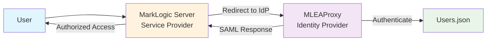

# 🎭 MLEAProxy SAML 2.0 Guide

Complete guide for SAML 2.0 Identity Provider functionality in MLEAProxy.

---

## 📋 Table of Contents

- [Overview](#overview)
- [Quick Start](#quick-start)
- [Endpoints](#endpoints)
- [Configuration](#configuration)
- [Role Resolution](#role-resolution)
- [Usage Examples](#usage-examples)
- [Service Provider Integration](#service-provider-integration)
- [Security](#security)
- [API Reference](#api-reference)

---

## Overview

MLEAProxy provides complete SAML 2.0 Identity Provider (IdP) functionality for Single Sign-On (SSO) authentication.

### 🎯 Key Features

- 🎭 **IdP Functionality**: Full SAML 2.0 Identity Provider implementation
- 📜 **IdP Metadata**: Automated metadata endpoint for SP configuration
- ✍️ **Digital Signatures**: XML signature support for assertions
- 🎫 **Attribute Statements**: Flexible role and attribute mapping
- 🔄 **HTTP-Redirect Binding**: Standard SAML protocol binding support
- 👥 **3-Tier Role Resolution**: Flexible role assignment with fallback (New in 2025)

### 📊 SAML Endpoints

| Endpoint | Method | Purpose | Protocol |
|----------|--------|---------|----------|
| `/saml/auth` | GET | SAML authentication (SSO) | HTTP-Redirect Binding |
| `/saml/idp-metadata` | GET | IdP metadata XML | SAML Metadata |

---

## Quick Start

### Generate IdP Metadata

```bash
# Start MLEAProxy
java -jar mleaproxy.jar

# Get IdP metadata
curl http://localhost:30389/saml/idp-metadata
```

**Response:**

```xml
<?xml version="1.0" encoding="UTF-8"?>
<EntityDescriptor xmlns="urn:oasis:names:tc:SAML:2.0:metadata" 
                  entityID="http://localhost:30389/saml/idp">
  <IDPSSODescriptor protocolSupportEnumeration="urn:oasis:names:tc:SAML:2.0:protocol">
    <KeyDescriptor use="signing">
      <KeyInfo xmlns="http://www.w3.org/2000/09/xmldsig#">
        <X509Data>
          <X509Certificate>MIICmzCCAYMCBgF...</X509Certificate>
        </X509Data>
      </KeyInfo>
    </KeyDescriptor>
    <SingleSignOnService Binding="urn:oasis:names:tc:SAML:2.0:bindings:HTTP-Redirect" 
                        Location="http://localhost:30389/saml/auth"/>
  </IDPSSODescriptor>
</EntityDescriptor>
```

### Test SAML Authentication

```bash
# Redirect user to SAML authentication endpoint
# (Requires base64-encoded SAMLRequest)
curl "http://localhost:30389/saml/auth?SAMLRequest=<base64-request>&RelayState=test"
```

---

## Endpoints

### 1️⃣ Authentication Endpoint (`/saml/auth`)

SAML 2.0 Identity Provider authentication endpoint for SSO.

#### Request Parameters

| Parameter | Required | Description | Example |
|-----------|----------|-------------|---------|
| `SAMLRequest` | Yes | Base64-encoded SAML AuthnRequest | `PHNhbWxwOkF1dGhuUmVx...` |
| `RelayState` | No | Application state to preserve | `https://app.com/return` |
| `userid` | Yes* | Username for authentication | `admin` |
| `password` | Yes* | User password | `secret` |
| `roles` | No | Comma-separated roles (override) | `admin,user` |

*Required in form submission or query parameters

#### Response

HTTP 302 Redirect with POST form containing:

- `SAMLResponse` - Base64-encoded SAML Response
- `RelayState` - Original relay state (if provided)

The response is sent to the Service Provider's Assertion Consumer Service (ACS) URL.

#### SAML Assertion Example

```xml
<saml:Assertion xmlns:saml="urn:oasis:names:tc:SAML:2.0:assertion">
  <saml:Issuer>http://localhost:30389/saml/idp</saml:Issuer>
  <saml:Subject>
    <saml:NameID>admin</saml:NameID>
  </saml:Subject>
  <saml:Conditions>
    <saml:AudienceRestriction>
      <saml:Audience>http://sp.example.com</saml:Audience>
    </saml:AudienceRestriction>
  </saml:Conditions>
  <saml:AttributeStatement>
    <saml:Attribute Name="roles">
      <saml:AttributeValue>admin</saml:AttributeValue>
      <saml:AttributeValue>user</saml:AttributeValue>
    </saml:Attribute>
  </saml:AttributeStatement>
</saml:Assertion>
```

### 2️⃣ IdP Metadata Endpoint (`/saml/idp-metadata`)

SAML 2.0 Identity Provider metadata for Service Provider configuration.

#### Request

**Method:** `GET`  
**No parameters required**

#### Response

Complete IdP metadata XML:

```xml
<?xml version="1.0" encoding="UTF-8"?>
<EntityDescriptor xmlns="urn:oasis:names:tc:SAML:2.0:metadata" 
                  xmlns:ds="http://www.w3.org/2000/09/xmldsig#"
                  entityID="http://localhost:30389/saml/idp">
  
  <IDPSSODescriptor protocolSupportEnumeration="urn:oasis:names:tc:SAML:2.0:protocol">
    
    <!-- Signing Certificate -->
    <KeyDescriptor use="signing">
      <ds:KeyInfo>
        <ds:X509Data>
          <ds:X509Certificate>
            MIICmzCCAYMCBgF...
          </ds:X509Certificate>
        </ds:X509Data>
      </ds:KeyInfo>
    </KeyDescriptor>
    
    <!-- Single Sign-On Service -->
    <SingleSignOnService 
      Binding="urn:oasis:names:tc:SAML:2.0:bindings:HTTP-Redirect" 
      Location="http://localhost:30389/saml/auth"/>
    
  </IDPSSODescriptor>
  
</EntityDescriptor>
```

#### Usage

```bash
# Download metadata
curl http://localhost:30389/saml/idp-metadata > mleaproxy-idp-metadata.xml

# View metadata
curl http://localhost:30389/saml/idp-metadata | xmllint --format -
```

---

## Configuration

### SAML Properties (`saml.properties`)

```properties
# ==========================================
# IdP Configuration
# ==========================================
saml.idp.entity-id=http://localhost:30389/saml/idp
saml.idp.sso-url=http://localhost:30389/saml/auth
saml.idp.metadata-url=http://localhost:30389/saml/idp-metadata

# ==========================================
# Signing Configuration
# ==========================================
saml.signing.enabled=true
saml.signing.algorithm=RSA_SHA256
saml.signing.certificate-path=/path/to/cert.pem
saml.signing.private-key-path=/path/to/key.pem

# ==========================================
# Assertion Configuration
# ==========================================
saml.assertion.lifetime=300                      # 5 minutes
saml.assertion.not-before-skew=60               # 1 minute clock skew
saml.assertion.not-on-or-after-skew=60          # 1 minute clock skew
saml.assertion.audience-restriction=true
saml.assertion.allowed-audiences=sp1.company.com,sp2.company.com

# ==========================================
# Subject Configuration
# ==========================================
saml.assertion.subject-confirmation-method=bearer
saml.assertion.recipient-check=true

# ==========================================
# Attribute Mapping
# ==========================================
saml.attributes.name=displayName
saml.attributes.email=mail
saml.attributes.roles=roles

# ==========================================
# Default Roles (New in 2025)
# ==========================================
# Default roles to assign when user is not found in users.json
# and no roles are specified in the request
# Use comma-separated list of roles
saml.default.roles=user
```

### User Repository Configuration

MLEAProxy uses a JSON-based user repository for SAML authentication.

**Location:** `src/main/resources/users.json`

**Format:**

```json
{
  "baseDN": "ou=users,dc=marklogic,dc=local",
  "users": [
    {
      "dn": "cn=manager",
      "sAMAccountName": "manager",
      "userPassword": "password",
      "displayName": "System Manager",
      "mail": "manager@example.com",
      "roles": ["admin", "manager"]
    },
    {
      "dn": "cn=user1",
      "sAMAccountName": "user1",
      "userPassword": "password",
      "displayName": "Test User 1",
      "mail": "user1@example.com",
      "memberOf": [
        "cn=appreader,ou=groups,dc=marklogic,dc=local",
        "cn=appwriter,ou=groups,dc=marklogic,dc=local"
      ],
      "roles": ["reader", "writer"]
    }
  ]
}
```

### Certificate Configuration

**Generate Self-Signed Certificate (for testing):**

```bash
# Generate RSA private key and self-signed certificate
openssl req -x509 -newkey rsa:2048 \
  -keyout saml-key.pem \
  -out saml-cert.pem \
  -days 365 -nodes \
  -subj "/CN=mleaproxy.company.com/O=Company/C=US"

# Configure in saml.properties
saml.signing.certificate-path=/path/to/saml-cert.pem
saml.signing.private-key-path=/path/to/saml-key.pem
```

**Production Certificate (CA-signed):**

```bash
# Generate CSR
openssl req -new -newkey rsa:2048 \
  -keyout saml-key.pem \
  -out saml-csr.pem \
  -nodes \
  -subj "/CN=mleaproxy.company.com/O=Company/C=US"

# Submit CSR to Certificate Authority
# Receive signed certificate: saml-cert.pem

# Configure in saml.properties
saml.signing.certificate-path=/path/to/saml-cert.pem
saml.signing.private-key-path=/path/to/saml-key.pem
```

---

## Role Resolution

### 🎯 3-Tier Role Resolution System (New in 2025)

MLEAProxy implements the same sophisticated 3-tier priority system for SAML as OAuth:

```
┌─────────────────────────────────────────┐
│  Priority 1: Request Parameter Roles    │  ← Highest Priority
│  (Explicit override via 'roles' param)  │
└─────────────────────────────────────────┘
              ↓ (if not provided)
┌─────────────────────────────────────────┐
│  Priority 2: JSON User Repository       │  ← Medium Priority
│  (User's assigned roles in users.json)  │
└─────────────────────────────────────────┘
              ↓ (if user not found)
┌─────────────────────────────────────────┐
│  Priority 3: Default Configuration      │  ← Lowest Priority
│  (saml.default.roles property)          │
└─────────────────────────────────────────┘
```

### How It Works

#### Priority 1: Request Parameter Roles

When `roles` parameter is provided in the SAML authentication request:

```http
GET /saml/auth?SAMLRequest=<base64>&userid=admin&password=secret&roles=admin,developer
```

**Result:**
- SAML assertion includes: `roles=["admin", "developer"]`
- Overrides user's default roles in users.json

**Use Cases:**
- Testing with specific roles
- Temporary privilege elevation
- Role-based testing scenarios

#### Priority 2: JSON User Repository

When no `roles` parameter is provided and user exists in `users.json`:

```json
{
  "users": [
    {
      "sAMAccountName": "admin",
      "userPassword": "admin",
      "roles": ["admin", "user", "developer"]
    }
  ]
}
```

**Result:**
- SAML assertion includes: `roles=["admin", "user", "developer"]`
- From users.json

**Use Cases:**
- Normal SSO authentication flow
- User-specific role assignment
- Production scenarios

#### Priority 3: Default Configuration

When user is **not found** in `users.json` and no `roles` parameter provided:

```properties
# saml.properties
saml.default.roles=user,guest
```

**Result:**
- SAML assertion includes: `roles=["user", "guest"]`
- From saml.default.roles property

**Use Cases:**
- Guest access
- Default minimal permissions
- Fallback for new users

### Configuration Examples

#### Example 1: Minimal Access by Default

```properties
saml.default.roles=guest,readonly
```

All unknown users get read-only guest access in SAML assertions.

#### Example 2: Standard User Access

```properties
saml.default.roles=user
```

Unknown users get standard user role in SAML assertions.

#### Example 3: No Default Access

```properties
saml.default.roles=
```

Unknown users get no roles (empty attribute).

#### Example 4: Multiple Default Roles

```properties
saml.default.roles=user,viewer,reporter
```

Unknown users get multiple default roles in SAML assertions.

### Logging

Role resolution decisions are logged for troubleshooting:

```log
# Priority 1: Request parameter roles
INFO  - Using roles from request parameter for user 'admin': admin,developer

# Priority 2: JSON user roles
INFO  - Using roles from JSON for user 'admin': admin,user,developer

# Priority 3: Default roles
INFO  - User 'unknown' not found in JSON, using default roles: user

# User found but no roles
INFO  - User 'admin' found in JSON but has no roles assigned
```

---

## Usage Examples

### Scenario 1: Download IdP Metadata

```bash
# Download metadata for SP configuration
curl http://localhost:30389/saml/idp-metadata > mleaproxy-idp.xml

# Format and view
curl http://localhost:30389/saml/idp-metadata | xmllint --format -
```

### Scenario 2: Basic SAML Authentication

Typical SAML SSO flow:

```
1. User accesses Service Provider (SP)
   ↓
2. SP generates SAMLRequest
   ↓
3. User redirected to IdP with SAMLRequest
   GET /saml/auth?SAMLRequest=<base64>&RelayState=<state>
   ↓
4. MLEAProxy authenticates user (form or URL params)
   ↓
5. MLEAProxy generates signed SAMLResponse
   ↓
6. User redirected to SP with SAMLResponse
   POST <SP-ACS-URL>
   SAMLResponse=<base64>
   RelayState=<state>
   ↓
7. SP validates SAMLResponse and creates session
```

### Scenario 3: SAML with Role Override

Test SAML flow with specific roles:

```bash
# Authenticate with custom roles
curl -G http://localhost:30389/saml/auth \
  --data-urlencode "SAMLRequest=$(echo '<saml:AuthnRequest.../>' | base64)" \
  --data-urlencode "userid=testuser" \
  --data-urlencode "password=password" \
  --data-urlencode "roles=admin,developer"
```

**Result:**
- SAML assertion includes: `roles=["admin", "developer"]`
- Original user roles from users.json ignored

### Scenario 4: SAML with Default Roles

Authenticate unknown user:

```bash
# Authenticate user not in repository
curl -G http://localhost:30389/saml/auth \
  --data-urlencode "SAMLRequest=$(echo '<saml:AuthnRequest.../>' | base64)" \
  --data-urlencode "userid=new_user" \
  --data-urlencode "password=password"
```

**Result:**
- User `new_user` not found in users.json
- SAML assertion includes default roles: `["user"]`

### Scenario 5: Extract and Decode SAML Response

```bash
# Intercept SAML response (in browser network tools or proxy)
# Extract SAMLResponse value
SAML_RESPONSE="PD94bWwgdmVyc2lvbj0iMS4w..."

# Decode and format
echo "$SAML_RESPONSE" | base64 -d | xmllint --format -
```

---

## Service Provider Integration

### MarkLogic Server Configuration

MarkLogic Server acts as a **Service Provider (SP)** that redirects users to MLEAProxy (the Identity Provider) for authentication. When a user attempts to access MarkLogic, they are redirected to MLEAProxy's SAML endpoint, authenticated, and then redirected back to MarkLogic with a SAML assertion containing user information and roles.

#### Configuration Overview



#### Step 1: Get MLEAProxy IdP Metadata

First, retrieve the Identity Provider metadata from MLEAProxy:

```bash
# Get IdP metadata
curl http://localhost:30389/saml/idp-metadata > mleaproxy-idp-metadata.xml

# View the metadata
cat mleaproxy-idp-metadata.xml
```

The metadata contains the IdP certificate you'll need for MarkLogic configuration.

#### Step 2: Extract IdP Certificate

Extract the X.509 certificate from the metadata:

```bash
# Extract certificate from metadata XML
grep -A 50 "X509Certificate" mleaproxy-idp-metadata.xml | \
  grep -v "X509Certificate" | \
  sed 's/^[[:space:]]*//' > idp-cert-base64.txt

# Convert to PEM format
echo "-----BEGIN CERTIFICATE-----" > idp-cert.pem
cat idp-cert-base64.txt >> idp-cert.pem
echo "-----END CERTIFICATE-----" >> idp-cert.pem

# View certificate details
openssl x509 -in idp-cert.pem -text -noout
```

#### Step 3: Create External Security Configuration

In **MarkLogic Admin Console** (http://localhost:8001):

**Navigate to:** Security → External Security → Create

**External Security Configuration:**

| Setting | Value | Notes |
|---------|-------|-------|
| **external security name** | `mleaproxy-saml` | Unique identifier |
| **description** | `SAML authentication via MLEAProxy` | Optional description |
| **authentication** | `saml` | Authentication protocol |
| **cache timeout** | `300` | Login cache timeout in seconds (5 minutes) |
| **authorization** | `saml` | Authorization scheme |

**SAML Server Configuration:**

| Setting | Value | Example |
|---------|-------|---------|
| **SAML entity ID** | `http://localhost:30389/saml/idp` | IdP Entity ID from metadata |
| **SAML destination** | `http://localhost:30389/saml/auth` | IdP SSO endpoint URL |
| **SAML issuer** | `marklogic-server` | Your MarkLogic server identifier |
| **SAML assertion host** | `localhost:8000` | Your MarkLogic app server host:port |
| **SAML IDP certificate authority** | *(see below)* | PEM-encoded X.509 certificate |

**SAML IDP Certificate Authority (Example):**

Paste the complete PEM certificate from Step 2:

```
-----BEGIN CERTIFICATE-----
MIIDyzCCArOgAwIBAgIUVfpV56K9w6BsaPh9Wd6nRzF4zB0wDQYJKoZIhvcNAQEL
BQAwdTELMAkGA1UEBhMCVVMxDjAMBgNVBAgMBVN0YXRlMQ0wCwYDVQQHDARDaXR5
MRUwEwYDVQQKDAxPcmdhbml6YXRpb24xDTALBgNVBAsMBFVuaXQxITAfBgNVBAMM
GFNBTUwgU2lnbmluZyBDZXJ0aWZpY2F0ZTAeFw0yNTEwMDMxMjU5MDFaFw0zNTEw
MDExMjU5MDFaMHUxCzAJBgNVBAYTAlVTMQ4wDAYDVQQIDAVTdGF0ZTENMAsGA1UE
BwwEQ2l0eTEVMBMGA1UECgwMT3JnYW5pemF0aW9uMQ0wCwYDVQQLDARVbml0MSEw
HwYDVQQDDBhTQU1MIFNpZ25pbmcgQ2VydGlmaWNhdGUwggEiMA0GCSqGSIb3DQEB
AQUAA4IBDwAwggEKAoIBAQC0cI6uJcEbNg/tpEFDW8cfAuKOOLLEOoikFqfVHs3z
8q/Rkj7NlzIT9yUi/5ZGoqbw074egpo1087BMW46vEYhAGhfB6FpElk+YiOEf78w
BamIVeYTJJXUfNnvd+ZkSNAqsLRdIeMvYTxirjJAonnYwFGvJ16a80eKftDN4iZ+
s+JKKdYA6qFqkO3SoLgD1MIyiHn7Ud3bDGoEHmq2nFkf+vcu7/eSfzmdWOziBN+0
CriXY3MoAyn3hRw81RJ4xGQi4iw5PMJ0r6WkJPfP85MTwtM9pnh+26HQCo6RUDou
7TwmShjuYY+Q+9zXPlr70mkitsxwPTONVaxqzOj2Vn2dAgMBAAGjUzBRMB0GA1Ud
DgQWBBTKfGm/kXVS2vr4RpJweTgE0K3G9zAfBgNVHSMEGDAWgBTKfGm/kXVS2vr4
RpJweTgE0K3G9zAPBgNVHRMBAf8EBTADAQH/MA0GCSqGSIb3DQEBCwUAA4IBAQBQ
vZuRV2cMpZKx4QK0y9eEtSZnfNJfrQLdQpBfR7VfcCkLHVwWSdGXT0oQndO5UhVd
w2YhhIpNGvf6ufIhqSEtgZJnyklRagfysEspM3EsmwLkvA0msDA4MW/SUH1XF5Tn
L7Zts2rYRSpnF67+S8uBXXfQcCtbuS8f0uVJWkXp1YA9BEHYkWp/kIpX4owwWNMX
pHwWbAPghhoONjDhG2fVVB9aywfcUcnN3ovXWzN9AgInK4LWzQyQ9S34Jdx9KZpF
He8P5aP3uGJOA6pOiKeMWKCbiUzJoL8ccStdckJswc27u0qQbwvmmUgfeCbEOMWP
H4Q7WSiUTjRF5Ig3ibuh
-----END CERTIFICATE-----
```

> **Note:** This is your MLEAProxy IdP certificate. Get the actual certificate from your IdP metadata endpoint.

#### Step 4: Configure App Server

**Navigate to:** Configure → App Servers → [Your App Server] (e.g., port 8000)

**Authentication Settings:**

| Setting | Value | Notes |
|---------|-------|-------|
| **authentication** | `application-level` | Enable application-level auth |
| **internal security** | `false` | Disable internal authentication |
| **external security** | `mleaproxy-saml` | Select your external security config |

Click **OK** to save.

#### Step 5: Test SAML Authentication

1. **Access MarkLogic Application:**

   ```bash
   # Open browser to your MarkLogic app
   open http://localhost:8000/
   ```

2. **Automatic Redirect:**
   
   MarkLogic will automatically redirect you to:
   ```
   http://localhost:30389/saml/auth?SAMLRequest=...
   ```

3. **Login Form:**
   
   You'll see MLEAProxy's login page. Enter credentials:
   - **Username:** `user1` (from users.json)
   - **Password:** `password`

4. **SAML Response:**
   
   MLEAProxy authenticates the user and redirects back to MarkLogic with:
   ```xml
   <saml:Assertion>
     <saml:AttributeStatement>
       <saml:Attribute Name="roles">
         <saml:AttributeValue>admin</saml:AttributeValue>
         <saml:AttributeValue>user</saml:AttributeValue>
       </saml:Attribute>
     </saml:AttributeStatement>
   </saml:Assertion>
   ```

5. **Authorized Access:**
   
   MarkLogic receives the assertion, validates the signature, extracts roles, and grants access.

#### Step 6: Verify User and Roles

Check that MarkLogic received the user information:

**XQuery in MarkLogic Query Console:**

```xquery
xquery version "1.0-ml";

(: Get current user :)
let $user := xdmp:get-current-user()

(: Get user roles :)
let $roles := xdmp:get-current-roles()

return (
  <user>{$user}</user>,
  <roles>{
    for $role in $roles
    return <role>{xdmp:role-name($role)}</role>
  }</roles>
)
```

**Expected Output:**

```xml
<user>user1</user>
<roles>
  <role>admin</role>
  <role>user</role>
  <role>reader</role>
</roles>
```

#### Configuration via REST API

You can also configure external security via MarkLogic's Management API:

**Create External Security:**

```bash
curl -X POST http://localhost:8002/manage/v2/external-security \
  -H "Content-Type: application/json" \
  -u admin:admin \
  -d '{
    "external-security-name": "mleaproxy-saml",
    "description": "SAML authentication via MLEAProxy",
    "authentication": "saml",
    "cache-timeout": 300,
    "authorization": "saml",
    "saml-entity-id": "http://localhost:30389/saml/idp",
    "saml-destination": "http://localhost:30389/saml/auth",
    "saml-issuer": "marklogic-server",
    "saml-assertion-host": "localhost:8000",
    "saml-idp-certificate": "-----BEGIN CERTIFICATE-----\nMIIDyzCC...\n-----END CERTIFICATE-----"
  }'
```

**Update App Server:**

```bash
curl -X PUT http://localhost:8002/manage/v2/servers/Default/properties \
  -H "Content-Type: application/json" \
  -u admin:admin \
  -d '{
    "authentication": "application-level",
    "internal-security": false,
    "external-security": "mleaproxy-saml"
  }'
```

#### Troubleshooting MarkLogic Integration

**1. Redirect Loop**

**Symptom:** Browser redirects between MarkLogic and MLEAProxy endlessly

**Solution:**
- Verify `SAML assertion host` matches your MarkLogic app server host:port
- Check `SAML issuer` is consistent
- Ensure cookies are enabled in browser

**2. Invalid Signature**

**Symptom:** `SAML response signature validation failed`

**Solution:**
- Verify certificate in MarkLogic matches IdP metadata exactly
- Check certificate hasn't expired: `openssl x509 -in cert.pem -noout -dates`
- Ensure no extra whitespace in PEM certificate

**3. User Not Found**

**Symptom:** Authentication succeeds but user has no roles

**Solution:**
- Verify user exists in `users.json`
- Check 3-tier role resolution configuration
- Set default roles: `saml.default.roles=user,guest` in saml.properties
- Review MLEAProxy logs for role resolution decisions

**4. Certificate Validation Failed**

**Symptom:** `Unable to validate IdP certificate`

**Solution:**
- Use complete PEM format with BEGIN/END markers
- Verify certificate chain is complete
- Check certificate is not self-signed (or add to trusted CAs)

**Debug Logging:**

Enable SAML debug logging in both systems:

**MLEAProxy (saml.properties):**
```properties
saml.debug=true
logging.level.com.marklogic.handlers.undertow.SAMLAuthHandler=DEBUG
```

**MarkLogic (XQuery):**
```xquery
xdmp:log("SAML Authentication", "debug")
```

#### Complete MarkLogic Configuration Example

**External Security XML (for reference):**

```xml
<external-security xmlns="http://marklogic.com/manage/security">
  <external-security-name>mleaproxy-saml</external-security-name>
  <description>SAML authentication via MLEAProxy Identity Provider</description>
  <authentication>saml</authentication>
  <cache-timeout>300</cache-timeout>
  <authorization>saml</authorization>
  <saml-entity-id>http://localhost:30389/saml/idp</saml-entity-id>
  <saml-destination>http://localhost:30389/saml/auth</saml-destination>
  <saml-issuer>marklogic-server</saml-issuer>
  <saml-assertion-host>localhost:8000</saml-assertion-host>
  <saml-idp-certificate>
-----BEGIN CERTIFICATE-----
MIIDyzCCArOgAwIBAgIUVfpV56K9w6BsaPh9Wd6nRzF4zB0wDQYJKoZIhvcNAQEL
BQAwdTELMAkGA1UEBhMCVVMxDjAMBgNVBAgMBVN0YXRlMQ0wCwYDVQQHDARDaXR5
MRUwEwYDVQQKDAxPcmdhbml6YXRpb24xDTALBgNVBAsMBFVuaXQxITAfBgNVBAMM
GFNBTUwgU2lnbmluZyBDZXJ0aWZpY2F0ZTAeFw0yNTEwMDMxMjU5MDFaFw0zNTEw
MDExMjU5MDFaMHUxCzAJBgNVBAYTAlVTMQ4wDAYDVQQIDAVTdGF0ZTENMAsGA1UE
BwwEQ2l0eTEVMBMGA1UECgwMT3JnYW5pemF0aW9uMQ0wCwYDVQQLDARVbml0MSEw
HwYDVQQDDBhTQU1MIFNpZ25pbmcgQ2VydGlmaWNhdGUwggEiMA0GCSqGSIb3DQEB
AQUAA4IBDwAwggEKAoIBAQC0cI6uJcEbNg/tpEFDW8cfAuKOOLLEOoikFqfVHs3z
8q/Rkj7NlzIT9yUi/5ZGoqbw074egpo1087BMW46vEYhAGhfB6FpElk+YiOEf78w
BamIVeYTJJXUfNnvd+ZkSNAqsLRdIeMvYTxirjJAonnYwFGvJ16a80eKftDN4iZ+
s+JKKdYA6qFqkO3SoLgD1MIyiHn7Ud3bDGoEHmq2nFkf+vcu7/eSfzmdWOziBN+0
CriXY3MoAyn3hRw81RJ4xGQi4iw5PMJ0r6WkJPfP85MTwtM9pnh+26HQCo6RUDou
7TwmShjuYY+Q+9zXPlr70mkitsxwPTONVaxqzOj2Vn2dAgMBAAGjUzBRMB0GA1Ud
DgQWBBTKfGm/kXVS2vr4RpJweTgE0K3G9zAfBgNVHSMEGDAWgBTKfGm/kXVS2vr4
RpJweTgE0K3G9zAPBgNVHRMBAf8EBTADAQH/MA0GCSqGSIb3DQEBCwUAA4IBAQBQ
vZuRV2cMpZKx4QK0y9eEtSZnfNJfrQLdQpBfR7VfcCkLHVwWSdGXT0oQndO5UhVd
w2YhhIpNGvf6ufIhqSEtgZJnyklRagfysEspM3EsmwLkvA0msDA4MW/SUH1XF5Tn
L7Zts2rYRSpnF67+S8uBXXfQcCtbuS8f0uVJWkXp1YA9BEHYkWp/kIpX4owwWNMX
pHwWbAPghhoONjDhG2fVVB9aywfcUcnN3ovXWzN9AgInK4LWzQyQ9S34Jdx9KZpF
He8P5aP3uGJOA6pOiKeMWKCbiUzJoL8ccStdckJswc27u0qQbwvmmUgfeCbEOMWP
H4Q7WSiUTjRF5Ig3ibuh
-----END CERTIFICATE-----
  </saml-idp-certificate>
</external-security>
```

---

### Okta Configuration

**1. Create SAML Application:**

1. Log into Okta Admin Console
2. Navigate to **Applications** → **Create App Integration**
3. Select **SAML 2.0**
4. Enter Application Name

**2. Configure SAML Settings:**

```
General Settings:
  App Name: MLEAProxy SAML

SAML Settings:
  Single sign on URL: http://localhost:30389/saml/auth
  Audience URI (SP Entity ID): http://localhost:30389/saml/idp
  Default RelayState: (leave blank)
  Name ID format: EmailAddress or unspecified
  Application username: Email or Okta username

Attribute Statements:
  Name: roles
  Value: user.roles

  Name: email  
  Value: user.email

  Name: displayName
  Value: user.displayName
```

**3. Upload IdP Metadata:**

```bash
# Download MLEAProxy metadata
curl http://localhost:30389/saml/idp-metadata > mleaproxy-idp.xml

# Upload to Okta:
# SAML Settings → Identity Provider Metadata → Upload File
```

**4. Test SSO:**

- Click **View Setup Instructions**
- Copy IdP metadata URL
- Test SSO connection

### Azure AD Configuration

**1. Create Enterprise Application:**

```bash
# Using Azure CLI
az ad app create \
  --display-name "MLEAProxy SAML" \
  --identifier-uris "http://localhost:30389/saml/idp" \
  --reply-urls "http://localhost:30389/saml/auth"
```

**2. Configure SAML (Azure Portal):**

1. Navigate to **Azure AD** → **Enterprise Applications**
2. Select your application
3. Go to **Single sign-on** → Select **SAML**

```
Basic SAML Configuration:
  Identifier (Entity ID): http://localhost:30389/saml/idp
  Reply URL (ACS URL): http://localhost:30389/saml/auth
  Sign on URL: http://localhost:30389/saml/auth

User Attributes & Claims:
  roles: user.assignedroles
  email: user.mail
  displayName: user.displayname
```

**3. Download Metadata:**

```bash
# From Azure AD SAML settings
# Download Federation Metadata XML

# Configure MLEAProxy to trust Azure AD certificate
```

**4. Test SSO:**

- Use Azure AD Test button
- Or access application URL directly

### SimpleSAMLphp Configuration

**1. Download IdP Metadata:**

```bash
curl http://localhost:30389/saml/idp-metadata > metadata/mleaproxy-idp.xml
```

**2. Configure authsources.php:**

```php
<?php
// config/authsources.php

$config = [
    'mleaproxy-sp' => [
        'saml:SP',
        
        // IdP metadata
        'idp' => 'http://localhost:30389/saml/idp',
        
        // Or use metadata file
        'metadata.sign.enable' => true,
        'metadata.sign.privatekey' => 'server.pem',
        'metadata.sign.certificate' => 'server.crt',
    ],
];
```

**3. Configure metadata/saml20-idp-remote.php:**

```php
<?php
// metadata/saml20-idp-remote.php

$metadata['http://localhost:30389/saml/idp'] = [
    'SingleSignOnService' => 'http://localhost:30389/saml/auth',
    'certData' => 'MIICmzCCAYMCBgF...',  // From IdP metadata
];
```

**4. Test:**

```php
// Access SimpleSAMLphp test page
https://your-sp.com/simplesaml/module.php/core/authenticate.php?as=mleaproxy-sp
```

### Generic Service Provider

**Required Information from IdP Metadata:**

```xml
<!-- From /saml/idp-metadata -->

Entity ID: http://localhost:30389/saml/idp

SSO URL: http://localhost:30389/saml/auth

Binding: urn:oasis:names:tc:SAML:2.0:bindings:HTTP-Redirect

Certificate: <X509Certificate>MIICmzCCAYMCBgF...</X509Certificate>
```

**Configure in SP:**

1. **IdP Entity ID**: `http://localhost:30389/saml/idp`
2. **SSO URL**: `http://localhost:30389/saml/auth`
3. **Binding**: HTTP-Redirect
4. **Certificate**: Copy from IdP metadata
5. **NameID Format**: `urn:oasis:names:tc:SAML:1.1:nameid-format:unspecified`
6. **Attribute Mapping**:
   - `roles` → Application roles
   - `email` → User email
   - `displayName` → User display name

---

## Security

### 1. XML Signature Support

**Enable Digital Signatures:**

```properties
saml.signing.enabled=true
saml.signing.algorithm=RSA_SHA256
saml.signing.certificate-path=/path/to/cert.pem
saml.signing.private-key-path=/path/to/key.pem
```

**Signature Algorithms:**

- `RSA_SHA256` (Recommended)
- `RSA_SHA384`
- `RSA_SHA512`

**Verification:**

Service Providers verify signatures using the certificate from IdP metadata.

### 2. XML Injection Protection

**Automatic Security Features:**

- Schema validation against OASIS SAML schemas
- Entity expansion limits (max 10)
- Attribute count limits (max 100)
- DOCTYPE declarations disallowed
- External entities blocked

**Secure XML Parser Configuration:**

```java
// Automatic configuration
- Maximum entity expansions: 10
- Disallow DOCTYPE declarations
- Secure processing enabled
- External DTD loading disabled
```

### 3. Assertion Security

**Time Constraints:**

```properties
# Assertion valid for 5 minutes
saml.assertion.lifetime=300

# Allow 1 minute clock skew
saml.assertion.not-before-skew=60
saml.assertion.not-on-or-after-skew=60
```

**Audience Restrictions:**

```properties
# Enable audience checking
saml.assertion.audience-restriction=true

# Allowed audiences
saml.assertion.allowed-audiences=sp1.company.com,sp2.company.com
```

**Subject Confirmation:**

```properties
# Bearer confirmation method
saml.assertion.subject-confirmation-method=bearer

# Verify recipient
saml.assertion.recipient-check=true
```

### 4. Best Practices

**Production Checklist:**

- [ ] Use CA-signed certificates (not self-signed)
- [ ] Enable HTTPS for all SAML endpoints
- [ ] Use strong RSA keys (2048+ bits)
- [ ] Set short assertion lifetime (5-10 minutes)
- [ ] Enable audience restrictions
- [ ] Verify recipient in subject confirmation
- [ ] Implement replay prevention
- [ ] Monitor for unusual assertion patterns
- [ ] Rotate signing certificates regularly
- [ ] Enable audit logging
- [ ] Validate all SP metadata
- [ ] Use signed metadata when possible

**Secure Configuration:**

```properties
# HTTPS endpoints (production)
saml.idp.entity-id=https://auth.company.com/saml/idp
saml.idp.sso-url=https://auth.company.com/saml/auth
saml.idp.metadata-url=https://auth.company.com/saml/idp-metadata

# Strong signatures
saml.signing.enabled=true
saml.signing.algorithm=RSA_SHA256

# Short assertion lifetime
saml.assertion.lifetime=300

# Audience restrictions
saml.assertion.audience-restriction=true
saml.assertion.allowed-audiences=prod-sp1.company.com,prod-sp2.company.com

# Subject confirmation
saml.assertion.subject-confirmation-method=bearer
saml.assertion.recipient-check=true
```

### 5. Certificate Management

**Certificate Expiration Monitoring:**

```bash
# Check certificate expiration
openssl x509 -in saml-cert.pem -noout -dates

# Check certificate details
openssl x509 -in saml-cert.pem -noout -text
```

**Certificate Rotation:**

```bash
# Generate new certificate
openssl req -x509 -newkey rsa:2048 \
  -keyout saml-key-new.pem \
  -out saml-cert-new.pem \
  -days 365 -nodes

# Update configuration
saml.signing.certificate-path=/path/to/saml-cert-new.pem
saml.signing.private-key-path=/path/to/saml-key-new.pem

# Restart MLEAProxy

# Update all Service Providers with new metadata
curl https://auth.company.com/saml/idp-metadata > new-metadata.xml
```

---

## API Reference

### Configuration Properties

```properties
# ==========================================
# IdP Configuration
# ==========================================
saml.idp.entity-id=http://localhost:30389/saml/idp
saml.idp.sso-url=http://localhost:30389/saml/auth
saml.idp.metadata-url=http://localhost:30389/saml/idp-metadata

# ==========================================
# Signing Configuration
# ==========================================
saml.signing.enabled=true                        # Default: true
saml.signing.algorithm=RSA_SHA256                # Default: RSA_SHA256
saml.signing.certificate-path=/path/to/cert.pem  # Required if signing enabled
saml.signing.private-key-path=/path/to/key.pem   # Required if signing enabled

# ==========================================
# Assertion Configuration
# ==========================================
saml.assertion.lifetime=300                      # Default: 300 seconds
saml.assertion.not-before-skew=60               # Default: 60 seconds
saml.assertion.not-on-or-after-skew=60          # Default: 60 seconds
saml.assertion.audience-restriction=true         # Default: true
saml.assertion.allowed-audiences=sp1,sp2         # Comma-separated

# ==========================================
# Subject Configuration
# ==========================================
saml.assertion.subject-confirmation-method=bearer # Default: bearer
saml.assertion.recipient-check=true              # Default: true

# ==========================================
# Attribute Mapping
# ==========================================
saml.attributes.name=displayName                 # Default: displayName
saml.attributes.email=mail                       # Default: mail
saml.attributes.roles=roles                      # Default: roles

# ==========================================
# Default Roles (New in 2025)
# ==========================================
saml.default.roles=user                          # Comma-separated list
```

### SAML Request Parameters

| Parameter | Required | Type | Description |
|-----------|----------|------|-------------|
| `SAMLRequest` | Yes | String (Base64) | Encoded SAML AuthnRequest |
| `RelayState` | No | String | Application state to preserve |
| `userid` | Yes | String | Username for authentication |
| `password` | Yes | String | User password |
| `roles` | No | String | Comma-separated roles override |

### SAML Response Format

```xml
<samlp:Response xmlns:samlp="urn:oasis:names:tc:SAML:2.0:protocol"
                ID="_unique-id"
                Version="2.0"
                IssueInstant="2025-01-01T12:00:00Z"
                Destination="https://sp.example.com/acs">
  
  <saml:Issuer>http://localhost:30389/saml/idp</saml:Issuer>
  
  <samlp:Status>
    <samlp:StatusCode Value="urn:oasis:names:tc:SAML:2.0:status:Success"/>
  </samlp:Status>
  
  <saml:Assertion xmlns:saml="urn:oasis:names:tc:SAML:2.0:assertion"
                  ID="_assertion-id"
                  Version="2.0"
                  IssueInstant="2025-01-01T12:00:00Z">
    
    <saml:Issuer>http://localhost:30389/saml/idp</saml:Issuer>
    
    <!-- Digital Signature (if enabled) -->
    <ds:Signature xmlns:ds="http://www.w3.org/2000/09/xmldsig#">
      ...
    </ds:Signature>
    
    <saml:Subject>
      <saml:NameID>admin</saml:NameID>
      <saml:SubjectConfirmation Method="urn:oasis:names:tc:SAML:2.0:cm:bearer">
        <saml:SubjectConfirmationData 
          NotOnOrAfter="2025-01-01T12:05:00Z"
          Recipient="https://sp.example.com/acs"/>
      </saml:SubjectConfirmation>
    </saml:Subject>
    
    <saml:Conditions 
      NotBefore="2025-01-01T11:59:00Z"
      NotOnOrAfter="2025-01-01T12:05:00Z">
      <saml:AudienceRestriction>
        <saml:Audience>https://sp.example.com</saml:Audience>
      </saml:AudienceRestriction>
    </saml:Conditions>
    
    <saml:AttributeStatement>
      <saml:Attribute Name="roles">
        <saml:AttributeValue>admin</saml:AttributeValue>
        <saml:AttributeValue>user</saml:AttributeValue>
      </saml:Attribute>
      <saml:Attribute Name="email">
        <saml:AttributeValue>admin@example.com</saml:AttributeValue>
      </saml:Attribute>
      <saml:Attribute Name="displayName">
        <saml:AttributeValue>Administrator</saml:AttributeValue>
      </saml:Attribute>
    </saml:AttributeStatement>
    
  </saml:Assertion>
  
</samlp:Response>
```

---

## Standards References

- [OASIS SAML 2.0](http://docs.oasis-open.org/security/saml/v2.0/) - Security Assertion Markup Language
- [SAML 2.0 Metadata](http://docs.oasis-open.org/security/saml/v2.0/saml-metadata-2.0-os.pdf) - Metadata Specification
- [SAML 2.0 Bindings](http://docs.oasis-open.org/security/saml/v2.0/saml-bindings-2.0-os.pdf) - Protocol Bindings
- [SAML 2.0 Profiles](http://docs.oasis-open.org/security/saml/v2.0/saml-profiles-2.0-os.pdf) - Profiles Specification

---

## Related Documentation

- **[README.md](./README.md)** - General application overview
- **[LDAP_GUIDE.md](./LDAP_GUIDE.md)** - LDAP functionality
- **[OAUTH_GUIDE.md](./OAUTH_GUIDE.md)** - OAuth 2.0 functionality
- **[SAML_IDP_METADATA_COMPLETE.md](./SAML_IDP_METADATA_COMPLETE.md)** - Detailed IdP metadata documentation
- **[TESTING_GUIDE.md](./TESTING_GUIDE.md)** - Testing procedures

---

<div align="center">

**[⬆ Back to Top](#-mleaproxy-saml-20-guide)**

</div>
