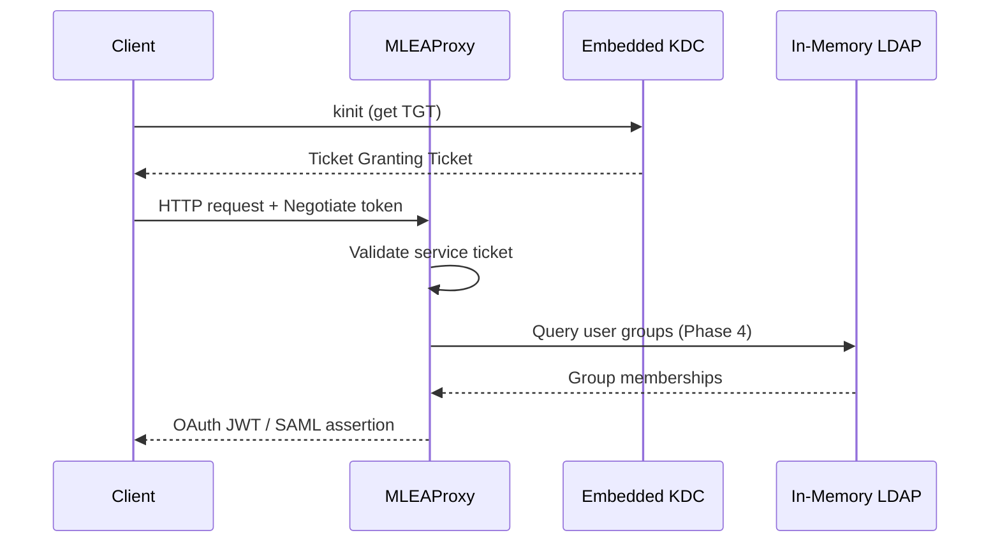

# 🎫 MLEAProxy Kerberos Guide

Complete guide for Kerberos authentication, SPNEGO, and OAuth/SAML protocol bridges in MLEAProxy.

---

## 📋 Table of Contents

- [Overview](#overview)
- [Quick Start](#quick-start)
- [Architecture](#architecture)
- [Configuration](#configuration)
- [Kerberos Endpoints](#kerberos-endpoints)
- [Phase 4 Enhancements](#phase-4-enhancements)
- [Phase 2: SPNEGO Authentication (Detailed)](#phase-2-spnego-authentication-detailed)
- [Phase 3: OAuth/SAML Bridges (Detailed)](#phase-3-oauthsaml-bridges-detailed)
- [Phase 4: LDAP Integration & Refresh Tokens (Detailed)](#phase-4-ldap-integration--refresh-tokens-detailed)
- [Security Best Practices](#security-best-practices)
- [Troubleshooting](#troubleshooting)
- [Related Documentation](#related-documentation)

---

## Overview

MLEAProxy provides comprehensive Kerberos support with the following features:

### 🎯 Key Features

- **Embedded Kerberos KDC**: Apache Kerby 2.0.3 for development and testing
- **SPNEGO Authentication**: HTTP Negotiate authentication (RFC 4559)
- **OAuth Bridge**: Exchange Kerberos tickets for OAuth JWT tokens
- **SAML Bridge**: Exchange Kerberos tickets for SAML 2.0 assertions
- **LDAP Integration**: Query LDAP for group-based role resolution (Phase 4)
- **Refresh Tokens**: OAuth 2.0 refresh token support with rotation (Phase 4)
- **Multi-tier Role Resolution**: JSON → LDAP → defaults (Phase 4)

### 🔌 Kerberos Implementation Phases

MLEAProxy's Kerberos support was implemented in 4 phases:

| Phase | Feature | Status | Documentation |
|-------|---------|--------|---------------|
| **Phase 1** | Embedded Kerberos KDC | ✅ Complete | [KERBEROS_PHASE1_COMPLETE.md](./KERBEROS_PHASE1_COMPLETE.md) |
| **Phase 2** | SPNEGO HTTP Authentication | ✅ Complete | [KERBEROS_PHASE2_COMPLETE.md](./KERBEROS_PHASE2_COMPLETE.md) |
| **Phase 3** | OAuth/SAML Protocol Bridges | ✅ Complete | [KERBEROS_PHASE3_COMPLETE.md](./KERBEROS_PHASE3_COMPLETE.md) |
| **Phase 4** | LDAP Integration & Refresh Tokens | ⏳ 60% Complete | [KERBEROS_PHASE4_QUICK_REF.md](./KERBEROS_PHASE4_QUICK_REF.md) |

---

## Quick Start

### Prerequisites

- ☕ **Java 21+** (OpenJDK LTS recommended)
- 🔨 **Maven 3.9+** (for building)
- 🎫 **Kerberos Client** (kinit, MIT Kerberos or Windows)

### Enable Kerberos

```properties
# kerberos.properties
kerberos.enabled=true
kerberos.realm=MARKLOGIC.LOCAL
kerberos.kdc.host=localhost
kerberos.kdc.port=88
kerberos.service-principal=HTTP/localhost@MARKLOGIC.LOCAL
kerberos.keytab-location=./kerberos/keytabs/service.keytab
```

### Basic Usage

```bash
# 1. Start MLEAProxy with Kerberos enabled
java -jar mleaproxy.jar

# 2. Get Kerberos ticket
kinit mluser1@MARKLOGIC.LOCAL
# Password: password

# 3. Test SPNEGO authentication
curl --negotiate -u : http://localhost:8080/api/protected

# 4. Exchange Kerberos ticket for OAuth JWT
curl --negotiate -u : -X POST http://localhost:8080/oauth/token-from-kerberos

# 5. Exchange Kerberos ticket for SAML assertion
curl --negotiate -u : -X POST http://localhost:8080/saml/assertion-from-kerberos
```

---

## Architecture

### Kerberos Authentication Flow



### Component Architecture

```
┌─────────────────────────────────────────────────────────────┐
│                      MLEAProxy Server                        │
├─────────────────────────────────────────────────────────────┤
│  ┌───────────────────────────────────────────────────────┐  │
│  │         Embedded Kerberos KDC (Phase 1)              │  │
│  │  • Apache Kerby 2.0.3                                │  │
│  │  • Realm: MARKLOGIC.LOCAL                            │  │
│  │  • User principals and keytabs                       │  │
│  └───────────────────────────────────────────────────────┘  │
│                            ↓                                 │
│  ┌───────────────────────────────────────────────────────┐  │
│  │     SPNEGO Authentication Layer (Phase 2)            │  │
│  │  • HTTP Negotiate support                            │  │
│  │  • JAAS/GSS-API validation                           │  │
│  │  • Service principal authentication                   │  │
│  └───────────────────────────────────────────────────────┘  │
│                            ↓                                 │
│  ┌──────────────────────┬────────────────────────────────┐  │
│  │  OAuth Bridge        │  SAML Bridge                   │  │
│  │  (Phase 3)           │  (Phase 3)                     │  │
│  │  • JWT generation    │  • SAML 2.0 assertions        │  │
│  │  • RSA signing       │  • XML generation             │  │
│  │  • Role claims       │  • Attribute statements       │  │
│  └──────────────────────┴────────────────────────────────┘  │
│                            ↓                                 │
│  ┌───────────────────────────────────────────────────────┐  │
│  │       Role Resolution Layer (Phase 4)                 │  │
│  │  1. JSON User Repository                             │  │
│  │  2. LDAP Group Queries ← NEW!                        │  │
│  │  3. Default Configuration                            │  │
│  └───────────────────────────────────────────────────────┘  │
│                            ↓                                 │
│  ┌───────────────────────────────────────────────────────┐  │
│  │      Token Management (Phase 4)                       │  │
│  │  • Refresh token service ← NEW!                      │  │
│  │  • Token rotation                                     │  │
│  │  • Automatic expiration                              │  │
│  └───────────────────────────────────────────────────────┘  │
└─────────────────────────────────────────────────────────────┘
```

---

## Configuration

### Complete Kerberos Configuration

```properties
# ================================================================
# KERBEROS CONFIGURATION
# ================================================================

# ----- Core Kerberos Settings -----
kerberos.enabled=true
kerberos.realm=MARKLOGIC.LOCAL
kerberos.kdc.host=localhost
kerberos.kdc.port=88

# ----- Service Principal -----
kerberos.service-principal=HTTP/localhost@MARKLOGIC.LOCAL
kerberos.keytab-location=./kerberos/keytabs/service.keytab

# ----- Debug Options -----
kerberos.debug=false
sun.security.krb5.debug=false

# ----- OAuth Bridge Settings -----
oauth.token.expiration.seconds=3600
oauth.jwt.issuer=mleaproxy-oauth-server
oauth.signing.key.path=classpath:static/certificates/privkey.pem
oauth.default.roles=user

# ----- SAML Bridge Settings -----
saml.issuer=http://localhost:8080
saml.assertion.validity.seconds=300
saml.default.roles=user

# ================================================================
# PHASE 4 ENHANCEMENTS
# ================================================================

# ----- LDAP Role Integration -----
ldap.role.query.enabled=true
ldap.role.query.host=localhost
ldap.role.query.port=60389
ldap.role.query.base-dn=dc=MarkLogic,dc=Local
ldap.role.query.bind-dn=cn=Directory Manager
ldap.role.query.bind-password=password
ldap.role.query.user-filter=(uid={0})
ldap.role.query.group-attribute=memberOf

# Optional: explicit group-to-role mapping
ldap.role.mapping=\
  cn=app-readers,ou=groups,dc=marklogic,dc=local=reader,\
  cn=app-writers,ou=groups,dc=marklogic,dc=local=writer,\
  cn=admins,ou=groups,dc=marklogic,dc=local=admin

# ----- OAuth Refresh Tokens -----
oauth.refresh.token.enabled=true
oauth.refresh.token.expiry.seconds=2592000  # 30 days
oauth.refresh.token.cleanup.interval.seconds=3600  # 1 hour
```

### Configuration Files

MLEAProxy uses multiple configuration files for different protocols:

| File | Purpose | Contains |
|------|---------|----------|
| `kerberos.properties` | Kerberos configuration | KDC, realm, principals, keytabs |
| `oauth.properties` | OAuth settings | JWT signing, token expiration, refresh tokens |
| `saml.properties` | SAML settings | Assertion validity, signing certificates |
| `ldap.properties` | LDAP settings | Servers, listeners, in-memory directories |
| `mleaproxy.properties` | Main config | Application properties, feature toggles |

---

## Kerberos Endpoints

### OAuth Bridge Endpoints

#### POST /oauth/token-from-kerberos

Exchange a Kerberos ticket for an OAuth JWT access token.

**Request:**
```bash
curl --negotiate -u : -X POST \
  http://localhost:8080/oauth/token-from-kerberos
```

**Response:**
```json
{
  "access_token": "eyJhbGciOiJSUzI1NiIsImtpZCI6IjE3Y2UwNDc0MjgyYmEwMDEifQ...",
  "token_type": "Bearer",
  "expires_in": 3600,
  "scope": "app-reader app-writer admin",
  "refresh_token": "a1b2c3d4-e5f6-7890-abcd-ef1234567890...",
  "principal": "mluser1",
  "kerberos_principal": "mluser1@MARKLOGIC.LOCAL",
  "roles": ["app-reader", "app-writer", "admin"],
  "auth_method": "kerberos-oauth-bridge"
}
```

**Features:**
- Validates Kerberos ticket using JAAS/GSS-API
- Extracts principal from ticket
- Queries JSON repository → LDAP → defaults for roles (Phase 4)
- Generates RSA-signed JWT
- Includes refresh token (Phase 4)

#### POST /oauth/refresh (Phase 4)

Refresh an OAuth access token using a refresh token.

**Request:**
```bash
curl -X POST http://localhost:8080/oauth/refresh \
  -d "grant_type=refresh_token" \
  -d "refresh_token=YOUR_REFRESH_TOKEN"
```

**Response:**
```json
{
  "access_token": "eyJhbGciOiJSUzI1NiIsImtpZCI6IjE3Y2UwNDc0MjgyYmEwMDEifQ...",
  "token_type": "Bearer",
  "expires_in": 3600,
  "scope": "app-reader app-writer admin",
  "refresh_token": "NEW_REFRESH_TOKEN...",
  "principal": "mluser1",
  "auth_method": "refresh_token"
}
```

**Features:**
- Single-use refresh tokens (consumed on use)
- Token rotation (old token invalidated, new issued)
- No Kerberos authentication required
- Automatic expiration (30 days default)

### SAML Bridge Endpoint

#### POST /saml/assertion-from-kerberos

Exchange a Kerberos ticket for a SAML 2.0 assertion.

**Request:**
```bash
curl --negotiate -u : -X POST \
  http://localhost:8080/saml/assertion-from-kerberos
```

**Response:**
```xml
<?xml version="1.0" encoding="UTF-8"?>
<Assertion xmlns="urn:oasis:names:tc:SAML:2.0:assertion"
           ID="_a1b2c3d4-e5f6-7890-abcd-ef1234567890"
           IssueInstant="2025-10-07T14:30:00Z"
           Version="2.0">
  <Issuer>http://localhost:8080</Issuer>
  <Subject>
    <NameID Format="urn:oasis:names:tc:SAML:1.1:nameid-format:unspecified">
      mluser1@MARKLOGIC.LOCAL
    </NameID>
  </Subject>
  <Conditions NotBefore="2025-10-07T14:30:00Z"
              NotOnOrAfter="2025-10-07T14:35:00Z"/>
  <AttributeStatement>
    <Attribute Name="username">
      <AttributeValue>mluser1</AttributeValue>
    </Attribute>
    <Attribute Name="roles">
      <AttributeValue>app-reader</AttributeValue>
      <AttributeValue>app-writer</AttributeValue>
      <AttributeValue>admin</AttributeValue>
    </Attribute>
  </AttributeStatement>
</Assertion>
```

**Features:**
- Validates Kerberos ticket
- Generates SAML 2.0 assertion XML
- Queries JSON repository → LDAP → defaults for attributes (Phase 4)
- Configurable assertion validity (5 minutes default)

---

## Phase 4 Enhancements

### 1. LDAP Role Integration

**Feature**: Query in-memory LDAP for group-based role resolution.

**Benefits:**
- Dynamic role assignment based on LDAP groups
- No need to maintain roles in JSON file
- Supports enterprise LDAP/Active Directory integration

**Configuration:**
```properties
ldap.role.query.enabled=true
ldap.role.query.host=localhost
ldap.role.query.port=60389
ldap.role.query.base-dn=dc=MarkLogic,dc=Local
```

**Example:**
```bash
# User exists in LDAP with groups: app-readers, developers

kinit bob@MARKLOGIC.LOCAL
curl --negotiate -u : -X POST \
  http://localhost:8080/oauth/token-from-kerberos | jq .roles

# Output: ["app-readers", "developers"]
```

**Role Resolution Priority:**
1. **JSON User Repository** - Check users.json first
2. **LDAP Query** - Query LDAP if not found in JSON (NEW!)
3. **Default Roles** - Use configured defaults if not found

### 2. OAuth Refresh Tokens

**Feature**: Long-lived refresh tokens for extended sessions.

**Benefits:**
- Reduced re-authentication overhead
- Better user experience for long-running applications
- Token rotation for security

**Configuration:**
```properties
oauth.refresh.token.enabled=true
oauth.refresh.token.expiry.seconds=2592000  # 30 days
```

**Usage Flow:**
```bash
# 1. Get initial tokens (includes refresh_token)
TOKENS=$(curl --negotiate -u : -X POST \
  http://localhost:8080/oauth/token-from-kerberos)

REFRESH_TOKEN=$(echo "$TOKENS" | jq -r .refresh_token)

# 2. When access token expires, refresh without Kerberos
curl -X POST http://localhost:8080/oauth/refresh \
  -d "grant_type=refresh_token" \
  -d "refresh_token=$REFRESH_TOKEN"
```

**Security Features:**
- Single-use tokens (consumed on refresh)
- Token rotation (new refresh token issued)
- Automatic expiration cleanup
- Cryptographically secure generation

### 3. Multi-tier Role Resolution

**Feature**: Three-tier fallback for role assignment.

**Resolution Order:**
```
User requests OAuth/SAML token
          ↓
1. Check users.json (JsonUserRepository)
   ├─ Found → Use roles from JSON
   └─ Not found ↓
2. Query LDAP for group memberships (NEW!)
   ├─ Found → Extract roles from groups
   └─ Not found ↓
3. Use default roles from configuration
```

**Benefits:**
- Flexible role assignment
- Support for multiple user sources
- Graceful degradation

---

## Phase 2: SPNEGO Authentication (Detailed)

### Overview

Phase 2 implemented custom SPNEGO authentication using Java JAAS and GSS-API, fully compatible with Spring Boot 3.x.

### Components

1. **KerberosAuthenticationFilter.java** - Custom filter that validates Kerberos tickets
2. **KerberosSecurityConfig.java** - Spring Security configuration
3. **KerberosAuthHandler.java** - REST endpoints for authentication

### Phase 2 Endpoints

| Endpoint | Auth Required | Description |
|----------|---------------|-------------|
| `/kerberos/auth` | Yes | Get JWT token |
| `/kerberos/token` | Yes | Alias for /auth |
| `/kerberos/whoami` | Yes | Get user info |
| `/kerberos/health` | No | Health check |

### Key Features

✅ Browser-based Kerberos SSO (Firefox/Chrome)  
✅ Command-line authentication (curl --negotiate)  
✅ JWT token generation  
✅ Spring Boot 3.x compatible  
✅ No deprecated dependencies  
✅ Custom JAAS/GSS-API implementation  

### Phase 2 Architecture

```
Browser/curl → HTTP request with Negotiate header
              ↓
KerberosAuthenticationFilter
  ├─ Extract ticket from Authorization header
  ├─ JAAS login (service principal + keytab)
  ├─ GSS-API validation
  └─ Set Spring Security context
              ↓
KerberosAuthHandler
  ├─ Read authenticated principal
  ├─ Generate JWT token
  └─ Return token
```

### Phase 2 Configuration

```properties
kerberos.enabled=true
kerberos.service-principal=HTTP/localhost@MARKLOGIC.LOCAL
kerberos.keytab-location=./kerberos/keytabs/service.keytab
kerberos.realm=MARKLOGIC.LOCAL
```

### Phase 2 Testing

```bash
# Get Kerberos ticket
export KRB5_CONFIG=./krb5.conf
kinit mluser1
# Password: password

# Test SPNEGO authentication
curl --negotiate -u : http://localhost:8080/kerberos/auth
```

**Expected Response:**
```json
{
  "token": "eyJhbGciOiJIUzI1NiJ9...",
  "principal": "mluser1@MARKLOGIC.LOCAL",
  "roles": ["ROLE_USER"],
  "expiration": "2025-10-08T15:30:00Z"
}
```

---

## Phase 3: OAuth/SAML Bridges (Detailed)

### Overview

Phase 3 added protocol bridge endpoints that connect Kerberos with OAuth 2.0 and SAML 2.0, enabling seamless integration between authentication protocols.

### What Was Built

1. **Kerberos → OAuth Bridge** - Exchange tickets for OAuth JWT tokens
2. **Kerberos → SAML Bridge** - Exchange tickets for SAML assertions
3. **Role Integration** - Automatic role loading from user repository

### Phase 3 Endpoints

| Endpoint | Method | Purpose | Output |
|----------|--------|---------|--------|
| `/oauth/token-from-kerberos` | POST | Exchange Kerberos → OAuth | OAuth JWT (RSA-signed) |
| `/saml/assertion-from-kerberos` | POST | Exchange Kerberos → SAML | SAML 2.0 assertion (XML) |

### OAuth Bridge Endpoint

**POST /oauth/token-from-kerberos**

Exchange Kerberos ticket for OAuth JWT token with full role integration.

**Request:**
```bash
curl --negotiate -u : -X POST \
  http://localhost:8080/oauth/token-from-kerberos
```

**Response:**
```json
{
  "access_token": "eyJraWQiOiI5N2Jj...",
  "token_type": "Bearer",
  "expires_in": 3600,
  "principal": "mluser1",
  "kerberos_principal": "mluser1@MARKLOGIC.LOCAL",
  "roles": ["app-reader", "data-reader"],
  "auth_method": "kerberos-oauth-bridge"
}
```

### SAML Bridge Endpoint

**POST /saml/assertion-from-kerberos**

Exchange Kerberos ticket for SAML 2.0 assertion with user attributes.

**Request:**
```bash
curl --negotiate -u : -X POST \
  http://localhost:8080/saml/assertion-from-kerberos
```

**Response:** SAML 2.0 XML assertion

```xml
<saml:Assertion xmlns:saml="urn:oasis:names:tc:SAML:2.0:assertion">
  <saml:Issuer>mleaproxy-saml-idp</saml:Issuer>
  <saml:Subject>
    <saml:NameID>mluser1@MARKLOGIC.LOCAL</saml:NameID>
  </saml:Subject>
  <saml:AttributeStatement>
    <saml:Attribute Name="roles">
      <saml:AttributeValue>app-reader</saml:AttributeValue>
      <saml:AttributeValue>data-reader</saml:AttributeValue>
    </saml:Attribute>
  </saml:AttributeStatement>
</saml:Assertion>
```

### Phase 3 Role Integration

Roles are automatically loaded from `users.json`:

```json
{
  "users": [
    {
      "username": "mluser1",
      "password": "password",
      "roles": ["app-reader", "data-reader"]
    }
  ]
}
```

**Role Flow in Phase 3:**
```
Kerberos ticket validated
          ↓
Extract principal (mluser1@MARKLOGIC.LOCAL)
          ↓
Strip realm → mluser1
          ↓
Look up in users.json
          ↓
Load roles → ["app-reader", "data-reader"]
          ↓
Include in OAuth/SAML response
```

---

## Phase 4: LDAP Integration & Refresh Tokens (Detailed)

### Overview

Phase 4 adds production-ready enhancements including LDAP role integration, OAuth refresh tokens, and multi-tier role resolution.

### Phase 4 Features

✅ **LDAP Role Integration** - Query LDAP for group-based roles  
✅ **OAuth Refresh Tokens** - Token refresh without re-authentication  
✅ **Enhanced OAuth Bridge** - Multi-tier role resolution  
⏳ **SAML Signing** - Coming soon  
⏳ **Configurable Attributes** - Coming soon  

### LDAP Role Integration

#### How It Works

**Multi-Tier Role Resolution:**

```
User requests OAuth token
          ↓
1. Check users.json (JsonUserRepository)
   ├─ Found → Use roles from JSON
   └─ Not found ↓
2. Query LDAP for group memberships (NEW!)
   ├─ Found → Extract roles from groups
   └─ Not found ↓
3. Use default roles from configuration
```

#### Enable LDAP Role Queries

```properties
# Enable LDAP role queries
ldap.role.query.enabled=true
ldap.role.query.host=localhost
ldap.role.query.port=60389
ldap.role.query.base-dn=dc=MarkLogic,dc=Local
ldap.role.query.bind-dn=cn=Directory Manager
ldap.role.query.bind-password=password
ldap.role.query.user-filter=(uid={0})
ldap.role.query.group-attribute=memberOf
```

#### Group-to-Role Mapping

```properties
# Map LDAP groups to application roles
ldap.role.mapping=\
  cn=app-readers,ou=groups,dc=marklogic,dc=local=reader,\
  cn=developers,ou=groups,dc=marklogic,dc=local=developer,\
  cn=admins,ou=groups,dc=marklogic,dc=local=admin
```

#### Example: User from LDAP

```bash
# User "bob" exists in LDAP with groups:
# - cn=app-readers,ou=groups,dc=marklogic,dc=local
# - cn=developers,ou=groups,dc=marklogic,dc=local

kinit bob@MARKLOGIC.LOCAL
curl -s --negotiate -u : -X POST \
  http://localhost:8080/oauth/token-from-kerberos | jq .roles

# Output: ["reader", "developer"]
# (roles automatically extracted from LDAP groups and mapped!)
```

### OAuth Refresh Tokens

#### Enable Refresh Tokens

```properties
# Enable refresh tokens
oauth.refresh.token.enabled=true
oauth.refresh.token.expiry.seconds=2592000  # 30 days

# Configure cleanup
oauth.refresh.token.cleanup.interval.seconds=3600  # 1 hour
```

#### Getting Tokens with Refresh Token

```bash
# Authenticate with Kerberos
kinit mluser1@MARKLOGIC.LOCAL

# Exchange for OAuth token (now includes refresh_token)
TOKEN_RESPONSE=$(curl -s --negotiate -u : -X POST \
  http://localhost:8080/oauth/token-from-kerberos)

echo "$TOKEN_RESPONSE" | jq .
```

**Response includes refresh_token:**
```json
{
  "access_token": "eyJhbGc...",
  "token_type": "Bearer",
  "expires_in": 3600,
  "refresh_token": "a1b2c3d4-e5f6-7890-abcd-ef1234567890",
  "principal": "mluser1",
  "roles": ["app-reader", "app-writer"]
}
```

#### Using Refresh Tokens

**POST /oauth/refresh** (NEW in Phase 4)

Refresh OAuth access token using refresh token - no Kerberos authentication required!

**Request:**
```bash
# Extract refresh token
REFRESH_TOKEN=$(echo "$TOKEN_RESPONSE" | jq -r .refresh_token)

# Get new access token using refresh token
curl -X POST http://localhost:8080/oauth/refresh \
  -d "grant_type=refresh_token" \
  -d "refresh_token=$REFRESH_TOKEN" | jq .
```

**Success Response:**
```json
{
  "access_token": "eyJhbGc...",  // New access token
  "refresh_token": "x9y8z7w6-...",  // New refresh token (rotated)
  "token_type": "Bearer",
  "expires_in": 3600,
  "principal": "mluser1",
  "auth_method": "refresh_token"
}
```

#### Token Rotation Security

**Old refresh token is consumed after use:**
- After successful refresh, old token cannot be reused
- New refresh token is issued
- Prevents replay attacks

```bash
# Try to reuse old refresh token
curl -X POST http://localhost:8080/oauth/refresh \
  -d "grant_type=refresh_token" \
  -d "refresh_token=$OLD_TOKEN" | jq .

# Response:
# {
#   "error": "invalid_grant",
#   "error_description": "Token already used"
# }
```

#### Complete Refresh Token Example

```bash
#!/bin/bash
# Phase 4 OAuth refresh token workflow

# 1. Initial authentication with Kerberos
echo "Getting Kerberos ticket..."
kinit mluser1@MARKLOGIC.LOCAL

# 2. Exchange for OAuth tokens
echo "Exchanging for OAuth tokens..."
TOKENS=$(curl -s --negotiate -u : -X POST \
  http://localhost:8080/oauth/token-from-kerberos)

ACCESS_TOKEN=$(echo "$TOKENS" | jq -r .access_token)
REFRESH_TOKEN=$(echo "$TOKENS" | jq -r .refresh_token)

echo "✓ Got access token"
echo "✓ Got refresh token"

# 3. Use access token for API calls
echo "Making API calls with access token..."
for i in {1..5}; do
  curl -s -H "Authorization: Bearer $ACCESS_TOKEN" \
    http://localhost:8080/api/data
  sleep 1
done

# 4. Refresh access token (no Kerberos needed!)
echo "Refreshing access token..."
NEW_TOKENS=$(curl -s -X POST http://localhost:8080/oauth/refresh \
  -d "grant_type=refresh_token" \
  -d "refresh_token=$REFRESH_TOKEN")

NEW_ACCESS_TOKEN=$(echo "$NEW_TOKENS" | jq -r .access_token)
NEW_REFRESH_TOKEN=$(echo "$NEW_TOKENS" | jq -r .refresh_token)

echo "✓ Got new access token"
echo "✓ Got new refresh token"

# 5. Continue with new tokens
echo "Making API calls with new access token..."
for i in {1..5}; do
  curl -s -H "Authorization: Bearer $NEW_ACCESS_TOKEN" \
    http://localhost:8080/api/data
  sleep 1
done

echo "✓ Done! No Kerberos re-authentication required."
```

### Phase 4 Testing

#### Test LDAP Role Resolution

```bash
# Create test user in LDAP (or use existing)
# User should NOT exist in users.json

kinit testuser@MARKLOGIC.LOCAL
TOKEN_RESPONSE=$(curl -s --negotiate -u : -X POST \
  http://localhost:8080/oauth/token-from-kerberos)

# Check if roles came from LDAP
echo "$TOKEN_RESPONSE" | jq .roles
# Expected: roles from LDAP groups

# Check logs for confirmation
tail -f logs/mleaproxy.log | grep "LDAP"
# Expected: "Loaded X roles from LDAP for user: testuser"
```

#### Test Refresh Token Flow

```bash
# 1. Get initial tokens
RESPONSE=$(curl -s --negotiate -u : -X POST \
  http://localhost:8080/oauth/token-from-kerberos)

REFRESH_TOKEN=$(echo "$RESPONSE" | jq -r .refresh_token)

# 2. Use refresh token
NEW_RESPONSE=$(curl -s -X POST http://localhost:8080/oauth/refresh \
  -d "grant_type=refresh_token" \
  -d "refresh_token=$REFRESH_TOKEN")

echo "$NEW_RESPONSE" | jq .

# 3. Verify old refresh token is consumed
OLD_RETRY=$(curl -s -X POST http://localhost:8080/oauth/refresh \
  -d "grant_type=refresh_token" \
  -d "refresh_token=$REFRESH_TOKEN")

echo "$OLD_RETRY" | jq .
# Expected: {"error":"invalid_grant","error_description":"Token already used"}

echo "✅ Token rotation working correctly"
```

### Phase 4 Performance Considerations

#### LDAP Connection Pooling

LDAPRoleService uses connection pool (3-10 connections):
- Minimum: 3 connections
- Maximum: 10 connections
- Automatic connection lifecycle management

#### Refresh Token Storage

**Current Implementation:** In-memory (ConcurrentHashMap)
- ✅ Fast lookups
- ✅ No external dependencies
- ⚠️ Tokens lost on restart
- ⚠️ Not suitable for distributed deployments

**Production Recommendation:** Use Redis
- Persistent across restarts
- Supports distributed systems
- Automatic expiration (TTL)
- High performance

#### Automatic Token Cleanup

```properties
# Cleanup runs periodically to remove expired tokens
oauth.refresh.token.cleanup.interval.seconds=3600  # 1 hour
```

### Phase 4 Migration Notes

#### Backward Compatibility

✅ **Fully backward compatible:**
- Existing OAuth clients work without changes
- `refresh_token` is optional (can be ignored)
- LDAP integration is optional (disabled by default)
- Phase 3 endpoints unchanged

#### Upgrading from Phase 3

```bash
# 1. Pull Phase 4 code
git pull origin main

# 2. Compile
mvn clean compile

# 3. Add configuration (optional)
cat >> application.properties << EOF
ldap.role.query.enabled=true
oauth.refresh.token.enabled=true
EOF

# 4. Restart application
mvn spring-boot:run
```

---

## Security Best Practices

### Kerberos Security

1. **Use Strong Passwords**: Ensure user principals have strong passwords
2. **Secure Keytab Files**: Protect keytab files with appropriate permissions (chmod 600)
3. **Regular Key Rotation**: Rotate service principal keys periodically
4. **Enable Encryption**: Use AES256 encryption for tickets

### OAuth/SAML Bridge Security

1. **Short Access Token Lifetime**: Keep access tokens short-lived (1 hour default)
2. **Refresh Token Rotation**: Always rotate refresh tokens on use
3. **HTTPS Only**: Use TLS for all OAuth/SAML endpoints in production
4. **Validate Tickets**: Always validate Kerberos tickets before issuing tokens

### LDAP Integration Security

1. **Use LDAPS**: Enable TLS for LDAP connections in production
2. **Least Privilege**: Use read-only LDAP service account
3. **Validate DNs**: LDAPRoleService validates LDAP DNs
4. **Connection Pooling**: Limit concurrent LDAP connections

### Production Recommendations

| Component | Development | Production |
|-----------|------------|------------|
| **Kerberos Realm** | Test realm (MARKLOGIC.LOCAL) | Production realm |
| **Service Principal** | HTTP/localhost | HTTP/fqdn.domain.com |
| **Access Token Lifetime** | 1 hour | 15-30 minutes |
| **Refresh Token Storage** | In-memory | Redis/Database |
| **LDAP Connection** | Unencrypted (ldap://) | Encrypted (ldaps://) |
| **Debug Logging** | Enabled | Disabled |

---

## Troubleshooting

### Common Issues

#### Issue: "Kerberos ticket not found"

**Symptoms**: 401 Unauthorized with "Kerberos ticket required"

**Solutions:**
1. Verify you have a valid Kerberos ticket: `klist`
2. Get a new ticket: `kinit username@REALM`
3. Ensure client supports SPNEGO/Negotiate

**Test:**
```bash
# Get ticket
kinit mluser1@MARKLOGIC.LOCAL

# Verify ticket
klist

# Test authentication
curl --negotiate -u : http://localhost:8080/oauth/token-from-kerberos
```

#### Issue: "LDAP connection failed"

**Symptoms**: Roles not loaded, "LDAP role service not initialized"

**Solutions:**
1. Check LDAP server is running: `netstat -an | grep 60389`
2. Verify LDAP credentials in configuration
3. Test LDAP connection: `ldapsearch -H ldap://localhost:60389`

**Check Logs:**
```bash
tail -f logs/mleaproxy.log | grep "LDAPRoleService"
```

#### Issue: "Refresh token expired"

**Symptoms**: 401 Unauthorized with "Token expired"

**Solutions:**
1. Get new tokens with Kerberos authentication
2. Check token expiration configuration
3. For production: use persistent storage (Redis/Database)

**Verify Configuration:**
```properties
oauth.refresh.token.expiry.seconds=2592000  # Check this value
```

#### Issue: "Service principal not found"

**Symptoms**: "GSSException: No valid credentials provided"

**Solutions:**
1. Verify keytab file exists and has correct permissions
2. Check service principal is registered in KDC
3. Ensure keytab matches service principal name

**Debug:**
```bash
# List keytab contents
klist -k service.keytab

# Check keytab principals
ktutil
read_kt service.keytab
list
quit
```

### Debug Logging

Enable debug logging to troubleshoot issues:

```properties
# Enable Kerberos debug logging
kerberos.debug=true
sun.security.krb5.debug=true

# Enable LDAP debug logging
ldap.role.query.debug=true

# Enable OAuth debug logging
logging.level.com.marklogic.handlers.undertow.KerberosOAuthBridgeHandler=DEBUG

# Enable SAML debug logging
logging.level.com.marklogic.handlers.undertow.KerberosSAMLBridgeHandler=DEBUG
```

---

## Related Documentation

### Kerberos Developer Documentation

For detailed implementation notes and build history, see:

- **[../developer/KERBEROS_PHASE1_COMPLETE.md](../developer/KERBEROS_PHASE1_COMPLETE.md)** - Embedded KDC implementation details
- **[../developer/KERBEROS_PHASE2_COMPLETE.md](../developer/KERBEROS_PHASE2_COMPLETE.md)** - SPNEGO authentication implementation
- **[../developer/KERBEROS_PHASE3_COMPLETE.md](../developer/KERBEROS_PHASE3_COMPLETE.md)** - OAuth/SAML bridges implementation
- **[../developer/KERBEROS_PHASE4_IN_PROGRESS.md](../developer/KERBEROS_PHASE4_IN_PROGRESS.md)** - Phase 4 detailed implementation notes

> **Note:** Phase 2, 3, and 4 quick reference content has been integrated into this guide. See the detailed phase sections above.

### Related Protocol Guides

- **[OAUTH_GUIDE.md](./OAUTH_GUIDE.md)** - OAuth 2.0 implementation details
- **[SAML_GUIDE.md](./SAML_GUIDE.md)** - SAML 2.0 implementation details
- **[LDAP_GUIDE.md](./LDAP_GUIDE.md)** - LDAP/LDAPS and in-memory directory (consolidated)

### General Documentation

- **[README.md](./README.md)** - Main project documentation
- **[CONFIGURATION_GUIDE.md](./CONFIGURATION_GUIDE.md)** - Complete configuration reference
- **[TESTING_GUIDE.md](./TESTING_GUIDE.md)** - Testing procedures

---

## Standards and Specifications

- **[RFC 4120](https://tools.ietf.org/html/rfc4120)** - Kerberos V5 Protocol
- **[RFC 4559](https://tools.ietf.org/html/rfc4559)** - SPNEGO-based Kerberos and NTLM HTTP Authentication
- **[RFC 6749](https://tools.ietf.org/html/rfc6749)** - OAuth 2.0 Authorization Framework
- **[RFC 7519](https://tools.ietf.org/html/rfc7519)** - JSON Web Token (JWT)
- **[OASIS SAML 2.0](http://docs.oasis-open.org/security/saml/v2.0/)** - Security Assertion Markup Language

---

<div align="center">

**MLEAProxy Kerberos Integration**

[⬆ Back to Top](#-mleaproxy-kerberos-guide)

</div>
