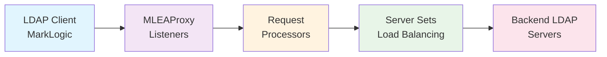
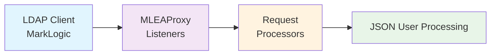
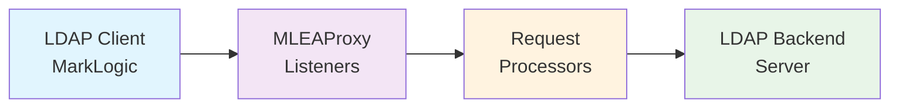
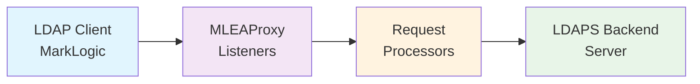
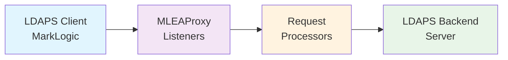
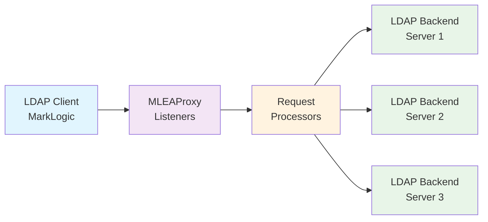
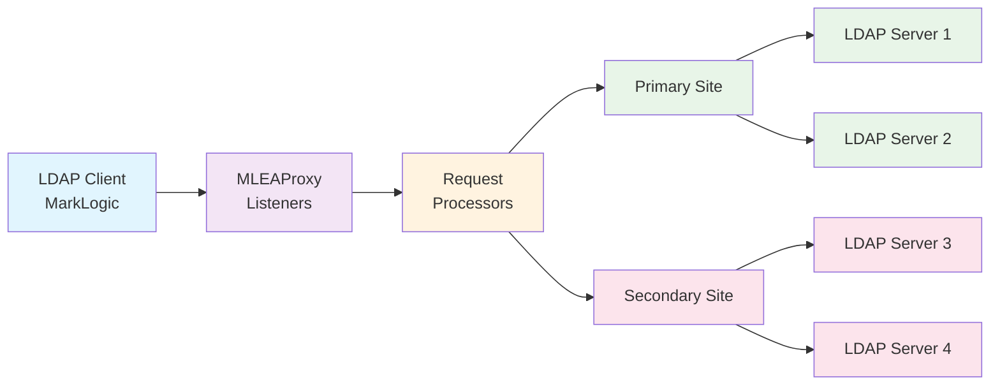

# 🔐 MLEAProxy LDAP Guide

Complete guide for LDAP/LDAPS authentication proxy functionality in MLEAProxy.

---

## 📋 Table of Contents

- [Overview](#overview)
- [Quick Start](#quick-start)
- [Configuration](#configuration)
- [Usage Examples](#usage-examples)
- [In-Memory LDAP Server](#in-memory-ldap-server)
- [Security Features](#security-features)
- [Troubleshooting](#troubleshooting)
- [API Reference](#api-reference)

---

## Overview

MLEAProxy provides comprehensive LDAP/LDAPS proxy and server capabilities with the following features:

### 🎯 Key Features

- 🔍 **Diagnostic Tool**: Debug LDAP authentication issues with detailed logging
- 🔄 **Proxy Mode**: Forward requests to backend LDAP/Active Directory servers  
- 📊 **Load Balancing**: Support for multiple backend servers with various algorithms
- 🏗️ **Standalone Mode**: JSON-based LDAP server for testing without backend infrastructure
- 🔒 **Security Hardening**: Built-in protection against LDAP injection and XML attacks

### 🔌 LDAP Endpoint

| Protocol | Port | Purpose | Features |
|----------|------|---------|----------|
| **LDAP** | 10389 (configurable) | LDAP proxy/server | Standalone server, Proxy mode, Load balancing, LDAPS support |

---

## Quick Start

### Default Configuration (Standalone JSON LDAP Server)

The simplest way to get started - no backend LDAP server required:

```bash
# Run with default configuration
java -jar mleaproxy.jar

# LDAP server starts on ldap://localhost:10389
# Uses built-in JSON user repository
```

Test the default server:

```bash
# Test LDAP connection
ldapsearch -H ldap://localhost:10389 \
  -D "cn=manager,ou=users,dc=marklogic,dc=local" \
  -w password \
  -b "ou=users,dc=marklogic,dc=local" \
  "(sAMAccountName=user1)"
```

---

## Configuration

MLEAProxy uses a flexible configuration system with components for LDAP, including in-memory directory servers.

### Configuration File

All LDAP configuration is contained in **`ldap.properties`**, which includes:
- **Backend LDAP servers** - Connect to external LDAP/AD servers
- **Server sets** - Group servers for load balancing
- **Listeners** - Define LDAP ports and request processors
- **Request processors** - Handle LDAP requests (proxy, standalone)
- **In-memory directories** - Embedded LDAP servers for testing (merged from directory.properties)

### 🏗️ Architecture Components



### 1️⃣ **Servers** - Backend LDAP/AD Servers

Define your backend LDAP or Active Directory servers:

```properties
# Basic server configuration
ldapserver.<name>.host=hostname_or_ip
ldapserver.<name>.port=port_number

# Examples
ldapserver.primary.host=ldap1.company.com
ldapserver.primary.port=389

ldapserver.secondary.host=ldap2.company.com  
ldapserver.secondary.port=636

ldapserver.ad.host=192.168.1.100
ldapserver.ad.port=636
```

### 2️⃣ **Server Sets** - Load Balancing Groups

Group servers together with optional TLS/SSL configuration:

```properties
# Parameters
ldapset.<set name>.servers        # Comma-separated list of server names (Required)
ldapset.<set name>.secure         # True/False for secure connection (Default: false)
ldapset.<set name>.keystore       # Path to Java keystore for client auth (Optional)
ldapset.<set name>.keystorepasswd # Keystore password (Required if keystore specified)
ldapset.<set name>.truststore     # Path to Java truststore for CA certs (Optional)
ldapset.<set name>.truststorepasswd # Truststore password (Required if truststore specified)

# Examples
ldapset.set1.servers=server1

ldapset.set2.servers=server1,server2

ldapset.set3.servers=ad1
ldapset.set3.secure=true
ldapset.set3.truststore=/Users/mwarnes/mlproxy.jks
ldapset.set3.truststorepasswd=password
```

### 3️⃣ **Request Processors** - Authentication Handlers

Configure how LDAP requests are processed:

```properties
# Parameters
requestProcessor.<name>.authclass   # Java class to process requests (Required)
requestProcessor.<name>.debuglevel  # Debug level: DEBUG|INFO|WARN|ERROR (Default: INFO)
requestProcessor.<name>.parm[1-20]  # Optional parameters (Maximum 20)

# Built-in Processors

# 1. JSON Request Processor (Default - Standalone Mode)
requestProcessor.jsonauthenticator.authclass=com.marklogic.processors.JsonRequestProcessor
requestProcessor.jsonauthenticator.debuglevel=DEBUG
requestProcessor.jsonauthenticator.parm1=/path/to/users.json

# 2. Proxy Request Processor (Proxy Mode)
requestProcessor.ldapproxy.authclass=com.marklogic.processors.ProxyRequestProcessor
requestProcessor.ldapproxy.debuglevel=DEBUG
# Optional: Map LDAP attributes (e.g., memberOf:isMemberOf)
requestProcessor.ldapproxy.parm1=memberOf:isMemberOf
```

### 4️⃣ **Listeners** - LDAP Server Instances

Define listening LDAP server instances:

```properties
# Parameters
listener.<name>.ipaddress       # IP address to bind (Default: 0.0.0.0)
listener.<name>.port            # Port to listen on (Required)
listener.<name>.debuglevel      # Debug level: INFO|WARN|ERROR|TRACE|DEBUG (Default: INFO)
listener.<name>.requestProcessor # Name of request processor to use (Required)
listener.<name>.secure          # Enable TLS: true|false (Default: false)
listener.<name>.keystore        # Java keystore with system certificate (Required for TLS)
listener.<name>.keystorepasswd  # Keystore password (Required for TLS)
listener.<name>.ldapset         # Name of LDAP server set (Required for proxy mode)
listener.<name>.ldapmode        # Balancing mode (Required for proxy mode)
listener.<name>.description     # Description (Optional)

# LDAP Modes
# - internal      : Standalone mode, no backend servers
# - single        : Use only first server in set
# - failover      : Use first server, failover to next on failure
# - roundrobin    : Distribute requests evenly across servers
# - roundrobindns : Use DNS-resolved IPs in round-robin
# - fewest        : Route to least-used server
# - fastest       : Route to fastest-responding server

# Example: Standalone JSON LDAP Server
listener.ldapjson.ipaddress=0.0.0.0
listener.ldapjson.port=10389
listener.ldapjson.debuglevel=DEBUG
listener.ldapjson.ldapmode=internal
listener.ldapjson.requestProcessor=jsonauthenticator
listener.ldapjson.description=Simple LDAP Server using JSON user store
```

### 5️⃣ **In-Memory Directory Servers** (NEW - merged from directory.properties)

Define embedded LDAP directory servers for testing and development:

```properties
# Comma-separated list of directory servers to start
directoryServers=marklogic

# Directory Server Configuration
ds.<name>.name=DisplayName           # Human-readable name
ds.<name>.ipaddress=0.0.0.0         # IP address to bind (Default: 0.0.0.0)
ds.<name>.port=60389                # Port to listen on (Default: 60389)
ds.<name>.basedn=dc=Example,dc=com  # Base DN for directory
ds.<name>.admindn=cn=admin          # Admin DN for bind operations
ds.<name>.adminpw=password          # Admin password

# Example: MarkLogic In-Memory Directory
ds.marklogic.name=MarkLogic1
ds.marklogic.ipaddress=0.0.0.0
ds.marklogic.port=60389
ds.marklogic.basedn=dc=MarkLogic,dc=Local
ds.marklogic.admindn=cn=Directory Manager
ds.marklogic.adminpw=password
```

**Features:**
- **UnboundID LDAP SDK**: High-performance in-memory directory
- **LDIF Import**: Loads users/groups from `marklogic.ldif` resource file
- **Kerberos Integration**: Used by Phase 4 LDAP role queries
- **Testing**: Perfect for development without external LDAP server

**Use Cases:**
- Kerberos LDAP role integration (Phase 4)
- Development and testing without external LDAP
- Unit tests and CI/CD pipelines
- Demonstration environments

See [In-Memory LDAP Server](#in-memory-ldap-server) section below for complete documentation.

### 6️⃣ **Active Listeners**

Specify which listeners to start:

```properties
# Start single listener
listeners=proxy

# Start multiple listeners
listeners=proxy,jsonserver
```

### 7️⃣ **Advanced Debugging**

Enable low-level LDAP protocol debugging:

```properties
ldap.debug=true
```

---

## Usage Examples

### Scenario 1: Standalone JSON LDAP Server

This is the default configuration - a simple LDAP server using JSON user data.

**Architecture:**



**Configuration (`mleaproxy.properties`):**

```properties
## Listeners
listeners=ldapjson

## Listener
listener.ldapjson.ipaddress=0.0.0.0
listener.ldapjson.port=10389
listener.ldapjson.debuglevel=DEBUG
listener.ldapjson.ldapmode=internal
listener.ldapjson.requestProcessor=jsonauthenticator
listener.ldapjson.description=Simple LDAP Server using JSON user store

## Processor
requestProcessor.jsonauthenticator.authclass=com.marklogic.processors.JsonRequestProcessor
requestProcessor.jsonauthenticator.debuglevel=DEBUG
```

**User Data (`users.json`):**

```json
{
  "baseDN": "ou=users,dc=marklogic,dc=local",
  "users": [
    {
      "dn": "cn=manager",
      "sAMAccountName": "manager",
      "userPassword": "password",
      "roles": ["admin"]
    },
    {
      "dn": "cn=user1",
      "sAMAccountName": "user1",
      "userPassword": "password",
      "memberOf": [
        "cn=appreader,ou=groups,dc=marklogic,dc=local",
        "cn=appwriter,ou=groups,dc=marklogic,dc=local",
        "cn=appadmin,ou=groups,dc=marklogic,dc=local"
      ],
      "roles": ["reader", "writer", "admin"]
    },
    {
      "dn": "cn=user2",
      "sAMAccountName": "user2",
      "userPassword": "password",
      "memberOf": [
        "cn=appreader,ou=groups,dc=marklogic,dc=local",
        "cn=appwriter,ou=groups,dc=marklogic,dc=local"
      ],
      "roles": ["reader", "writer"]
    }
  ]
}
```

**Testing:**

```bash
# Test LDAP search
ldapsearch -H ldap://localhost:10389 \
  -x -D "cn=manager,ou=users,dc=marklogic,dc=local" \
  -w password \
  -b "ou=users,dc=marklogic,dc=local" \
  -s sub -a always -z 1000 \
  "(sAMAccountName=user1)" \
  "memberOf" "objectClass"
```

**Output:**

```ldif
# user1, users, marklogic.local
dn: cn=user1,ou=users,dc=marklogic,dc=local
objectClass: top
objectClass: person
objectClass: organizationalPerson
objectClass: inetOrgPerson
memberOf: cn=appreader,ou=groups,dc=marklogic,dc=local
memberOf: cn=appwriter,ou=groups,dc=marklogic,dc=local
memberOf: cn=appadmin,ou=groups,dc=marklogic,dc=local
```

### Scenario 2: Simple LDAP Proxy

Forward LDAP requests to a backend LDAP server with detailed logging.

**Architecture:**



**Configuration:**

```properties
ldap.debug=true

## Listeners
listeners=proxy

## Listener
listener.proxy.ipaddress=0.0.0.0
listener.proxy.port=20389
listener.proxy.debuglevel=DEBUG
listener.proxy.ldapset=set1
listener.proxy.ldapmode=single
listener.proxy.requestProcessor=ldapproxy
listener.proxy.description=LDAP Proxy server

## Processor
requestProcessor.ldapproxy.authclass=com.marklogic.processors.ProxyRequestProcessor
requestProcessor.ldapproxy.debuglevel=DEBUG

## LDAP Server Set
ldapset.set1.servers=server1

## LDAP Server
ldapserver.server1.host=kerberos.marklogic.local
ldapserver.server1.port=10389
```

**Attribute Mapping:**

Map attributes between client and backend LDAP (useful for MarkLogic 8 compatibility):

```properties
# Map memberOf (MarkLogic) to isMemberOf (backend LDAP)
requestProcessor.ldapproxy.parm1=memberOf:isMemberOf
```

**Debug Output:**

```log
2017-07-02 17:43:06.325 DEBUG --- Attribute: isMemberOf, values={'cn=appreader,...'}
2017-07-02 17:43:06.325 DEBUG --- Mapping: isMemberOf to memberOf
2017-07-02 17:43:06.325 DEBUG --- Mapped Attribute: memberOf, values={'cn=appreader,...'}
```

### Scenario 3: Secure LDAP Proxy (LDAPS Backend)

Proxy LDAP requests with secure LDAPS connection to backend.

**Architecture:**



**Configuration:**

```properties
ldap.debug=true

## Listeners
listeners=proxy

## Listener
listener.proxy.ipaddress=0.0.0.0
listener.proxy.port=30389
listener.proxy.debuglevel=DEBUG
listener.proxy.secure=false
listener.proxy.ldapset=set1
listener.proxy.ldapmode=single
listener.proxy.requestProcessor=ldapproxy
listener.proxy.description=LDAP proxy with LDAPS backend

## Processor
requestProcessor.ldapproxy.authclass=com.marklogic.processors.ProxyRequestProcessor
requestProcessor.ldapproxy.debuglevel=DEBUG

## LDAP Server Set
ldapset.set1.servers=server1
ldapset.set1.secure=true
# Optional: Add truststore for CA certificate validation
ldapset.set1.truststore=/path/to/truststore.jks
ldapset.set1.truststorepasswd=password
# Optional: Add keystore for TLS client authentication
ldapset.set1.keystore=/path/to/keystore.jks
ldapset.set1.keystorepasswd=password

## LDAP Server
ldapserver.server1.host=kerberos.marklogic.local
ldapserver.server1.port=636
```

### Scenario 4: Fully Secure LDAP Proxy (LDAPS Both Sides)

LDAPS on both client and backend connections.

**Architecture:**



**Configuration:**

```properties
ldap.debug=true

## Listeners
listeners=proxy

## Listener
listener.proxy.ipaddress=0.0.0.0
listener.proxy.port=30636
listener.proxy.debuglevel=DEBUG
listener.proxy.secure=true
listener.proxy.keystore=/Users/mwarnes/mlproxy.jks
listener.proxy.keystorepasswd=password
listener.proxy.ldapset=set1
listener.proxy.ldapmode=single
listener.proxy.requestProcessor=ldapproxy
listener.proxy.description=Fully secure LDAP proxy (LDAPS both sides)

## Processor
requestProcessor.ldapproxy.authclass=com.marklogic.processors.ProxyRequestProcessor
requestProcessor.ldapproxy.debuglevel=DEBUG

## LDAP Server Set
ldapset.set1.servers=server1
ldapset.set1.secure=true

## LDAP Server
ldapserver.server1.host=kerberos.marklogic.local
ldapserver.server1.port=636
```

### Scenario 5: Load Balancing (Round Robin)

Balance requests across multiple LDAP servers.

**Architecture:**



**Configuration:**

```properties
ldap.debug=true

## Listeners
listeners=proxy

## Listener
listener.proxy.ipaddress=0.0.0.0
listener.proxy.port=30389
listener.proxy.debuglevel=DEBUG
listener.proxy.ldapset=set1
listener.proxy.ldapmode=roundrobin
listener.proxy.requestProcessor=ldapproxy
listener.proxy.description=Load balancing LDAP proxy

## Processor
requestProcessor.ldapproxy.authclass=com.marklogic.processors.ProxyRequestProcessor
requestProcessor.ldapproxy.debuglevel=DEBUG

## LDAP Server Set
ldapset.set1.servers=server1,server2,server3

## LDAP Servers
ldapserver.server1.host=192.168.0.50
ldapserver.server1.port=10389

ldapserver.server2.host=192.168.0.51
ldapserver.server2.port=10389

ldapserver.server3.host=192.168.0.52
ldapserver.server3.port=10389
```

**Load Balancing Algorithms:**

| Mode | Description | Use Case |
|------|-------------|----------|
| **single** | Only first server used | Development/testing |
| **failover** | Primary server with backup | High availability |
| **roundrobin** | Distribute evenly | Balanced load distribution |
| **roundrobindns** | DNS-based round robin | Cloud/dynamic environments |
| **fewest** | Least connections | Variable request sizes |
| **fastest** | Fastest response time | Heterogeneous servers |

### Scenario 6: Multi-Site Failover

Load balance within sites, with failover between sites.

**Architecture:**




**Configuration:**

```properties
ldap.debug=true

## Listeners
listeners=proxy

## Listener
listener.proxy.ipaddress=0.0.0.0
listener.proxy.port=30389
listener.proxy.debuglevel=DEBUG
listener.proxy.ldapset=set1,set2
listener.proxy.ldapmode=roundrobin
listener.proxy.requestProcessor=ldapproxy
listener.proxy.description=Multi-site load balancing with failover

## Processor
requestProcessor.ldapproxy.authclass=com.marklogic.processors.ProxyRequestProcessor
requestProcessor.ldapproxy.debuglevel=DEBUG

## LDAP Server Sets (Primary Site)
ldapset.set1.servers=server1,server2

## LDAP Server Sets (Secondary Site)
ldapset.set2.servers=server3,server4

## Primary Site Servers
ldapserver.server1.host=192.168.0.50
ldapserver.server1.port=10389

ldapserver.server2.host=192.168.0.51
ldapserver.server2.port=10389

## Secondary Site Servers
ldapserver.server3.host=192.168.0.52
ldapserver.server3.port=10389

ldapserver.server4.host=192.168.0.53
ldapserver.server4.port=10389
```

---

## In-Memory LDAP Server

MLEAProxy includes a built-in **in-memory LDAP directory server** powered by **UnboundID In-Memory Directory Server**. This feature provides a lightweight, embedded LDAP server that loads data from an LDIF file at startup.

### 🎯 Overview

**Use Cases**:
- **Testing**: Test LDAP authentication without external directory servers
- **Development**: Rapid prototyping with predefined user data
- **Demos**: Self-contained demonstrations
- **CI/CD**: Automated testing with consistent test data
- **Kerberos Integration**: Used by Phase 4 LDAP role queries
- **Training**: Learning LDAP concepts without infrastructure setup

**Key Features**:

✅ **UnboundID In-Memory Directory Server** (not Apache Directory Studio server)  
✅ **Compatible with Apache Directory Studio** as a client for management  
✅ **LDIF Import**: Loads data from `marklogic.ldif` or custom LDIF files  
✅ **Configurable**: Port, base DN, admin credentials all configurable  
✅ **Multiple Servers**: Can run multiple in-memory servers simultaneously  
✅ **Embedded**: Runs in the same JVM as MLEAProxy  
✅ **Fast Startup**: Loads in milliseconds  

### 🏗️ Architecture

```
┌─────────────────────────────────────────────────────────┐
│                    MLEAProxy JVM                         │
├─────────────────────────────────────────────────────────┤
│                                                          │
│  ┌──────────────────────────────────────────────────┐  │
│  │   In-Memory LDAP Server (UnboundID)              │  │
│  │   Port: 60389 (default)                          │  │
│  ├──────────────────────────────────────────────────┤  │
│  │   Data loaded from:                              │  │
│  │   - marklogic.ldif (bundled)                     │  │
│  │   - OR custom LDIF file                          │  │
│  └──────────────────────────────────────────────────┘  │
│                                                          │
│  ┌──────────────────────────────────────────────────┐  │
│  │   LDAP Proxy Listeners                           │  │
│  │   Port: 10389+ (proxies to real LDAP/in-memory) │  │
│  └──────────────────────────────────────────────────┘  │
│                                                          │
└─────────────────────────────────────────────────────────┘
           ↑                              ↑
           │                              │
    LDAP Clients              Apache Directory Studio
   (MarkLogic,               (for management/browsing)
    ldapsearch, etc.)
```

### 🚀 Quick Start

#### 1. Enable In-Memory Server

All in-memory LDAP configuration is now part of **`ldap.properties`** (previously in `directory.properties`):

```properties
# Enable in-memory LDAP server
directoryServers=marklogic

# Server configuration
ds.marklogic.name=MarkLogic1
ds.marklogic.ipaddress=0.0.0.0
ds.marklogic.port=60389
ds.marklogic.basedn=dc=MarkLogic,dc=Local
ds.marklogic.admindn=cn=Directory Manager
ds.marklogic.adminpw=password
```

#### 2. Start MLEAProxy

```bash
java -jar mlesproxy-2.0.0.jar
```

**Expected Log Output**:
```
Starting inMemory LDAP servers.
Using internal LDIF
Directory Server listening on: /0.0.0.0:60389 (MarkLogic1)
```

#### 3. Test Connection

```bash
# Test bind and search
ldapsearch -H ldap://localhost:60389 \
  -D "cn=Directory Manager" \
  -w password \
  -b "dc=MarkLogic,dc=Local" \
  "(objectClass=*)"
```

### ⚙️ In-Memory Server Configuration

**Configuration Properties:**

```properties
# ==========================================
# In-Memory Directory Servers
# ==========================================
# Comma-separated list of directory servers to start
directoryServers=marklogic

# Directory Server Configuration
ds.<name>.name=DisplayName           # Human-readable name
ds.<name>.ipaddress=0.0.0.0         # IP address to bind (Default: 0.0.0.0)
ds.<name>.port=60389                # Port to listen on (Default: 60389)
ds.<name>.basedn=dc=Example,dc=com  # Base DN for directory
ds.<name>.admindn=cn=admin          # Admin DN for bind operations
ds.<name>.adminpw=password          # Admin password
ds.<name>.ldifpath=/path/to/file.ldif # Optional: Custom LDIF file path

# Example: MarkLogic In-Memory Directory
ds.marklogic.name=MarkLogic1
ds.marklogic.ipaddress=0.0.0.0
ds.marklogic.port=60389
ds.marklogic.basedn=dc=MarkLogic,dc=Local
ds.marklogic.admindn=cn=Directory Manager
ds.marklogic.adminpw=password
```

**Configuration Properties Reference:**

| Property | Description | Default | Required |
|----------|-------------|---------|----------|
| `directoryServers` | Comma-separated list of servers | (none) | Yes |
| `ds.<name>.name` | Display name for the server | - | Yes |
| `ds.<name>.ipaddress` | Bind address (0.0.0.0 = all) | `0.0.0.0` | No |
| `ds.<name>.port` | LDAP port | `60389` | No |
| `ds.<name>.basedn` | Directory base DN | `dc=MarkLogic,dc=Local` | No |
| `ds.<name>.admindn` | Administrator DN | `cn=Directory Manager` | No |
| `ds.<name>.adminpw` | Administrator password | `password` | No |
| `ds.<name>.ldifpath` | Custom LDIF file path | (uses built-in) | No |

### 📋 Built-in LDIF File: `marklogic.ldif`

**Location**: `src/main/resources/marklogic.ldif`

**Contents**:
```ldif
version: 1

dn: dc=MarkLogic,dc=Local
objectClass: organization
objectClass: dcObject
dc: MarkLogic
o: MarkLogic

dn: ou=Users,dc=MarkLogic,dc=Local
objectClass: organizationalUnit
ou: Users

dn: ou=Groups,dc=MarkLogic,dc=Local
objectClass: organizationalUnit
ou: Groups
```

**Users in Built-in LDIF:**

| Username | DN | Password | Roles/Groups |
|----------|-----|----------|--------------|
| mluser1 | `uid=mluser1,ou=Users,dc=MarkLogic,dc=Local` | password | AppWriter, AppReader |
| mluser2 | `uid=mluser2,ou=Users,dc=MarkLogic,dc=Local` | password | (none) |
| mluser3 | `uid=mluser3,ou=Users,dc=MarkLogic,dc=Local` | password | (none) |
| appreader | `uid=appreader,ou=Users,dc=MarkLogic,dc=Local` | password | AppReader |
| appwriter | `uid=appwriter,ou=Users,dc=MarkLogic,dc=Local` | password | AppWriter |
| appadmin | `uid=appadmin,ou=Users,dc=MarkLogic,dc=Local` | password | AppAdmin |

**Note**: All passwords are "password" (Base64 encoded in LDIF: `cGFzc3dvcmQ=`)

**Groups in Built-in LDIF:**

| Group | DN | Members |
|-------|-----|---------|
| AppReader | `cn=AppReader,ou=Groups,dc=MarkLogic,dc=Local` | appreader |
| AppWriter | `cn=AppWriter,ou=Groups,dc=MarkLogic,dc=Local` | appwriter |
| AppAdmin | `cn=AppAdmin,ou=Groups,dc=MarkLogic,dc=Local` | appadmin |

### 📝 Using Custom LDIF Files

#### Option 1: Specify in Configuration

```properties
directoryServers=custom

ds.custom.name=CustomDirectory
ds.custom.port=60390
ds.custom.basedn=dc=example,dc=com
ds.custom.ldifpath=/opt/ldap-data/custom.ldif
```

#### Option 2: Create Custom LDIF

**Example: `/opt/ldap-data/custom.ldif`**:
```ldif
version: 1

dn: dc=example,dc=com
objectClass: top
objectClass: domain
dc: example

dn: ou=People,dc=example,dc=com
objectClass: organizationalUnit
ou: People

dn: uid=testuser,ou=People,dc=example,dc=com
objectClass: inetOrgPerson
objectClass: person
objectClass: top
uid: testuser
cn: Test User
sn: User
userPassword: testpass
```

### 🔄 Multiple In-Memory Servers

You can run multiple in-memory servers on different ports:

```properties
# Run two in-memory servers
directoryServers=server1,server2

# Server 1: MarkLogic test data
ds.server1.name=MarkLogic-Test
ds.server1.port=60389
ds.server1.basedn=dc=MarkLogic,dc=Local

# Server 2: Custom test data
ds.server2.name=Custom-Test
ds.server2.port=60390
ds.server2.basedn=dc=example,dc=com
ds.server2.ldifpath=/opt/data/example.ldif
```

### 🔧 Using Apache Directory Studio

**Apache Directory Studio** is an LDAP client that can connect to and manage the in-memory server.

#### 1. Download Apache Directory Studio

Download from: https://directory.apache.org/studio/

#### 2. Create Connection

1. **Open Apache Directory Studio**
2. **New Connection** → LDAP Browser → New Connection
3. **Connection Settings**:
   - **Connection name**: MLEAProxy In-Memory
   - **Hostname**: localhost
   - **Port**: 60389
   - **Encryption method**: No encryption

4. **Authentication**:
   - **Bind DN or user**: `cn=Directory Manager`
   - **Bind password**: `password`

5. **Click "Check Authentication"** → Should succeed
6. **Click "Finish"**

#### 3. Browse and Edit

Once connected, you can:
- ✅ Browse the directory tree
- ✅ View all entries and attributes
- ✅ Add new users and groups
- ✅ Modify existing entries
- ✅ Delete entries
- ✅ Export to LDIF
- ✅ Import from LDIF

**Note**: Changes are **in-memory only** and lost on restart unless you export to LDIF.

#### 4. Export Modified Data

**To preserve changes**:
1. **Right-click** on base DN (e.g., `dc=MarkLogic,dc=Local`)
2. **Export** → LDIF Export
3. **Save** to file (e.g., `/opt/data/modified.ldif`)
4. **Update** `ldap.properties`:
   ```properties
   ds.marklogic.ldifpath=/opt/data/modified.ldif
   ```
5. **Restart** MLEAProxy to load modified data

### 🧪 Testing In-Memory Server

#### Test Authentication

```bash
# Simple bind test
ldapsearch -H ldap://localhost:60389 \
  -D "uid=mluser1,ou=Users,dc=MarkLogic,dc=Local" \
  -w password \
  -b "dc=MarkLogic,dc=Local" \
  "(uid=mluser1)"
```

#### Search for All Users

```bash
ldapsearch -H ldap://localhost:60389 \
  -D "cn=Directory Manager" \
  -w password \
  -b "ou=Users,dc=MarkLogic,dc=Local" \
  "(objectClass=inetOrgPerson)"
```

#### Search for Groups

```bash
ldapsearch -H ldap://localhost:60389 \
  -D "cn=Directory Manager" \
  -w password \
  -b "ou=Groups,dc=MarkLogic,dc=Local" \
  "(objectClass=groupOfNames)"
```

#### Using Python ldap3

```python
from ldap3 import Server, Connection, ALL

# Connect to in-memory server
server = Server('localhost', port=60389, get_info=ALL)
conn = Connection(server, 
                  'cn=Directory Manager', 
                  'password', 
                  auto_bind=True)

# Search for users
conn.search('dc=MarkLogic,dc=Local', 
            '(objectClass=inetOrgPerson)',
            attributes=['uid', 'cn', 'businessCategory'])

for entry in conn.entries:
    print(f"User: {entry.uid}, Groups: {entry.businessCategory}")

conn.unbind()
```

### 🔗 Integration with LDAP Proxy

The in-memory server can be used as a backend for LDAP proxy listeners:

**Example: Proxy to In-Memory Server**:

```properties
# In-memory server
directoryServers=marklogic
ds.marklogic.port=60389
ds.marklogic.basedn=dc=MarkLogic,dc=Local

# LDAP proxy listener
listeners=proxy
listener.proxy.port=10389
listener.proxy.ldapset=inmemory
listener.proxy.ldapmode=single
listener.proxy.requestProcessor=ldapproxy

# Processor
requestProcessor.ldapproxy.authclass=com.marklogic.processors.ProxyRequestProcessor

# Backend: In-memory server
ldapset.inmemory.servers=localhost

ldapserver.localhost.host=localhost
ldapserver.localhost.port=60389
```

**Result**: Clients connect to port 10389, which proxies to in-memory server on 60389

### 🐛 Troubleshooting In-Memory Server

#### Server Not Starting

**Symptom**: No "Directory Server listening" message in logs

**Check**:
```bash
# Verify directoryServers is uncommented
grep "^directoryServers=" ldap.properties

# Expected: directoryServers=marklogic
```

**Solution**: Uncomment the line in `ldap.properties`

#### Port Already in Use

**Symptom**: Error about port binding

**Solution**: Change port in configuration:
```properties
ds.marklogic.port=60390  # Use different port
```

#### LDIF Import Error

**Symptom**: Error loading LDIF file

**Check LDIF syntax**:
```bash
# Validate LDIF file
ldapadd -H ldap://localhost:60389 \
  -D "cn=Directory Manager" \
  -w password \
  -f /path/to/custom.ldif -c
```

**Common Issues**:
- Missing `version: 1` header
- Incorrect DN syntax
- Missing required attributes
- Duplicate entries

#### Authentication Failed (In-Memory)

**Symptom**: Bind fails with error 49

**Check credentials**:
```bash
# Test with correct admin credentials
ldapsearch -H ldap://localhost:60389 \
  -D "cn=Directory Manager" \
  -w password \
  -b "dc=MarkLogic,dc=Local" \
  "(objectClass=*)"
```

**Verify admin DN matches configuration**:
```properties
ds.marklogic.admindn=cn=Directory Manager
ds.marklogic.adminpw=password
```

### 🚀 Advanced In-Memory Usage

#### Dynamic User Addition

**Via Apache Directory Studio**:
1. Connect to in-memory server
2. Right-click on `ou=Users,dc=MarkLogic,dc=Local`
3. **New** → **New Entry**
4. Select object classes: `inetOrgPerson`, `person`, `top`
5. Fill in required attributes:
   - `uid`: username
   - `cn`: common name
   - `sn`: surname
   - `userPassword`: password

#### Role-Based Access Control

The built-in LDIF uses `businessCategory` attribute for group membership:

```ldif
dn: uid=mluser1,ou=Users,dc=MarkLogic,dc=Local
...
businessCategory: cn=AppWriter,ou=Groups,dc=MarkLogic,dc=Local
businessCategory: cn=AppReader,ou=Groups,dc=MarkLogic,dc=Local
```

**LDAP Proxy** can map these to MarkLogic roles.

### ⚡ Performance Considerations

#### Memory Usage

In-memory servers load all data into RAM:
- **Small datasets** (<1000 entries): Negligible overhead
- **Medium datasets** (1000-10000 entries): ~10-50 MB
- **Large datasets** (>10000 entries): Consider external LDAP server

#### Startup Time

- **Built-in marklogic.ldif** (6 users, 3 groups): <100ms
- **Custom LDIF** (1000 entries): <500ms
- **Large LDIF** (10000 entries): ~2-5 seconds

#### Concurrent Connections

UnboundID In-Memory Directory Server handles:
- **100+ concurrent connections** easily
- **1000+ operations/second** for simple queries
- Suitable for most testing and development scenarios

### 📊 Use Cases

#### 1. CI/CD Testing

```yaml
# .github/workflows/test.yml
- name: Run LDAP Integration Tests
  run: |
    # Start MLEAProxy with in-memory LDAP
    java -jar mlesproxy-2.0.0.jar &
    sleep 5
    
    # Run tests
    mvn test -Dldap.url=ldap://localhost:60389
```

#### 2. Development Environment

Developers can test LDAP authentication locally without:
- Installing OpenLDAP or Active Directory
- Configuring external servers
- Network connectivity to production LDAP

#### 3. Demo Environments

Portable demo with self-contained authentication:
```bash
# Single command starts everything
java -jar mlesproxy-2.0.0.jar
```

#### 4. Kerberos Phase 4 LDAP Integration

The in-memory server is used by Kerberos Phase 4 for LDAP role queries:
- Stores user group memberships
- Provides role information for authenticated Kerberos users
- Enables full OAuth/SAML token generation with roles

See [KERBEROS_GUIDE.md](./KERBEROS_GUIDE.md) for Kerberos integration details.

#### 5. Training

Students can learn LDAP concepts using Apache Directory Studio connected to in-memory server.

### 📈 Comparison: In-Memory vs External LDAP

| Feature | In-Memory Server | External LDAP Server |
|---------|------------------|----------------------|
| **Setup** | Zero configuration | Requires installation |
| **Startup** | Instant (<1s) | Minutes to hours |
| **Persistence** | In-memory (lost on restart) | Persistent storage |
| **Performance** | Very fast (RAM-based) | Network + disk latency |
| **Scalability** | Limited by RAM | Enterprise scale |
| **HA/Replication** | No | Yes (production feature) |
| **Best For** | Dev/test/demo | Production environments |

### 💻 Source Code References

#### Implementation

**File**: `src/main/java/com/marklogic/handlers/ApplicationListener.java`

**Method**: `startInMemoryDirectoryServers()` (lines 155-197)

**Key Libraries**:
- UnboundID LDAP SDK: `com.unboundid.ldap.listener.InMemoryDirectoryServer`
- LDIF Reader: `com.unboundid.ldif.LDIFReader`

#### Configuration Interface

**File**: `src/main/java/com/marklogic/configuration/DSConfig.java`

Defines all configuration properties for directory servers.

#### Test Implementation

**File**: `src/test/java/com/marklogic/handlers/LDAPRequestHandlerTest.java`

Shows how tests use in-memory servers.

---

## Security Features

### 1. LDAP Injection Protection

MLEAProxy includes built-in protection against LDAP injection attacks:

**Automatic Sanitization:**
- Escapes special characters: `*`, `(`, `)`, `\`, `NUL`
- Validates DN syntax
- Prevents filter injection in search requests

**Example:**

```bash
# Malicious input: admin)(uid=*)
# MLEAProxy escapes to: admin\29\28uid=\2a\29

ldapsearch -H ldap://localhost:10389 \
  -D "cn=admin)(uid=*),dc=example,dc=com" \
  -w password

# Attack prevented, returns "Invalid DN"
```

### 2. Secure LDAP (LDAPS) Support

**Server-Side TLS:**

```properties
# Configure TLS for listener
listener.secure-ldap.secure=true
listener.secure-ldap.keystore=/path/to/keystore.jks
listener.secure-ldap.keystorepasswd=changeit
```

**Client-Side TLS (Backend):**

```properties
# Configure TLS for backend connection
ldapset.set1.secure=true
ldapset.set1.truststore=/path/to/truststore.jks
ldapset.set1.truststorepasswd=changeit

# Optional: TLS client authentication
ldapset.set1.keystore=/path/to/client-keystore.jks
ldapset.set1.keystorepasswd=changeit
```

### 3. Connection Security

```properties
# Rate limiting
listener.proxy.max-connections=1000
listener.proxy.idle-timeout=300

# IP filtering
listener.proxy.allowed-ips=192.168.1.0/24,10.0.0.0/8
```

### 4. JSON User Repository Security

**Recent Enhancement (2025):**

MLEAProxy now uses JSON format for user data instead of XML, providing:

- **Better Performance**: Faster JSON parsing with Jackson
- **Modern Format**: Industry-standard data format
- **Type Safety**: Strongly-typed user objects
- **Easier Maintenance**: More readable and editable

**User Storage (`users.json`):**

```json
{
  "baseDN": "ou=users,dc=marklogic,dc=local",
  "users": [
    {
      "dn": "cn=manager",
      "sAMAccountName": "manager",
      "userPassword": "password",
      "roles": ["admin"]
    }
  ]
}
```

**Features:**
- Case-insensitive username lookup
- Bcrypt password hashing support
- Role-based access control
- Custom attribute support

---

## Troubleshooting

### Common Issues

#### 1. Connection Refused

**Symptom:** `Connection refused` when connecting to MLEAProxy

**Solutions:**
- Check listener is started: `netstat -an | grep 10389`
- Verify bind address: `listener.proxy.ipaddress=0.0.0.0`
- Check firewall rules: `sudo ufw allow 10389/tcp`

#### 2. Authentication Failed

**Symptom:** `INVALID_CREDENTIALS` error

**Solutions:**
- Enable debug logging: `listener.proxy.debuglevel=DEBUG`
- Check user exists in users.json
- Verify password (case-sensitive)
- Check bind DN format: `cn=user,ou=users,dc=example,dc=com`

#### 3. TLS/SSL Errors

**Symptom:** `SSLHandshakeException` or certificate errors

**Solutions:**
- Verify certificate validity: `keytool -list -v -keystore keystore.jks`
- Check certificate chain completeness
- Add CA cert to truststore
- Verify hostname matches certificate CN

#### 4. Backend Connection Failed

**Symptom:** Cannot connect to backend LDAP server

**Solutions:**
- Test backend connectivity: `ldapsearch -H ldap://backend:389`
- Check server set configuration
- Verify network routing
- Enable LDAP debug: `ldap.debug=true`

### Debug Logging

**Enable maximum verbosity:**

```properties
ldap.debug=true
listener.proxy.debuglevel=DEBUG
requestProcessor.ldapproxy.debuglevel=DEBUG

# Spring Boot logging
logging.level.com.marklogic=DEBUG
logging.level.com.unboundid.ldap=DEBUG
```

**Sample Debug Output:**

```log
2017-07-02 12:54:14.630 INFO  --- XML Authenticator.authenticate called
2017-07-02 12:54:14.630 INFO  --- BindRequestProtocolOp(version=3, bindDN='cn=manager,...')
2017-07-02 12:54:14.631 DEBUG --- BindDN: cn=manager,ou=users,dc=marklogic,dc=local
2017-07-02 12:54:14.631 DEBUG --- UserDN: cn=manager
2017-07-02 12:54:14.655 INFO  --- BindResponseProtocolOp(resultCode=0)
```

---

## API Reference

### Configuration Properties

**Complete LDAP Configuration Reference:**

```properties
# ==========================================
# LDAP Debug
# ==========================================
ldap.debug=true|false

# ==========================================
# Listeners
# ==========================================
listeners=listener1,listener2,...

# ==========================================
# Listener Configuration
# ==========================================
listener.<name>.ipaddress=<ip-address>          # Default: 0.0.0.0
listener.<name>.port=<port>                     # Required
listener.<name>.debuglevel=DEBUG|INFO|WARN|ERROR # Default: INFO
listener.<name>.secure=true|false               # Default: false
listener.<name>.keystore=<path>                 # Required if secure=true
listener.<name>.keystorepasswd=<password>       # Required if secure=true
listener.<name>.ldapset=<serverset-name>        # Required for proxy mode
listener.<name>.ldapmode=internal|single|failover|roundrobin|roundrobindns|fewest|fastest
listener.<name>.requestProcessor=<processor-name> # Required
listener.<name>.description=<description>       # Optional

# ==========================================
# Request Processor
# ==========================================
requestProcessor.<name>.authclass=<fully-qualified-class-name> # Required
requestProcessor.<name>.debuglevel=DEBUG|INFO|WARN|ERROR       # Default: INFO
requestProcessor.<name>.parm1=<parameter>       # Optional (e.g., users.json path)
requestProcessor.<name>.parm2=<parameter>       # Optional

# ==========================================
# LDAP Server Sets
# ==========================================
ldapset.<name>.servers=server1,server2,...      # Required
ldapset.<name>.secure=true|false                # Default: false
ldapset.<name>.keystore=<path>                  # Optional (TLS client auth)
ldapset.<name>.keystorepasswd=<password>        # Required if keystore set
ldapset.<name>.truststore=<path>                # Optional (CA certs)
ldapset.<name>.truststorepasswd=<password>      # Required if truststore set

# ==========================================
# LDAP Servers
# ==========================================
ldapserver.<name>.host=<hostname>               # Required
ldapserver.<name>.port=<port>                   # Required
ldapserver.<name>.secure=true|false             # Default: false
ldapserver.<name>.bindDN=<bind-dn>              # Optional
ldapserver.<name>.bindPassword=<password>       # Optional
```

### Java API

**Custom Request Processor:**

```java
package com.marklogic.processors.custom;

import com.unboundid.ldap.listener.interceptor.*;
import com.unboundid.ldap.sdk.*;

public class CustomRequestProcessor extends InMemoryOperationInterceptor {
    
    @Override
    public void processSimpleBindRequest(InMemoryInterceptedSimpleBindRequest request)
            throws LDAPException {
        
        String bindDN = request.getRequest().getBindDN();
        String password = request.getRequest().getPassword().stringValue();
        
        // Custom authentication logic
        if (authenticate(bindDN, password)) {
            request.setResult(new BindResult(
                request.getMessageID(),
                ResultCode.SUCCESS,
                null, null, null, null
            ));
        } else {
            request.setResult(new BindResult(
                request.getMessageID(),
                ResultCode.INVALID_CREDENTIALS,
                "Authentication failed", null, null, null
            ));
        }
    }
    
    @Override
    public void processSearchRequest(InMemoryInterceptedSearchRequest request)
            throws LDAPException {
        
        SearchRequest searchRequest = request.getRequest();
        
        // Custom search logic
        List<SearchResultEntry> results = performSearch(
            searchRequest.getBaseDN(),
            searchRequest.getFilter(),
            searchRequest.getAttributeList()
        );
        
        request.sendSearchEntries(results);
        request.setResult(new SearchResult(
            request.getMessageID(),
            ResultCode.SUCCESS,
            null, null, null, null, results.size(), 0
        ));
    }
}
```

---

## Standards References

- [RFC 4511](https://tools.ietf.org/html/rfc4511) - LDAP: The Protocol
- [RFC 4513](https://tools.ietf.org/html/rfc4513) - LDAP: Authentication Methods and Security
- [RFC 4516](https://tools.ietf.org/html/rfc4516) - LDAP: Uniform Resource Locator
- [RFC 4517](https://tools.ietf.org/html/rfc4517) - LDAP: Syntaxes and Matching Rules
- [RFC 4518](https://tools.ietf.org/html/rfc4518) - LDAP: Internationalized String Preparation

---

## Related Documentation

- **[README.md](./README.md)** - General application overview
- **[OAUTH_GUIDE.md](./OAUTH_GUIDE.md)** - OAuth 2.0 functionality
- **[SAML_GUIDE.md](./SAML_GUIDE.md)** - SAML 2.0 functionality
- **[KERBEROS_GUIDE.md](./KERBEROS_GUIDE.md)** - Kerberos authentication (includes LDAP integration)
- **[TESTING_GUIDE.md](./TESTING_GUIDE.md)** - Testing procedures

---

<div align="center">

**[⬆ Back to Top](#-mleaproxy-ldap-guide)**

</div>
